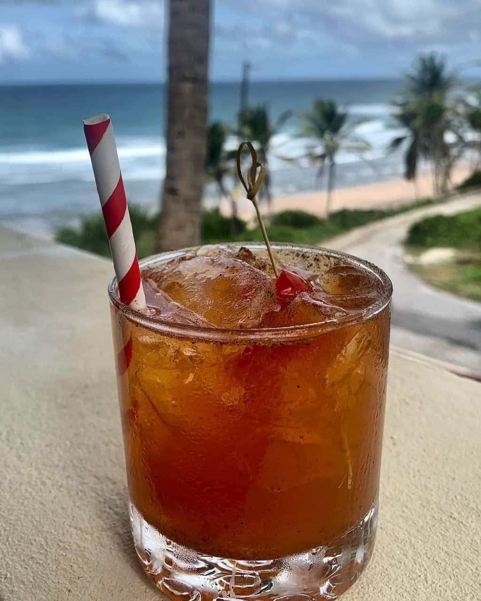

# Mauby (Bajan Bark-Bitter Cooler)

*Barbados's bitter-aromatic dark brown cooler: mauby bark simmered with cinnamon, cloves, star anise, orange peel and bay leaves, then sweetened, chilled and served over ice.*

**Serves:** 6-8 (makes about 1.5 litres)

**Prep Time:** 15 minutes (plus 12 hours steeping)

**Cook Time:** 30 minutes

## Overview
Mauby is one of the Caribbean's most distinctive non-alcoholic drinks: a refreshing slightly-bitter brown infusion with deep cultural roots in Barbados, Trinidad and across the English-speaking Caribbean. The bark comes from the Colubrina elliptica tree (also called West Indian carob), dried into small dark curls. It's the source of the drink's distinctive bitter character, close to root beer (which descended from similar Caribbean-American bark drinks). Outside the Caribbean, mauby bark sells at Caribbean specialty shops or as a pre-made concentrate; the fresh-bark version is dramatically better. The bark simmers with cinnamon, cloves, star anise, bay leaves, orange peel and ginger; that aromatic list is what transforms a bitter bark broth into something complex and fragrant. A generous sugar load (150 to 200 g per litre) balances the bitterness. Served over ice in tall glasses, sometimes with lime or mint. Sold from temporary trolleys with vendors calling "mauby! cold mauby!" through Bajan streets at midday.

## Ingredients

### The mauby base (makes 1.5 litres)
- 30 g dried mauby bark (Colubrina elliptica bark; sold at Caribbean shops in small bags)
- 2 cinnamon sticks
- 6 whole cloves
- 2 star anise pods
- 4 bay leaves
- 1 strip orange peel (about 5 × 2 cm; just the outer rind, avoid the white pith)
- 1 strip lemon peel
- 1 thick slice of fresh ginger (1 cm thick)
- 4-6 whole allspice berries (optional but very traditional)
- 1.5 litres cold water

### The sweetening
- 150-200 g granulated sugar (or 100 g sugar + 80 g soft brown sugar for depth)
- 1 tablespoon fresh lime juice (brightens the finished drink)

### To serve (per glass)
- Tall glass filled with ice cubes
- A slice of lime
- A sprig of mint (optional)

### To serve alongside (the traditional Caribbean snack)
- Bajan fish cakes, conkies, or a slice of coconut bread

## Method

### Stage 1 - The simmer
1. Place the mauby bark in a heavy saucepan.
2. Add the cinnamon sticks, cloves, star anise, bay leaves, orange peel, lemon peel, ginger slice and (optional) allspice berries.
3. Pour over the 1.5 litres of cold water.
4. Bring to a gentle boil over medium heat.
5. Reduce to a low simmer; cook covered 30 minutes.
6. The liquid will become a deep tea-brown colour and a bitter-aromatic fragrance will fill the kitchen.

### Stage 2 - Steep (overnight ideal)
1. Take the pan off the heat.
2. Leave the bark and spices in the brew.
3. Let stand at room temperature 4-6 hours, OR refrigerate overnight (12-24 hours) for the traditional full-flavour development.
4. The longer the steep, the more bitter-aromatic the drink (and the more sugar you'll need to balance).

### Stage 3 - Strain
1. Strain the brew through a fine sieve into a clean pitcher.
2. Discard the spent bark and spices.
3. You should have about 1.4 litres of brown brew.

### Stage 4 - Sweeten
1. While still warm (re-warm gently if it's gone cold), stir in 150 g of sugar (or the brown-sugar mix).
2. Stir till fully dissolved.
3. Taste; the drink should be slightly bitter, slightly sweet, deeply aromatic. Adjust sugar - some Bajans like it sweeter (up to 200 g); others enjoy the bitter edge.
4. Stir in the lime juice (brightens the finished flavour).

### Stage 5 - Chill
1. Cool to room temperature (about 30 minutes).
2. Refrigerate at least 2 hours till fully cold.

### Stage 6 - Serve
1. Fill tall glasses with ice cubes.
2. Pour the chilled mauby over the ice (about 200 ml per glass).
3. Garnish with a slice of lime and (optional) a sprig of mint.
4. Drink immediately while ice-cold.

## Notes
- **Mauby bark is the traditional ingredient:** the dried inner bark of Colubrina elliptica. Sold at Caribbean shops in small bags; the pre-made "mauby syrup" or "mauby extract" is the workable shortcut.
- **Overnight steep is dramatic:** the traditional Caribbean technique. 12-24 hours of cooled steep gives the deepest flavour.
- **Balance the bitter:** 150-200 g sugar per 1.5 litres of strained brew is the traditional Bajan sweetness. Less = too bitter; more = flavoured syrup.
- **The bitter-aromatic character is the point:** mauby is NOT supposed to be sweet like cola. The slight bitterness is what makes it identity-specific to the Caribbean.
- **Don't over-cook:** 30 minutes simmer is enough. Longer simmering makes the drink overly bitter.
- **Drink cold:** mauby is at its peak ice-cold over fresh ice. Room-temperature mauby loses character.

## Variations
**Quick mauby with pre-made syrup:** mix 3 tablespoons of commercial mauby syrup with 200 ml of cold water + a slice of lime; instant Caribbean cooler.
**Mauby with rum (boozy variant):** add 30 ml of Bajan rum to each glass - the adult Bajan rum-shop variant.
**Mauby cocktail (modern):** mauby + rum + ginger ale + fresh lime juice; the modern Caribbean cocktail-bar variant.
**Mauby with milk (cocoa-tea-style):** swap half the water for whole milk; warm gently - the comforting hot variant.
**Stronger mauby (longer steep):** steep 36-48 hours for the most-intense version.
**Sweeter mauby (kids' version):** double the sugar - for those who find the bitter edge too aggressive.
**Mauby concentrate:** simmer the bark in 750 ml of water (instead of 1.5 litres) for a stronger concentrate; dilute with cold water 1:1 to serve.
**Iced mauby slush:** blend the chilled mauby with ice in a blender - the Bajan summer slush.

## Serving
At a Bajan street cart (the traditional setting; mauby vendors call "mauby!" through every Bajan town at midday) · at a Bajan rum-shop alongside fish cakes and a cutter · at a Bajan beach picnic · at a Bajan family Sunday lunch as the non-alcoholic accompaniment · at a Bajan church social · at a Bajan Independence Day buffet · at home as the Caribbean cooler alternative to lemonade · paired with Bajan fish cakes, conkies, coconut bread, or simply on its own as a midday refresher.

## Storage
- The chilled mauby refrigerates 5 days; the flavours can deepen slightly over 2-3 days.
- Mauby concentrate (a 2x strength brew) refrigerates 2 weeks.
- The dried mauby bark keeps indefinitely in a sealed jar in a dry pantry.
- Don't freeze - the flavour profile changes.
- A typical Bajan household keeps a 2-litre jug of mauby in the fridge in the warmer months.
- Commercial mauby syrup keeps refrigerated 6 months once opened.
