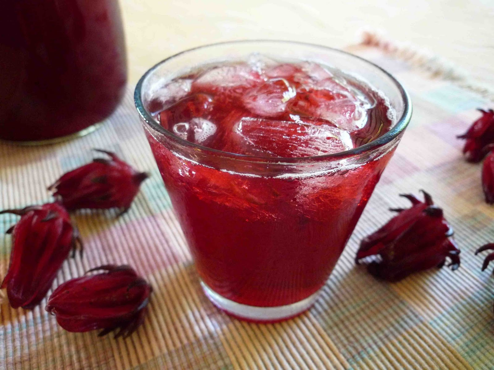

# Sorrel (Caribbean Hibiscus Christmas Drink)

*Barbados's canonical Christmas drink: dried hibiscus calyces steeped with ginger, cloves, cinnamon, allspice and orange peel, then sweetened, chilled, and optionally laced with dark Bajan rum for the adult Christmas pour.*

**Serves:** 8-10 (makes about 1.5 litres)

**Prep Time:** 15 minutes (plus 24 hours steeping)

**Cook Time:** 25 minutes

## Overview
Sorrel is the most identity-specifically Christmas drink in the Caribbean, made in vast quantities from mid-November through January; a Bajan Christmas table without it is unthinkable. The naming is confusing: Caribbean "sorrel" refers to dried hibiscus calyces (the bright-crimson flower bracts of Hibiscus sabdariffa), not the European leafy-green herb of the same name; outside the Caribbean it's sold at Caribbean shops, Mexican shops (as "jamaica" or "flor de jamaica") and increasingly mainstream supermarkets. The aromatic line is the Caribbean Christmas-spice combination: fresh ginger, whole cloves, cinnamon sticks, allspice berries, orange peel and sometimes star anise: that turns plain hibiscus tea into the canonical Bajan Christmas drink. After a brief simmer the brew steeps a long time (12-24 hours) so the colour deepens to ruby and the flavours fully develop. Strained, sweetened generously, optionally laced with 60-120 ml of dark Bajan rum per litre for the canonical Christmas-Day adult pour. Served over ice: the deep red matches the season and the tart-sweet-spice profile pairs with Bajan Christmas ham and jug-jug.

## Ingredients

### The sorrel base (makes 1.5 litres)
- 60 g dried hibiscus calyces (sold as "sorrel" at Caribbean shops, or "flor de jamaica" at Mexican shops, or as a hibiscus tea ingredient at health-food shops)
- 1.5 litres cold water
- 2 cinnamon sticks
- 8 whole cloves
- 6 whole allspice berries
- 1 piece fresh ginger (about 4 cm), peeled and thickly sliced
- 1 strip orange peel (about 5 × 2 cm)
- 1 strip lemon peel
- 2 star anise pods (optional but very canonical)
- 1 bay leaf (the Bajan addition)

### The sweetening
- 200-300 g granulated sugar (or to taste; sorrel can be quite sweet)
- 2 tablespoons fresh lime juice

### The optional adult-version rum
- 120 ml dark Bajan rum (Mount Gay Eclipse, Cockspur, or any aged dark Caribbean rum)
- (Or rum to each individual glass: 30 ml per glass)

### To finish (per glass)
- Ice cubes
- A slice of fresh orange OR a sprig of mint
- An optional small splash of additional rum or sparkling water

### To serve at a Bajan Christmas table
- Bajan baked Christmas ham
- Jug-jug (the canonical Bajan Christmas Eve dish)
- Bajan rum cake
- Coconut bread
- Sorrel cocktail glasses or tall highball glasses

## Method

### Stage 1 - The simmer
1. Place the dried hibiscus in a heavy saucepan.
2. Add the cinnamon sticks, cloves, allspice berries, sliced ginger, orange peel, lemon peel, optional star anise, and bay leaf.
3. Pour over the 1.5 litres of cold water.
4. Bring to a gentle boil; reduce to a low simmer.
5. Cover loosely; cook 20-25 minutes.
6. The liquid will become a deep ruby red and the kitchen will smell of warm spice and tart berry.

### Stage 2 - Long steep (12-24 hours; this is critical)
1. Take the pan off the heat.
2. Leave the hibiscus and spices in the brew.
3. Let stand at cool room temperature 4-6 hours, OR refrigerate 12-24 hours for the canonical full-colour-and-flavour development.

### Stage 3 - Strain
1. Strain the brew through a fine sieve into a clean pitcher or jug.
2. Press the spent hibiscus and spices gently with a wooden spoon to extract every drop of colour.
3. Discard the spent ingredients.

### Stage 4 - Sweeten and adjust
1. While the strained brew is still warm (or warm it gently if it's gone cold), stir in 200 g of sugar.
2. Stir till fully dissolved; taste.
3. Add more sugar (up to 300 g) if you like it sweeter; or leave at 200 g for a tarter brew.
4. Stir in the lime juice.

### Stage 5 - (Optional) Add the rum
1. For the canonical Bajan Christmas adult version: stir in 120 ml of dark Bajan rum at this stage (or leave it out and pour rum into each individual glass).

### Stage 6 - Chill
1. Cool to room temperature (about 30 minutes).
2. Refrigerate at least 2 hours till fully cold (overnight is fine).

### Stage 7 - Serve
1. Fill tall glasses with ice cubes.
2. Pour the chilled sorrel over the ice; about 200 ml per glass.
3. (For the adult version: add 30 ml dark Bajan rum to each glass before pouring the sorrel if you didn't add it to the pitcher.)
4. Garnish with a slice of fresh orange OR a sprig of mint.
5. Drink immediately while ice-cold.

## Notes
- **Dried hibiscus, not European sorrel:** the Caribbean "sorrel" is the hibiscus flower. European sorrel is a green herb - completely different.
- **Long overnight steep:** the canonical Caribbean technique. 12-24 hours of cooled steep gives the deepest red colour and the fullest spice infusion.
- **Generous sugar:** dried hibiscus is quite tart; 200-300 g sugar per 1.5 litres of brew is the canonical Caribbean sweetness.
- **The Christmas timing:** in Barbados, sorrel is essentially a November-December-January drink. Outside that season it feels off-period.
- **Adult vs kids' version:** the canonical Christmas adult version includes dark rum. Kids' sorrel is just the sweetened spiced infusion.
- **Don't over-simmer:** 25 minutes is enough. Longer simmering makes the spice profile too aggressive.

## Variations
**Sorrel with ginger (extra warming):** triple the fresh ginger - the warmer Christmas variant.
**Sorrel cocktail with falernum:** add 30 ml of Bajan falernum (the lime-ginger-clove-almond syrup) per glass - the upmarket Bajan cocktail variant.
**Sparkling sorrel:** top each glass with 30 ml of sparkling water or club soda - the modern bubbly variant.
**Sorrel sangria:** mix the sorrel 50/50 with dry red wine + diced fresh fruit - the Caribbean Christmas sangria.
**Sorrel mocktail (non-alcoholic):** the kids' version with no rum - excellent for the designated driver.
**Sorrel with pineapple (Trinidadian variant):** add 200 ml of pineapple juice - the Trinidadian Christmas variant.
**Sorrel slushie:** blend the chilled sorrel with crushed ice - the Bajan summer variant.
**Quick sorrel (24-hour batch):** simmer; steep 12 hours; strain and sweeten; faster than the canonical 24-hour version.
**Sorrel jelly:** dissolve gelatin in the strained warm brew; chill - the Bajan Christmas pudding variant.
**Sorrel syrup:** concentrate by simmering 2x; use as a Bajan cocktail mixer year-round.

## Serving
At a Bajan Christmas Eve dinner (the canonical setting; alongside jug-jug, baked ham, and Bajan rum cake) · at a Bajan Christmas Day lunch · at a Bajan New Year's Eve celebration · at a Bajan Independence Day (30 November) gathering · at a Caribbean Christmas-themed dinner · at home from mid-November through early January as the canonical Bajan Christmas drink · paired with Bajan baked ham, jug-jug, conkies, coconut bread, or rum cake.

## Storage
- The chilled sorrel refrigerates 1 week; the flavour deepens slightly over time.
- The rum-laced version refrigerates 2 weeks (alcohol preserves).
- Don't freeze the prepared drink - the colour and flavour suffer.
- The dried hibiscus and whole spices keep indefinitely in sealed jars in a dry pantry.
- A "sorrel concentrate" (2x strength brew) can be made and refrigerated for 4 weeks; dilute with cold water to serve.
- A typical Bajan household makes a large pot of sorrel in late November and keeps it in the fridge throughout December.
