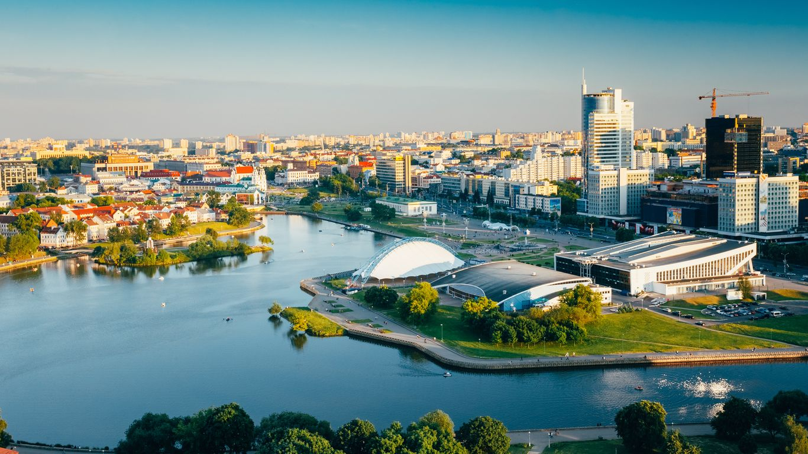

# Drinks of Belarus

Kvass sits on every village table in summer, the bright sour-rye refresher that quenches a haymaking thirst and gives cold soups their backbone. Krambambulya, the honey-and-spice spirit warmed with cinnamon and cloves, is the festive shot at weddings, Christmas and the long New Year tables. Belavezhskaya pushcha, the herbal bitter named after the ancient primeval forest on the Polish border, carries the resinous note of pine, juniper and bog herbs into a digestif glass. Strong sweet black tea (with a spoon of cherry or strawberry jam stirred in rather than sugar) is the afternoon ritual, a Russian-influenced habit that runs through every Belarusian kitchen from Brest to Vitebsk.
