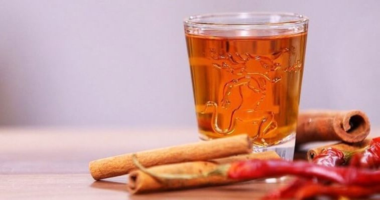

# Krambambulya

*The Belarusian honey-and-spice spirit: vodka infused with cinnamon, clove, nutmeg, ginger and black pepper, sweetened with forest honey, served warm in winter or at room temperature year-round in small thimble glasses.*

**Serves:** about 700 ml

**Prep Time:** 20 minutes (plus 2 weeks infusing)

**Cook Time:** 15 minutes

## Overview
Krambambulya is the Belarusian festive spirit, mentioned in 18th-century Grand Duchy poetry and still poured at weddings, Christmas, name-days and any occasion that calls for a toast. The base is good clean vodka, into which goes a careful spice mix (cinnamon and clove and nutmeg dominant, with ginger and black pepper for the lift) and a generous spoon of dark forest honey for body. The infusion sits for two weeks in a dark cupboard, gets strained, and is bottled to age a few more days before serving. The traditional version is drunk warm in winter, gently heated to about 40°C in a saucepan (never simmered, alcohol off), poured into small glasses and sipped slowly to chase off the cold. The warm version is the proper one, but the room-temperature version is just as Belarusian and shows up at every party from May to October. The spice list is non-negotiable; the honey can vary by region (linden honey is the most prized).

## Ingredients

- 700 ml good clean vodka (40 percent, not flavoured)
- 4 tbsp dark forest honey (linden, buckwheat or wild flower)
- 1 cinnamon stick (broken into 3 pieces)
- 8 whole cloves
- 1 whole nutmeg, lightly cracked with the back of a knife
- A 3 cm piece of fresh ginger, peeled and sliced
- 8 black peppercorns, lightly cracked
- 4 allspice berries (optional)
- 1 long strip of unwaxed lemon peel (optional, for a brighter finish)

### Equipment
- A clean 1 litre glass jar with a tight lid
- A funnel and muslin cloth for straining
- A 750 ml bottle for the finished spirit

## Method

### Stage 1 - Infuse
1. Pour the vodka into a clean 1 litre glass jar.
2. Add the honey and stir until dissolved (warm the jar slightly in a bowl of hot water if the honey is stubborn).
3. Drop in the cinnamon, cloves, cracked nutmeg, ginger, peppercorns, allspice and lemon peel.
4. Seal the jar tightly and shake well.
5. Store in a cool dark cupboard for 14 days. Shake the jar once a day for the first week.

### Stage 2 - Strain
1. After two weeks the vodka will have turned amber and smell deeply of spice and honey.
2. Line a funnel with muslin and set over a clean 750 ml bottle.
3. Pour the infused vodka through the muslin into the bottle. Press the spices gently to release any held liquid; discard.
4. Cap tightly and let the bottle rest in the cupboard for another 3 to 5 days to settle.

### Stage 3 - Serve cold
1. Pour a 20 to 25 ml measure into small thimble glasses or shot glasses.
2. Drink in one or two sips with a "Za zdarouje!" ("To health!").
3. A pickled cucumber, a slice of salo on dark rye, or a piece of marinated mushroom alongside as the chaser.

### Stage 4 - Serve warm (the winter version)
1. Pour 300 ml of krambambulya into a small heavy saucepan.
2. Warm over the lowest heat to 40 to 45°C; barely steaming, never simmering. A finger held briefly to the side of the pan should be uncomfortable but not painful.
3. Off the heat, pour into warmed small mugs or ceramic glasses.
4. A thin sliver of lemon peel on the top.

## Notes
- **Never boil.** Above 78°C the alcohol evaporates fast and the whole point goes with it. 40 to 45°C is the warmth zone.
- **Good honey is half the drink.** A pale supermarket honey gives a flat spirit; a dark linden, buckwheat or wild forest honey is what gives krambambulya its character.
- **Vodka quality.** A clean, neutral, well-distilled vodka is right. A premium designer vodka is wasted; a rough bottom-shelf one will scratch through the spices.
- **The infusion clock.** Two weeks is the sweet spot. One week and the spices have not fully released; three weeks and the cloves can take over with a chemical edge.

## Variations
- **Honey-only krambambulya.** Skip everything but the cinnamon and double the honey for a softer, almost cordial-like spirit. A bride's-table version.
- **Saffron krambambulya.** Add a small pinch of saffron threads to the infusion; turns the spirit deep gold, adds a Persian-leaning perfume.
- **Pepper-forward.** Double the black peppercorns and add 2 small dried chillies; a hunter's-table version, drunk to chase off the cold after a day in the forest.
- **Citrus krambambulya.** Replace the lemon peel with a long strip of orange peel and 2 cardamom pods; a modern Minsk-bistro recipe.

## Serving
- Serve cold in small thimble glasses with a salty zakuski chaser · warmed to 40°C on winter evenings in ceramic mugs · at weddings, Christmas and any toast-worthy occasion · sipped slowly, never drunk in one gulp despite the small glass

## Storage
- Keeps indefinitely in a tightly capped bottle in a cool dark cupboard
- The spice notes mellow over the first 6 months; the spirit is at its best between 1 month and 1 year
- Do not refrigerate; it dulls the perfume
- Once opened, the perfume slowly fades; use within 12 months

