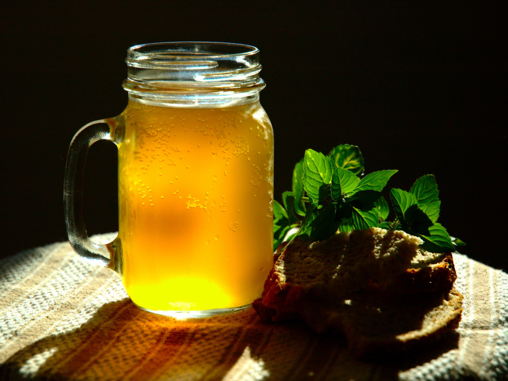

# Kvass Belarusian

*A bright, sour-sweet rye-bread fermented drink the colour of weak tea, with the bite of a sourdough crust and a soft natural fizz, the summer table-pour of every Belarusian village.*

**Serves:** about 2 litres

**Prep Time:** 20 minutes (plus 2 to 3 days fermenting)

**Cook Time:** 10 minutes

## Overview
Kvass is the everyday non-alcoholic (or barely alcoholic, 0.5 to 1.2 percent ABV) drink of the Belarusian-Russian-Ukrainian belt, made by fermenting dried dark rye bread with water, sugar and a starter of wild yeasts or commercial baker's yeast. The Belarusian version leans drier and rye-forward, less sweet than Russian shop kvass, with a deep crust character. The technique is village-kitchen simple: toast rye bread until almost black, steep in hot water overnight, strain the dark infusion, sweeten lightly, add yeast and raisins, let it ferment 2 days at room temperature, bottle, drink within 5 days. It is poured icy-cold over ice, often into earthenware mugs, served alongside cold okroshka soup (where it acts as both broth and beverage), drunk through a long Belarusian summer afternoon to cut the heat. Children drink it, grandfathers drink it, harvesters drink it from steel canisters in the fields.

## Ingredients

- 300 g dense dark rye bread (Borodinsky or proper sourdough rye)
- 2.5 litres water
- 100 g caster sugar
- 1/2 tsp instant baker's yeast (or 5 g fresh yeast)
- 20 raisins (the wild yeasts on the skins help the ferment along)
- 1 tbsp dark sultanas or a few mint leaves (optional, for a perfumed finish)

### Equipment
- A 3 litre glass jar or stoneware crock
- A clean cloth and a rubber band for cover
- A fine sieve and a muslin cloth for straining
- Glass bottles (sterilised) for storage

## Method

### Stage 1 - Toast the bread
1. Heat the oven to 180°C.
2. Tear the rye bread into rough 3 cm pieces.
3. Spread on a baking tray and toast 12 to 15 minutes, until very dark brown almost to black at the edges. The deeper the colour, the deeper the kvass.

### Stage 2 - Steep
1. Tip the toasted bread into a wide bowl or 3 litre jar.
2. Pour over 2.5 litres of just-boiled water.
3. Cover with a cloth and leave 8 to 12 hours (overnight) at room temperature.

### Stage 3 - Strain and sweeten
1. Pour the steeped liquid through a fine sieve lined with muslin into a clean jar. Press the bread to extract as much liquid as you can, then discard.
2. The liquid should be the colour of weak tea or strong coffee, slightly cloudy.
3. While still warm (around 30 to 35°C; warm but not hot), stir in the sugar until fully dissolved.

### Stage 4 - Ferment
1. Once the liquid is at room temperature (cooler than 30°C), sprinkle in the yeast and stir gently.
2. Drop in the raisins.
3. Cover with a cloth and a rubber band (CO2 needs to escape).
4. Leave at room temperature for 36 to 48 hours. The kvass will fizz quietly, the raisins may bob up and down, and the surface will develop a soft head.

### Stage 5 - Bottle
1. Taste the kvass after 36 hours. It should be sharp-sweet, lightly fizzy and smell yeasty.
2. Strain again through muslin into sterilised bottles, leaving 4 cm headspace.
3. Cap tightly and refrigerate 24 hours. The pressure builds in the bottle and the carbonation lifts.

### Stage 6 - Serve
1. Pour cold into glasses or earthenware mugs over a single ice cube.
2. A sprig of fresh mint or a long curl of lemon peel is welcome.

## Notes
- **Dark, toasted bread is everything.** Untoasted rye gives a pale, flat kvass. Toast to near-burnt at the edges; the bitter notes are what make it.
- **Watch the bottling pressure.** Kvass keeps fermenting in the bottle. After 24 hours in the fridge, open carefully over a sink the first time; if you leave it longer at room temperature, you may have a sticky kitchen.
- **Wild yeasts on raisins.** A handful of unwashed raisins carry their own yeast and add complexity to the ferment.
- **Drink young.** Belarusian kvass is at its best 1 to 5 days after bottling; beyond a week it turns vinegary.

## Variations
- **Mint kvass.** Add a small handful of fresh mint leaves at the bottling stage; perfumed and refreshing in high summer.
- **Honey kvass (myodovy kvas).** Replace half the sugar with light honey for a softer, floral version.
- **Beetroot kvass (svekol'ny kvas).** A different ferment entirely: raw beetroot, salt, water, fermented 5 days. Sharp and earthy, used as the broth for borscht more than as a drink.
- **Apple kvass.** Drop 200 g of sliced tart apple in with the bread at the steeping stage; an Orsha-region variant.

## Serving
Serve very cold from the fridge or with one ice cube · poured over okroshka cold-soup as broth · with a sprig of fresh mint · at the harvest table in jugs alongside salo and dark rye

## Storage
- Keeps 5 days in capped bottles in the fridge; lightly fizzy on day 2, sharper on day 5
- The carbonation builds; release the bottle pressure once daily by cracking the cap briefly
- Beyond a week, kvass turns vinegary and is better used in cooking (okroshka, beetroot soup) than drunk
- Do not freeze
