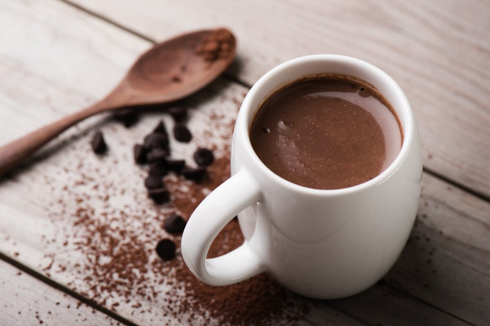

# Belgian Hot Chocolate (Chocolat Chaud Belge)

*Belgium's winter café ritual: real dark chocolate melted into hot whole milk with a slosh of cream and a pinch of salt, thick enough to coat a spoon: nothing like the powder-and-water versions sold abroad as "hot cocoa".*

**Serves:** 2

**Prep Time:** 5 minutes

**Cook Time:** 8 minutes

## Overview
Belgian hot chocolate is the country's chocolate tradition expressed as a drink: real chopped chocolate (not cocoa powder, not syrup, not pre-made mix) slowly melted into warm milk, with just enough cream to give body and just enough salt to lift the cocoa notes. Every Brussels, Bruges and Antwerp café serves a version; the higher-end pâtisseries make theatre of it, pouring warm milk at the table over a heaped spoonful of grated chocolate. Use Belgian couverture (Callebaut, Belcolade, Côte d'Or 70%): the same chocolate that goes into pralines and Liège waffles. The ratio is generous, about 1 part chopped chocolate to 4 parts milk by weight, much higher than supermarket hot chocolate powder. The result should be thick enough to coat the back of a spoon and leave a faint chocolate film on the cup wall. A pinch of fine sea salt sharpens the cocoa; a small slosh of single cream gives weight. Served in small handled mugs with a speculoos biscuit on the saucer.

## Ingredients

### Per serving (multiply for more)
- 50 g good Belgian dark couverture chocolate, finely chopped (Callebaut 70%, Côte d'Or 70%, Belcolade Noir Pure, or Marcolini Noir 70%)
- 200 ml whole milk
- 30 ml single cream (or extra whole milk for a lighter version)
- 1 teaspoon caster sugar (optional; a 70% chocolate may need a touch, a 60% probably doesn't)
- A small pinch of fine sea salt
- A tiny pinch of ground cinnamon (optional; some Brussels cafés add this, some don't)
- 1/4 teaspoon vanilla extract (optional)

### To finish
- A scant teaspoon of unsweetened cocoa powder, sieved over the top
- A small dollop of whipped cream (Chantilly; optional)
- Grated chocolate or a few chocolate shavings on top (optional)

### To serve alongside
- A small speculoos biscuit balanced on the saucer (the traditional Belgian café pairing)
- A teaspoon for stirring as the chocolate continues to dissolve
- A glass of cold still water on the side (some cafés serve this)

## Method

### Stage 1 - Chop the chocolate
1. Finely chop the chocolate with a heavy chef's knife. The smaller the pieces, the faster they melt.
2. Set aside in a small bowl.

### Stage 2 - Warm the milk and cream
1. Combine the milk and cream in a small heavy saucepan.
2. Warm over medium-low heat 3-4 minutes till you see steam rising and small bubbles at the edge, around 70-80°C.
3. Don't let it boil. Boiling milk scorches the chocolate and creates a skin.

### Stage 3 - Melt the chocolate in
1. Reduce the heat to its lowest setting.
2. Add the chopped chocolate to the warm milk in 3 batches, whisking constantly after each addition.
3. After the last batch is in, whisk steadily for 1-2 minutes till the mixture is smooth, glossy and uniformly dark.
4. Add the pinch of salt, the optional sugar, cinnamon and vanilla.
5. Taste, the drink should be intensely chocolaty, just barely sweet (the chocolate's natural sweetness leads; added sugar should round, not dominate), with the salt audible but not loud.
6. Adjust sweetness if needed.

### Stage 4 - The "Belgian whisk" for texture
1. With the pan still on the lowest heat, whisk vigorously for 30 seconds to incorporate a little air, this gives the drink a slightly mousse-like texture and a soft foam on top.
2. Some Brussels cafés use a small immersion blender for 5 seconds instead, excellent texture, but the whisk is the traditional way.

### Stage 5 - Pour and serve
1. Pour into 2 warmed small mugs (150-200 ml each).
2. Sieve a scant teaspoon of cocoa powder over the surface of each.
3. Add (optional) a small dollop of whipped Chantilly cream on the side or in the middle.
4. Grate a few chocolate shavings on top if you have the spare chocolate.
5. Place a speculoos biscuit on the saucer.
6. Serve immediately while hot.

## Notes
- **Chocolate quality is everything:** this drink lives or dies by the chocolate. A good 70% couverture (Callebaut, Belcolade, Côte d'Or, Marcolini) is non-negotiable. Cooking chocolate or cocoa-powder-based "hot chocolate mix" gives a watery, thin result.
- **Don't boil:** scorched milk ruins the flavour and the texture.
- **Whisk constantly:** the chocolate-milk emulsion can split if you stop. Steady agitation gives a smooth glossy drink.
- **Cream is optional but helps:** the single cream gives body. Without it, the drink can taste a touch thin. Don't go past double cream, it overwhelms.
- **Sugar is restrained:** Belgian hot chocolate is meant to taste of chocolate, not sweetness. A teaspoon is plenty for 70% chocolate; 60% needs less.
- **The biscuit on the saucer:** speculoos is traditional. A small piece of dark chocolate also works, as does a single Belgian praline.

## Variations
- **Chocolat chaud à l'orange:** add the grated zest of 1/2 an orange to the milk while heating, infuses the milk with bitter-orange notes; strain before adding chocolate. The Christmas-market variant.
- **Chocolat chaud à la cannelle:** double the cinnamon and add a star anise to the milk while warming, the winter-market variant.
- **Marshmallow Belgian hot chocolate:** top with 2 mini-marshmallows; modern variant, less traditional.
- **White Belgian hot chocolate:** swap the dark chocolate for Callebaut White 28% and add a teaspoon of vanilla bean paste; serve with a raspberry on top, elegant variant.
- **Spicy Mexican-Belgian hybrid:** add 1/4 teaspoon of grated chilli (Mexican / Espelette / Aleppo) and 1/4 teaspoon ground cardamom to the milk, the cocktail-bar variant.
- **Boozy Belgian hot chocolate:** add 30 ml of Cointreau, Cognac, or Belgian genever per cup just before serving, the after-dinner-drink variant.
- **Iced Belgian hot chocolate (chocolat chaud glacé):** prepare as above, let cool, blend with crushed ice and a scoop of vanilla ice cream, the summer variant; closer to a Café liégeois (see [Café liégeois](cafe-liegeois.md)).

## Serving
- At a Brussels chocolatier-café (the traditional setting; Mary on the Rue Royale, Pierre Marcolini in the Sablon district, Wittamer on the Place du Grand-Sablon) · at a Bruges Christmas market on a cold December afternoon · at an Antwerp tea-room mid-morning · at home as a winter Sunday-afternoon ritual · paired with a buttery speculoos or a hand-made praline · as the traditional post-skating drink in the Ardennes.

## Storage
- Doesn't store well, the chocolate-milk emulsion separates within an hour. Make and drink fresh.
- Leftover hot chocolate can be refrigerated 2 days; reheat gently on the stovetop with a brief whisk to re-emulsify. Some texture is lost.
- Freezing breaks the emulsion irreversibly; don't.
- The cold leftover poured over a scoop of vanilla ice cream becomes a passable instant café liégeois.
- The dry components (chopped chocolate, cocoa powder) keep in the pantry indefinitely; pre-portion 50 g sachets for a quick weeknight version.
