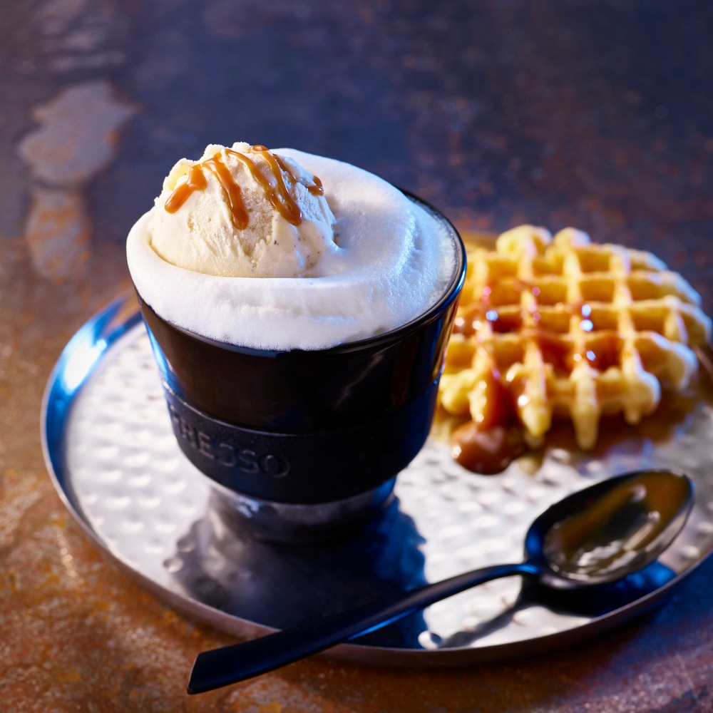

# Café Liégeois

*Liège's iced-coffee dessert-drink: cold espresso poured over two scoops of vanilla ice cream and topped with Chantilly cream and cocoa powder: halfway between a coffee and a sundae.*

**Serves:** 2

**Prep Time:** 10 minutes

**Cook Time:** None (assembly only)

## Overview
The café liégeois is the Belgian classic café dessert-drink: strong cold coffee poured over vanilla ice cream and crowned with whipped cream. It sits in the same family as the Italian affogato (which uses hot espresso poured at the table) but with the coffee chilled first so the ice cream doesn't melt too fast. The components matter: strong cold espresso (not weak filter coffee), two generous scoops of good vanilla bean ice cream per glass, and a soft mound of Chantilly cream: lightly sweetened, less sweet than American whipped cream (Belgian Chantilly is typically just cream and a tablespoon of icing sugar per 250 ml). A dusting of cocoa powder or chocolate shavings finishes it. Eat with a long iced-tea spoon and sipped with a straw between bites. The historical detail: the drink was called "café viennois" until 1914, when the German invasion of Belgium and particularly the bombardment of Liège made anything Viennese unpopular, and Belgian menus renamed it to honour the city's resistance.

## Ingredients

### Per serving (multiply for more)
- 60 ml strong espresso, cooled to room temperature (or chilled if you can spare 30 minutes)
- 2 generous scoops good vanilla bean ice cream (Häagen-Dazs vanilla, Carte d'Or vanilla, or a local artisan version)
- 1 teaspoon caster sugar (optional; depends on how sweet the ice cream is)
- 60 ml lightly whipped Chantilly cream (recipe below)
- A dusting of unsweetened cocoa powder OR a few chocolate shavings (Belgian dark, ideally)

### The Chantilly cream (makes enough for 4 servings)
- 200 ml double cream (very cold)
- 1 tablespoon icing sugar
- 1/2 teaspoon vanilla extract

### Glassware
- A tall, slightly waisted dessert glass or sundae glass (about 250-300 ml capacity): the classic French-Belgian "verre à café liégeois" shape

### To serve alongside
- A long iced-tea spoon (for the ice cream and cream)
- A short paper straw (for the coffee at the bottom)
- A small speculoos biscuit on the saucer (optional, very Belgian)

## Method

### Stage 1 - Brew and cool the coffee
1. Brew 60 ml of strong espresso per serving (the modern Belgian café uses an espresso machine; for home, a Moka pot works perfectly).
2. Let the espresso cool to room temperature, about 15-20 minutes.
3. If you can spare the time, refrigerate it for another 15 minutes, colder coffee gives you longer before the ice cream melts.
4. Don't add sugar at this stage if your ice cream is already sweet; the optional teaspoon goes in after a taste-test at the end.

### Stage 2 - Make the Chantilly cream
1. Place the cold double cream in a chilled bowl.
2. Whisk by hand (or use an electric beater on medium) till the cream just starts to thicken.
3. Add the icing sugar and vanilla extract.
4. Continue whisking till you reach SOFT peaks, the cream holds its shape briefly when the whisk is lifted but the peak tips slump softly back. Don't whip to stiff peaks; the Chantilly should slump slightly into the coffee, not stand rigid.
5. Refrigerate till assembly.

### Stage 3 - Assemble
1. Take 2 tall dessert glasses from the freezer (chilling them helps).
2. Place 2 generous scoops of vanilla ice cream in each glass.
3. Pour the cold coffee slowly down the side of each glass, letting it pool around the base of the ice cream. About 60 ml per glass.
4. Don't pour over the ice cream from above; you want the coffee at the bottom and the ice cream floating on top.

### Stage 4 - The Chantilly crown
1. Spoon (or pipe with a star tip) a generous mound of Chantilly cream on top of the ice cream.
2. The Chantilly should sit proud above the rim of the glass, soft and slightly slumping.
3. Dust the top with sieved cocoa powder, or scatter a few chocolate shavings.

### Stage 5 - Serve immediately
1. Serve with a long iced-tea spoon planted in the cream.
2. Add a short paper straw at the back of the glass (the straw is for the coffee at the bottom).
3. Place a speculoos biscuit on the saucer (optional but traditional).

### Stage 6 - The eating ritual
1. The diner spoons the Chantilly and ice cream from the top.
2. As the ice cream melts into the coffee at the bottom, the drink becomes a creamy iced coffee.
3. The straw goes in to sip the melted-coffee-cream mixture between spoonfuls.
4. Finish in 5-10 minutes, much longer and the ice cream is gone.

## Notes
- **Cold coffee is essential:** hot coffee melts the ice cream within 30 seconds and you've made a melted mess. Always cool.
- **Ice cream quality matters:** budget ice cream gives a thin, icy drink. A good vanilla bean (Häagen-Dazs, Carte d'Or, or local artisan) gives the proper creamy body.
- **Chantilly to soft peaks only:** stiff Chantilly sits like a brick on top; soft Chantilly slumps gently into the coffee and becomes part of the drink as you eat.
- **Don't over-sweeten:** Belgian café liégeois isn't an American milkshake. The vanilla ice cream provides the sweetness; the Chantilly has a touch of icing sugar; the coffee provides the bitter counterpoint. That balance is what defines it.
- **Glass shape matters:** a wide-rimmed dessert glass channels the aromas; a tall narrow flute (or worse, a coffee cup) makes the proportions look wrong.
- **Speculoos on the saucer:** the traditional pairing. A small piece of Belgian dark chocolate also works.

## Variations
- **Café liégeois au chocolat:** swap one of the two vanilla ice cream scoops for a scoop of good chocolate ice cream, richer, more dessert-like.
- **Café liégeois with whisky or Cognac:** add 15 ml of Irish whisky, Cognac, or Belgian genever to the cold coffee before assembling, the boozy adult variant.
- **Chocolat liégeois (Belgian variant):** swap the cold coffee for cold Belgian hot chocolate (see [Belgian hot chocolate](belgian-hot-chocolate.md)): chocolate ice cream + cold hot chocolate + Chantilly; entirely chocolate.
- **Café liégeois with a brandy snap:** stand a brandy snap biscuit up in the cream for a textural counter-point, the modern Brussels tea-room variant.
- **Iced coffee float (American style):** the simpler American version, cold coffee poured into a glass with a scoop of vanilla ice cream and no Chantilly. Less drink, more snack.
- **Affogato (Italian):** the Italian cousin, one scoop of vanilla ice cream in a small cup, HOT espresso poured over at table. Drier, more bracing than the Belgian.
- **Café liégeois without ice cream (just iced coffee):** purists would object, but a cold espresso poured over crushed ice with a slosh of cream is what some Belgian cafés sell as "café liégeois léger", the lighter version.
- **Dairy-free version:** swap the dairy ice cream for a coconut-milk or oat-milk vanilla ice cream; the cream for whipped coconut cream.

## Serving
- At a Liège tea-room or a Brussels café (the traditional setting) · at a Belgian summer terrace on a warm afternoon · as a Belgian dessert course after a heavy lunch · in the second half of a long Belgian Sunday brunch · at home as a treat-yourself drink-dessert · paired with a small speculoos or a hand-made Belgian praline.

## Storage
- Doesn't store, assemble and eat. The ice cream and Chantilly start melting from minute one.
- The Chantilly cream keeps refrigerated 2-3 hours; re-whisk briefly before using if it has loosened.
- The brewed coffee keeps refrigerated 24 hours; bring to room temperature or use straight from the fridge for the assembly.
- Don't freeze the assembled drink, the ice cream blends into the coffee on thaw and you have a flat coffee slurry.
- The components (coffee in a thermos, ice cream in the freezer, cream cold and not yet whipped) can be ready in advance for fast assembly.
