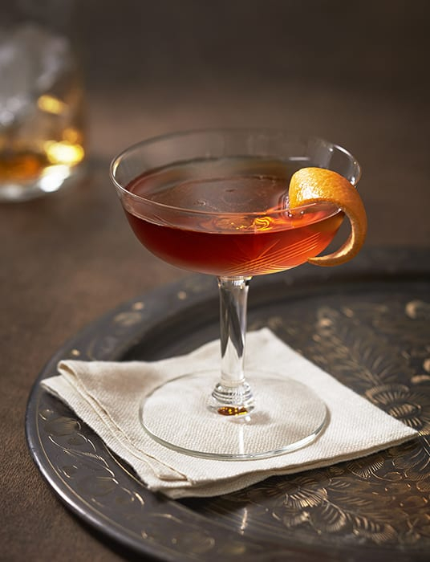

# Genever (Dutch-Belgian Malt Wine Spirit)

*Belgium and the Netherlands' shared juniper-flavoured grain spirit, and the historical ancestor of all modern gin. Brewed from a malt-wine base (a mash of rye, barley and wheat distilled to a low-strength malty spirit), then redistilled with juniper berries, and either bottled straight (jonge genever, "young") or aged in oak (oude genever, "old", golden and rounded). Drunk at room temperature in a slim tulip glass, often served alongside a small beer (a "kopstootje"). Belgium has 5 protected denominations of origin including Hasselt and Liege; the Dutch capital of genever production is the polder-flat town of Schiedam.*

**Serves:** 1 (per serving)

**Prep Time:** 2 minutes

**Cook Time:** None

## Overview
Genever (also spelled jenever; Dutch: jenever) is the original juniper-flavoured spirit and the direct ancestor of London dry gin. It's produced in Belgium and the Netherlands (with smaller traditions in northern France and parts of Germany), and protected by EU geographical indication: only spirits made in Belgium, the Netherlands, northern France or two German regions can call themselves genever. The construction differs from English gin in three important ways. First, the base spirit: gin starts from a neutral grain spirit (vodka-like, flavourless); genever starts from a "malt wine" - a low-strength (around 50% ABV) distillate of malted rye, barley and wheat, which keeps a distinct malty, slightly bread-like flavour. The malt wine is the heart of the spirit; younger genevers contain higher proportions of malt wine and read more like a malty whiskey-grain spirit; cleaner genevers are mostly neutral grain. Second, the redistillation with botanicals: traditionally juniper and a small handful of other botanicals (coriander, fennel, anise, angelica root); modern genevers add a wider range. Third, the optional barrel aging: oude genever ("old") spends time in oak (often used wine or sherry casks) and emerges golden, rounded, and more complex - somewhere between gin and a young whiskey. The classic Belgian-Dutch service: a slim "tulpglas" (tulip glass) filled to the brim with cold genever, the glass resting on a small saucer; the drinker bends down to take the first sip from the rim without lifting the glass (so as not to spill the brimful), then sits up and continues. Often paired with a small beer (a Belgian "kopstootje" - "little head-bump") for a contrast of sharp spirit and refreshing brew. Three details: SERVE AT ROOM TEMPERATURE (not cold; chilling shuts down the malt and juniper notes), DON'T MIX (genever is a sipping spirit, not a cocktail mixer; using it in a G&T misses the point), and PAIR WITH A SMALL BEER (the kopstootje is the canonical Belgian service - one shot of genever, one half-pint of pale lager, alternating sips).

## Ingredients

### Per serving
- 40 ml good Belgian or Dutch genever:
  - **Filliers Oude Graanjenever** (Belgian, 5-year aged; complex, rounded)
  - **Hasselt Oude Jenever** (Belgian, AOC-protected from Hasselt)
  - **Bols Corenwyn** (Dutch, 100% malt wine; archetypal old-style)
  - **De Kuyper Jonge Jenever** (Dutch, young, fresh, gin-like)
  - **Olifant** (Dutch, popular café standard)
  - **Bokma Oude Jenever** (Dutch, classic style)
  - **Diep 9** (Belgian craft producer)

### Glassware
- A "tulpglas" (tulip glass; slim conical with a short stem and flared rim) - 30-50 ml capacity
- OR a small whisky tumbler as a fallback

### The kopstootje accompaniment (optional but canonical)
- 1 × 250 ml glass of cold Belgian pale lager (Stella Artois, Jupiler, Maes) OR Dutch lager (Amstel, Heineken)

### Garnish (modern; not traditional)
- A small twist of lemon peel (modern Brussels variant)
- A grind of fresh black pepper on the surface (modern Antwerp variant)

## Method

### Stage 1 - Bring to room temperature
1. Genever should be served at room temperature (18-20°C). Don't refrigerate - the malt and juniper notes shut down when cold.
2. If you live in a hot climate, a 10-minute fridge cool is acceptable; below 10°C is not.

### Stage 2 - Prepare the glass
1. Use a clean dry tulip glass.
2. Place the empty glass on a small saucer (the traditional Belgian-Dutch service rests the glass on a saucer).
3. The tulpglas's flared rim is engineered to channel the aroma upward.

### Stage 3 - The fill
1. Pour the genever into the glass right to the brim - traditional Belgian-Dutch fill is so high the meniscus rises slightly above the rim.
2. The drinker is expected to bend down for the first sip (so as not to spill the brimful glass).

### Stage 4 - The first sip (the Belgian-Dutch tradition)
1. Without lifting the glass from the saucer, bend down so your face is level with the glass.
2. Take a small sip from the rim - just enough to lower the level so you can pick the glass up safely.
3. Then sit up and continue normally.

### Stage 5 - The kopstootje (optional)
1. If serving with a beer, the beer is poured into a small glass alongside.
2. The drinker alternates between sips: a small sip of genever (sharp, malty, juniper-forward), then a sip of beer (refreshing, light), then back to the genever.
3. The contrast is the entire point - genever's intensity vs the beer's quenching lightness.

### Stage 6 - The full service
1. Serve unhurried. A small portion of dry biscuit or a square of mild cheese alongside.
2. Genever is a slow-sipping spirit, contemplated like a good single-malt whisky.

## Notes
- **Room temperature:** genever's malt-wine base shows its character at 18-22°C. Below 10°C the malt notes vanish.
- **Tulip glass shape matters:** the flared rim channels the juniper-and-malt aroma upward to the nose. A whisky tumbler is acceptable but less aromatic.
- **Bend-down-first-sip is the canonical Belgian-Dutch ritual:** it's a small social marker that you know how to drink genever properly.
- **Don't mix:** genever is too distinctive to disappear into a cocktail (with a few exceptions; see Variations). Treat it like an aged whisky.
- **Young vs old:** jonge genever (young) is cleaner, sharper, more gin-like; oude genever (old) is rounder, maltier, golden from oak. Old is harder to find outside the Low Countries; both are worth tasting.
- **The kopstootje is sociable:** the canonical Belgian café order. Don't drink it fast.

## Variations
**Kopstootje (the canonical Belgian-Dutch pairing):** 40 ml genever + 250 ml cold pale lager, alternating sips.
**Genever with a slice of cucumber:** modern Antwerp variant; a slice of cucumber on the rim, like a contemporary gin garnish.
**Genever on the rocks (modern):** strictly speaking, not traditional - but many modern Belgian bars serve oude genever over ice with a twist of orange peel.
**Genever cocktail - "the Dutchman":** 40 ml jonge genever + 20 ml lime juice + 10 ml sugar syrup, shaken with ice, strained into a coupe - a riff on the daiquiri.
**Genever Negroni:** swap the gin in a Negroni for jonge genever - a maltier, rounder take on the classic.
**Hot genever (winter; wintergenever):** warm 60 ml genever with 1 teaspoon honey and a strip of orange peel; serve in a small heated glass - the Flemish winter warmer.
**Genever ice cream:** 50 ml jonge genever stirred into 500 ml of softened vanilla ice cream and refrozen - the modern Belgian dessert.

## Serving
At a Belgian café in Antwerp, Brussels, Ghent or Liège (the canonical setting) · at a Hasselt distillery tasting room · at a Dutch koffiehuis at midday · with a small beer for the kopstootje · at a Belgian Christmas-market food stall · at home in the late afternoon, before dinner · paired with strong cheese, dry biscuits, or a small Belgian filet américain canapé.

## Storage
- Genever keeps indefinitely sealed in the bottle. Don't worry about expiration.
- Once opened, drink within 12 months for the best flavour (the oxygen slowly changes the malt notes).
- Store upright in a cool dark place (not in direct sunlight; not next to a hot stove).
- Don't refrigerate the bottle - room-temperature storage maintains the flavour profile.
- Old genever (5+ year aged in oak) develops further complexity in the bottle if stored well; it can be cellared like a fine whisky.
