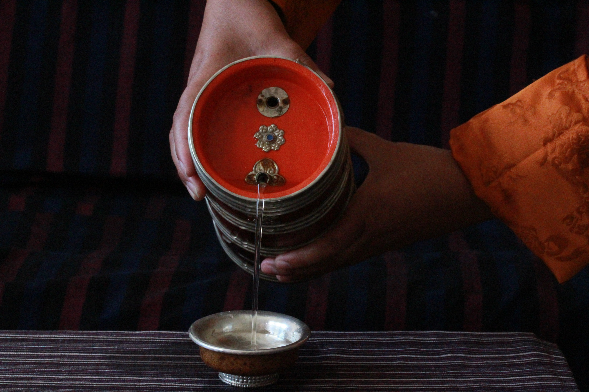

# Ara (Bhutanese Home Liquor)

*The traditional Bhutanese spirit: distilled from fermented rice, maize, wheat or barley in copper stills at home in eastern villages, served warm in small glasses, sometimes with an egg dropped in for the cold-weather variant. Strong, slightly sweet, the drink offered at every Bhutanese celebration.*

**Serves:** 6 small glasses (assumes pre-distilled ara is bought; this recipe is the serving preparation, not the distillation)

**Prep Time:** 2 minutes

**Cook Time:** 4 minutes

## Overview
Ara is Bhutan's home-distilled spirit, produced legally for personal use in rural eastern Bhutan (Trashigang and Mongar districts especially) from fermented grain mash. Rice, maize, wheat or millet is cooked, mixed with a yeast-and-mould starter (phab), fermented for several days, then distilled in small copper stills sitting over wood fires. The result is a clear or slightly cloudy spirit of 20-40% ABV depending on the household. Distillation is technically restricted to small-scale rural production, and ara is consumed at home and at all major Bhutanese ceremonies. The traditional preparation isn't to drink it neat: ara is gently warmed in a small kettle, sometimes with butter and an egg dropped in for the cold-mountain variant (ara-tongba), and served in small wooden or metal cups. This recipe covers the warming and serving, since distillation requires specialist equipment and is regulated.

## Ingredients

- 500 ml ara (Bhutanese rice or maize spirit; brought back from Bhutan, or sold at Bhutanese restaurants abroad, or a strong rice-based spirit like Korean soju or shochu as a substitute at higher ABV)
- 2 tablespoons unsalted butter (for the buttered version)
- 2 eggs (for the celebratory ara-tongba version)
- A pinch of salt

### To serve
- 6 small wooden or metal cups (or shot glasses)
- Optional: 6 ezay (chilli dip) or zaw (puffed rice) as the chaser

## Method

### Stage 1 - Warm gently
1. Pour the ara into a small metal saucepan or a Bhutanese ara-kettle.
1. Warm over low heat until just steaming (about 50°C). Don't boil — boiling drives off the alcohol you're trying to drink.

### Stage 2 - Standard serve
1. For the plain warm version, pour the warmed ara into the cups; serve immediately.

### Stage 3 - Buttered serve (optional)
1. Stir 2 tablespoons of butter into the warmed ara until melted. The butter floats as a thin layer on top.
1. Add a pinch of salt and stir.
1. Pour into cups.

### Stage 4 - Ara-tongba (festive serve, optional)
1. In a small pan, lightly beat 2 eggs.
1. Warm the ara, then pour over the beaten eggs while whisking; the heat lightly cooks the egg into thin ribbons in the spirit. Don't let it scramble — keep whisking.
1. Serve immediately in cups.

## Notes
- **Don't boil.** Above 78°C alcohol vaporises. Keep the warming to just-steaming.
- **The buttered version is warming.** A small amount of butter (and the salt) makes ara into a body-warming drink for cold Bhutanese winters; common in eastern hill villages.
- **The egg version is celebratory.** Ara-tongba (or wai-rip-sum) is served at weddings, harvest festivals and the Bhutanese new year (Losar).
- **Substitutes.** If you can't get real ara, a strong Asian rice spirit (Korean soju at 40%, Japanese shochu, or Chinese baijiu) approximates the warming behaviour. Vodka is too sharp and "European-distilled" tasting.

## Variations
- **With ginger.** Add a 2 cm piece of fresh ginger to the warming pan; faintly spicy variant for winter.
- **Honey ara.** Stir in 1 teaspoon of honey per cup; sweetening for guests who find ara too sharp.
- **Cold ara.** Less traditional but exists; served over ice with a wedge of lime in modern Thimphu bars.

## Storage
- Sealed ara keeps indefinitely at room temperature. Once opened, the spirit holds 6+ months.
- Warmed ara doesn't store; serve immediately.
