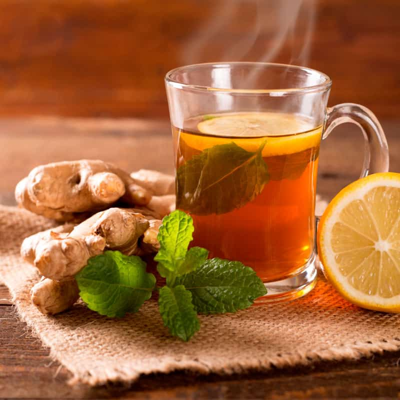

# Bhutanese Ginger Tea

*The Bhutanese household remedy-drink: fresh ginger simmered hard in water with honey and a squeeze of lemon, served hot in small glass cups. The cure for cold mornings, sore throats, mountain altitude headaches, and just-because-it-tastes-good moments.*

**Serves:** 4 small cups

**Prep Time:** 3 minutes

**Cook Time:** 12 minutes

## Overview
Bhutanese ginger tea (called dralo in some regions) is the household drink at any sign of a cold, a long day in the mountains, or a guest arriving in cold weather. The build is dead simple: fresh ginger root sliced thick (skin on for extra warmth and flavour), simmered hard in water for 10 minutes to extract every drop of the ginger oils, sweetened with local honey rather than sugar, finished with a squeeze of fresh lemon for brightness. Bhutanese households add a small piece of cinnamon or a few cardamom pods in winter; some western Bhutanese versions include a tiny pinch of black pepper for extra warmth. The result is a clear pale-amber liquid with a strong ginger kick, sweet floral notes from the honey, and a bright lift from the lemon. Drink it slowly in small glass cups; the warmth spreads through the body within minutes. Often the first thing offered to visitors at high-altitude villages where the cold cuts deep.

## Ingredients

- 60 g fresh ginger root, sliced thick (skin on; about 8-10 thick slices)
- 800 ml water
- 4 tablespoons honey (local mountain honey is the Bhutanese choice; any good honey works)
- Juice of 1 lemon
- 1 small piece of cinnamon stick (optional, winter)
- 4 cardamom pods, lightly crushed (optional, winter)
- A small pinch of black pepper (optional, western Bhutanese style)

### To serve
- 4 small heatproof glass cups

## Method

### Stage 1 - Simmer
1. Put the ginger slices, water, and any optional spices (cinnamon, cardamom, pepper) into a small saucepan.
1. Bring to a hard rolling boil for 2 minutes — this gets the ginger oils released quickly.
1. Reduce to a strong simmer for 10 minutes. The water turns a pale amber and the kitchen smells distinctly of ginger.

### Stage 2 - Sweeten
1. Off the heat, stir in the honey until completely dissolved. Don't add honey while boiling — high heat damages the honey's delicate aromatics.
1. Squeeze in the lemon juice. The amber colour brightens slightly.

### Stage 3 - Strain and serve
1. Strain through a fine sieve into the cups.
1. Serve hot, ideally with a small biscuit or a piece of dried fruit on the side.

## Notes
- **Skin-on ginger.** The skin holds flavour and gets strained out anyway. Don't bother peeling.
- **Hard boil then simmer.** The initial hard boil extracts the warming compounds; the simmer extracts the flavour. Both matter.
- **Honey at the end, not during boiling.** Honey loses its complex aromatics when boiled. Add off the heat once the brew is no longer at full boil.
- **Strong by default.** Bhutanese ginger tea is properly punchy — 60 g of ginger to 800 ml of water is the right ratio. Lighter brews taste like ginger-flavoured water.

## Variations
- **With turmeric.** Add a 2 cm piece of fresh turmeric (sliced, skin on) to the simmer. Deepens the colour to golden, adds earthy warmth. Common as a wellness tea.
- **With cloves.** Add 4 whole cloves to the simmer for a more aromatic version.
- **Without lemon.** Some prefer pure ginger and honey without the citrus brightness.
- **Iced.** Brew double-strength, sweeten, chill, serve over ice with extra lemon. Modern Thimphu summer-café variant.

## Storage
- Brewed ginger tea keeps 2 days in the fridge sealed; the ginger sharpness fades after 48 hours. Reheat gently before serving.
- Best brewed fresh — the kettle goes on, the cup goes out, that's the rhythm.
