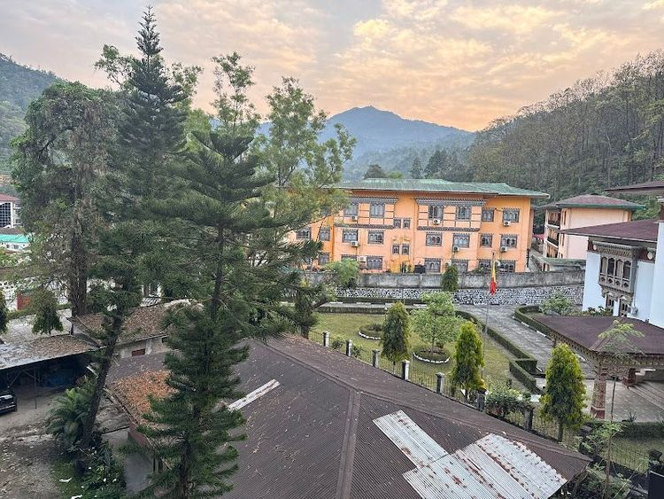

# Drinks of Bhutan

Suja (butter tea churned with yak butter and salt) for the mountain cold, ara (the local rice or millet spirit), thumba (fermented millet drunk through a bamboo straw), and milk tea brewed strong for visitors.
