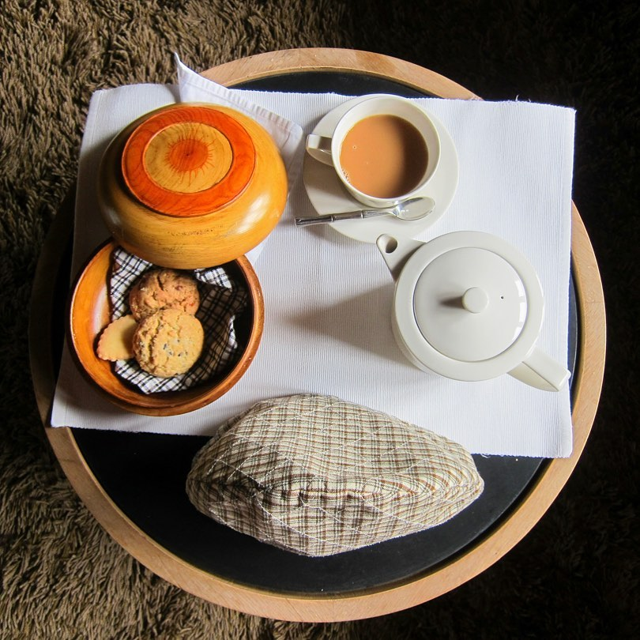

# Ngaja (Bhutanese Sweet Milk Tea)

*Bhutan's everyday sweet tea: strong black tea boiled hard with milk, sugar and cardamom, sometimes a touch of ginger or cinnamon, served in glass cups at breakfast and as the welcome drink at every Bhutanese home.*

**Serves:** 4 cups

**Prep Time:** 2 minutes

**Cook Time:** 8 minutes

## Overview
Where suja (the famous Bhutanese butter tea) is the daily mountain drink for hard work, ngaja is the lowland-friendly sweet alternative: strong black tea, hot milk, sugar, and gentle spice. Bhutanese households serve ngaja to guests at any hour, alongside small biscuits or zaw (puffed rice). The brew is closer to Indian masala chai than to Tibetan butter tea, reflecting Bhutan's southern Indian-Bhutanese cultural overlap, but the spice mix is gentler than Indian chai - usually just cardamom, sometimes a tiny piece of cinnamon or fresh ginger for cold mornings. The drink is properly sweet, sometimes very sweet, by Bhutanese standards.

## Ingredients

- 4 teaspoons strong black tea (Assam, or any robust black tea)
- 600 ml water
- 400 ml whole milk
- 4 cardamom pods, lightly crushed
- 1 small piece of fresh ginger, sliced (optional, for warmth)
- A small piece of cinnamon stick (optional)
- 4 to 6 teaspoons sugar, to taste

## Method

### Stage 1 - Brew
1. Bring the water, tea, cardamom (and ginger / cinnamon if using) to the boil in a saucepan.
1. Reduce to a hard simmer for 3 minutes.

### Stage 2 - Add milk and sugar
1. Pour in the milk and add the sugar. Stir and bring back to a gentle simmer.
1. Simmer 3 minutes more; don't let it boil hard or the milk scorches.

### Stage 3 - Strain and serve
1. Strain through a fine sieve into small glass cups.
1. Serve hot, with a biscuit or a small bowl of zaw on the side.

## Notes
- **Sweet by default.** Bhutanese ngaja is properly sweet; start at 5 teaspoons and adjust down if too much.
- **Whole milk only.** Skim makes a thin, sad tea.
- **Cardamom is the signature.** Don't skip even if you skip the ginger or cinnamon.

## Variations
- **Without spice.** Plain milk-tea ngaja - tea, milk, sugar. The simpler everyday version.
- **With Tibetan touch.** Add a tiny pinch of salt to the brew alongside the sugar; common in Eastern Bhutan near the Tibetan border.

## Storage
- Doesn't store. Brew fresh.
