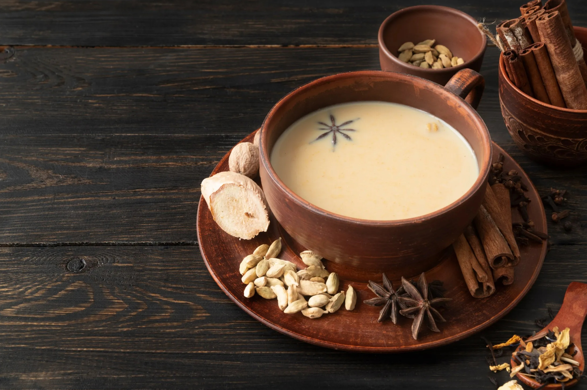

# Suja

*Bhutanese butter tea: strong black or compressed pu-erh-style tea, churned with yak butter and salt into a savoury, calorie-dense Himalayan drink.*

**Serves:** 4

**Prep Time:** 5 minutes

**Cook Time:** 15 minutes

## Overview
Suja (also called po cha in Tibet) is the Himalayan butter tea: strong-brewed black or compressed dark tea, simmered hard, then churned in a wooden cylinder (chandong) with yak butter and salt to emulsify into a savoury, calorie-dense drink that's closer to a thin soup than a Western cup of tea. The salt and the fat are not optional: at 3000m altitude in the cold of a Bhutanese winter, the drink delivers sustained energy and electrolytes the way no sugary drink can. Substitute regular unsalted butter for yak butter outside the Himalayas (you'll lose some of the gamey funk that defines the original, but the body holds up). Served in small bowls with a saucer of zaow (puffed rice) to crunch as you sip.

## Ingredients

- 1 litre cold water
- 2 tablespoons compressed pu-erh tea, or 3 tablespoons strong black loose-leaf tea
- 50 g yak butter (or unsalted regular butter; or a mix with ghee)
- 1 teaspoon fine salt (or to taste)

### To serve
- Small bowls or handleless cups
- A saucer of zaow (Tibetan puffed rice; or substitute puffed barley/rice)

## Method

### Stage 1 - Brew strong
1. Bring the water to a boil; add the tea. Reduce to a simmer and cook hard for 10 to 12 minutes until the water is very dark.
1. Strain through a fine sieve into a saucepan; discard the leaves.

### Stage 2 - Churn with butter
1. Add the butter and salt to the hot tea.
1. Either pour into a blender and blitz for 30 to 45 seconds, OR whisk vigorously with a balloon whisk for 90 seconds; the goal is emulsification: the butter shouldn't sit on top, it should be uniformly distributed.
1. The tea will turn a milky, slightly grainy red-brown and smell richly savoury.

### Stage 3 - Serve
1. Pour into small bowls or cups; the drink should be hot enough to steam.
1. Serve with a saucer of puffed rice or barley on the side.

## Notes
- **Salt, not sugar.** This is a savoury drink in the Himalayan tradition; sugaring it kills the point.
- **Emulsify hard.** Butter on top of tea is just sad; whisk or blend until the drink is uniformly creamy.

## Storage
- Drink within an hour; the butter separates as the tea cools.
