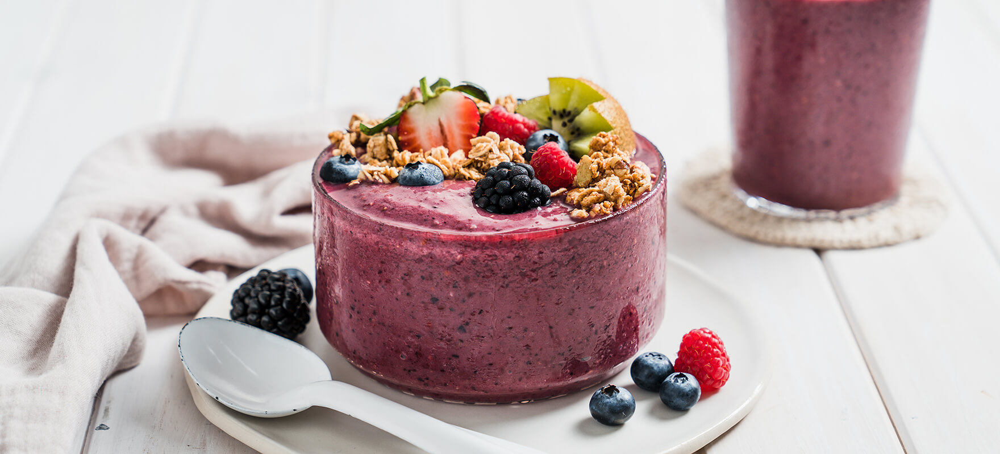

# Açaí Bowl Drink

*Brazil's purple smoothie bowl: frozen Amazonian açaí pulp blended with banana into a thick slushy purple cream, topped with granola, banana, strawberries and condensed milk.*

**Serves:** 2 large bowls

**Prep Time:** 5 minutes

**Cook Time:** None (blender-only)

## Overview
The açaí bowl is Brazil's most successfully exported food of the 2010s, and the traditional beach food of Rio de Janeiro, post-workout snack at Brazilian gyms and breakfast at every fitness-Brazilian café in São Paulo. Açaí (pronounced "ah-sigh-EE") is a small dark-purple berry from the açaí palm tree (Euterpe oleracea), native to the Amazon basin: particularly the state of Pará in northern Brazil where it's been a staple of indigenous diets for centuries. The berries are pulped and the pulp frozen for distribution; commercial açaí sells worldwide as frozen pulp packets (typically 100 g, sometimes flavoured with guaraná syrup) or freeze-dried powder. Blended with banana and a splash of liquid (water, milk or coconut water) into a thick semi-frozen purple cream the consistency of soft-serve. Poured into a chilled bowl and topped generously with granola, sliced banana, strawberries, honey or condensed milk (the traditional Brazilian sweetener), shredded coconut and sometimes chia seeds or kiwi.

## Ingredients

### Açaí base (for 2 bowls)
- 200 g frozen açaí pulp (2 standard 100g sachets; brand: Sambazon, Naked, Pitanga; available at health-food shops, large supermarkets, and online)
- 2 ripe bananas (frozen for best texture; otherwise fresh)
- 50-100 ml water OR cold coconut water OR cold whole milk (start with less; add if too thick)
- 2 teaspoons guaraná syrup (or honey, or maple syrup)
- 1 teaspoon vanilla extract (optional)

### Toppings (the half-the-dish element)
- 100 g good granola or muesli (Cape Crunch-style is good; or any nut-and-oat granola)
- 1 fresh banana (sliced into rounds)
- 6 fresh strawberries (sliced)
- 3 tablespoons shredded coconut (toasted or untoasted)
- 3 tablespoons of sweet sauce drizzle (any of: condensed milk, honey, maple syrup, or chocolate sauce)
- A small handful of cocoa nibs (optional)
- 1 tablespoon chia seeds (optional)
- 1 kiwi (sliced; optional)
- A small handful of fresh blueberries (optional)
- A few mint leaves (optional, for garnish)

### Optional Brazilian flourishes
- A drizzle of guaraná syrup over the top
- A spoonful of Brazil-nut butter
- Sliced acai-berry-style superfood toppings

## Method

### Stage 1 - Prepare the bowls
1. Place 2 large bowls in the freezer for 5 minutes to chill (gives the açaí base more time to stay frozen).

### Stage 2 - Blend the açaí base
1. Place the frozen açaí pulp packs in a blender.
2. Add the bananas (frozen if possible; otherwise fresh).
3. Add the guaraná syrup (or honey/maple) and vanilla (if using).
4. Add just 50 ml of liquid to start.
5. Blend on high speed.
6. The mixture will be very stiff at first, use a tamper or pause and scrape down the sides.
7. Add more liquid in small increments (1 tablespoon at a time) only if needed to keep the blender moving.
8. The final consistency should be like soft-serve ice cream, thick enough to hold a spoon upright when scooped into the bowl.

### Stage 3 - Plate
1. Take the chilled bowls from the freezer.
2. Spoon the açaí blend into each bowl.
3. Smooth the top slightly with the back of a spoon.

### Stage 4 - Top generously
1. Sprinkle a generous handful of granola over the top.
2. Arrange the sliced banana, sliced strawberry, and any other fresh fruit decoratively on top.
3. Drizzle the condensed milk (or honey/maple) generously over.
4. Scatter shredded coconut and chia seeds (if using).
5. Add cocoa nibs and mint leaves for garnish.

### Stage 5 - Serve
1. Serve immediately with a spoon.
2. Eat from the top down, breaking through the toppings into the açaí cream beneath.
3. Drink a glass of water alongside (some Brazilians serve a small wedge of orange).

## Notes
- **Frozen açaí pulp is essential:** the soft-serve texture comes from the frozen pulp. Don't try with thawed pulp.
- **Use minimal liquid:** you want soft-serve, not a smoothie. Add liquid sparingly.
- **Frozen banana adds bulk and creaminess:** if you have time, freeze the bananas overnight; the texture is significantly better.
- **The toppings are the dish:** don't skimp. Generous granola + fresh fruit + sweet drizzle is the traditional structure.
- **Eat fast:** the açaí cream melts within 10-15 minutes of being plated.

## Variations
**Classic Brazilian açaí com banana e granola:** the traditional setup described above.
**Açaí na tigela com leite condensado:** the Rio favourite, with extra condensed milk drizzled generously.
**Açaí with peanut butter:** drizzle natural peanut butter over (very popular at Brazilian gyms).
**Açaí superbowl (modern fitness variant):** add a scoop of protein powder to the blend; top with seeds and nuts.
**Açaí with sliced mango and passion fruit:** swap the strawberries for tropical fruit, Brazilian tropical variant.
**Vegan açaí:** skip the condensed milk; use maple syrup or agave.
**Açaí milkshake:** add more liquid (200 ml) to make a thick drinkable shake instead of a bowl.
**Frozen açaí pop:** make the base; freeze in popsicle moulds. Brazilian summer kids' treat.
**Açaí with Nutella:** drizzle Nutella over the top, modern dessert variant.
**Açaí com tapioca pearls:** add boba/tapioca pearls, Brazilian-Asian fusion bowl.

## Serving
At a Rio de Janeiro beach kiosk (the traditional setting) · at a São Paulo "fitness-Brazilian" café · at a Brazilian gym's post-workout bar · as a Brazilian summer breakfast · at a Brazilian beach-side lunch (in 35°C heat) · at a Brazilian-themed café anywhere worldwide · at home for a healthy weekend breakfast.

## Storage
- Eat fresh; the texture is best within 15 minutes of blending.
- Açaí base (without toppings) can be frozen back into popsicles for next-day eating.
- Don't try to make ahead and refrigerate, the texture goes wrong.
- Frozen açaí pulp packets keep 6 months in the freezer.
- Toppings can be prepared 1-2 days ahead (granola, sliced fruit, etc).
- The dish is fundamentally a "make-fresh-when-you-want-it" preparation.
