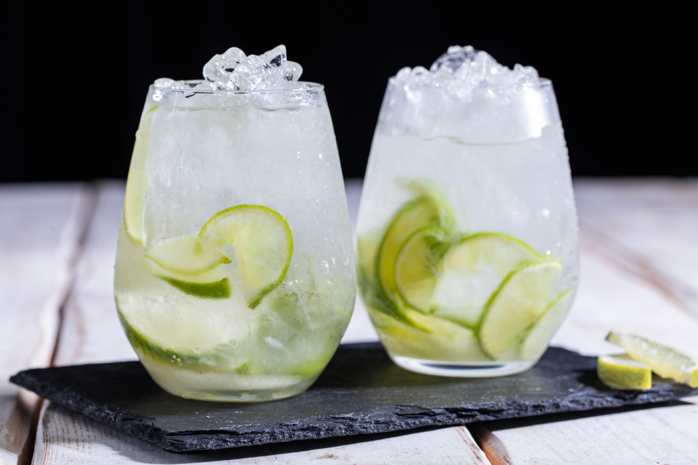

# Caipirinha

*Brazil's national cocktail: lime wedges muddled with sugar in a chunky glass, topped with cachaça (Brazilian sugarcane spirit) and crushed ice, stirred briefly. Bright, fresh, intensely limey, with the funky-grassy backbone of cachaça beneath. The drink of every Brazilian beach, every churrasco, every bar from Copacabana to Salvador.*

**Serves:** 1

**Prep Time:** 5 minutes

**Cook Time:** None

## Overview
Caipirinha (literally "little peasant" or "little country girl"; from "caipira" - a Brazilian rural person) is Brazil's national cocktail and one of the most universally recognised drinks in the world. The construction is brilliantly simple: lime wedges (with the skin on, the pith removed) are muddled in a heavy old-fashioned glass with white granulated sugar; cachaça (Brazil's sugarcane spirit, distinguished from rum by being made from fresh sugarcane juice rather than molasses) is poured over; the glass is filled with crushed ice and stirred briefly. The result is a vivid green-yellow drink with chunks of lime and ice, slightly sweet, sharply citrusy, with the funky-grassy backbone of cachaça beneath. Caipirinhas appear at every Brazilian setting from the beach kiosks of Rio de Janeiro to the upscale bars of São Paulo, from rural farm-house lunches to wedding receptions. The drink is the canonical Brazilian welcome at any social gathering.

## Ingredients

### Per drink
- 1 fresh lime (cut into 8 wedges; the central white pith removed to avoid bitterness; small Brazilian lima galega ideal, but regular lime works)
- 2-3 teaspoons white granulated sugar (some prefer caster; brown sugar gives a different flavour - see variations)
- 60 ml good cachaça (the Brazilian standard; Pitú is the most exported brand, but small-producer cachaças like Sagatiba, Velho Barreiro, or Magnífica are excellent)
- Crushed ice (canonical) OR ice cubes
- A heavy old-fashioned glass (200-250 ml capacity)
- A wooden muddler or the back of a heavy spoon

### Optional flourishes
- 1 teaspoon honey instead of sugar (modern variant)
- A few mint leaves (less canonical but excellent)
- A small wedge of lime on the rim for garnish

## Method

### Stage 1 - Prep the lime
1. Cut the lime in half lengthways.
2. Cut each half into 4 wedges (so 8 wedges total).
3. With the tip of a small knife, remove the white central pith (running along the length of each wedge) - this is the bitter part.
4. Place the wedges in a heavy old-fashioned glass.

### Stage 2 - Add the sugar and muddle
1. Add 2-3 teaspoons of sugar over the lime wedges.
2. Using a wooden muddler or the back of a heavy spoon, press and twist the lime wedges 8-12 times.
3. The goal is to:
   - Release the lime juice
   - Release the essential oils from the lime skin (these give the cocktail its bright fragrance)
   - Partially dissolve the sugar
4. Don't muddle to mush - you want the lime wedges still visible.

### Stage 3 - Add the cachaça
1. Pour the 60 ml cachaça over the muddled lime-sugar mixture.
2. Stir briefly with the muddler to combine.

### Stage 4 - Add the ice
1. Fill the glass with crushed ice (canonical) or ice cubes.
2. Stir briefly to chill and mix.

### Stage 5 - Serve
1. Serve immediately with a short straw or just sip.
2. The drink is meant to be enjoyed quickly while cold and the ice is still mostly solid.
3. Some bars garnish with a lime wedge on the rim.

## Notes
- **Cachaça, not rum:** the canonical Brazilian spirit. Distinct from rum (which is made from molasses; cachaça from fresh sugarcane juice). The flavour is grassier, funkier, more vegetal.
- **Pith removed:** the bitter white pith ruins the drink. A few seconds with a knife is worth it.
- **Don't over-muddle:** crush the limes enough to release juice and oils, but keep the wedges identifiable. Over-muddling extracts bitter notes from the rind.
- **Crushed ice is canonical:** dilutes the drink as you sip; gives the right texture. Ice cubes work but result in a slightly stronger drink.
- **Stir, don't shake:** a caipirinha is built in the glass; shaking is incorrect.
- **Drink fast:** as the ice melts, the drink dilutes; it's best in the first 5-10 minutes.

## Variations
**Caipirinha with brown sugar (modern):** swap white sugar for soft light brown sugar - adds caramel depth.
**Caipiroska:** swap cachaça for vodka - for those who find cachaça too funky. Less authentic, very popular abroad.
**Caipiríssima:** swap cachaça for white rum - Caribbean variant.
**Caipirinha de morango (strawberry):** add 2-3 fresh strawberries to muddle alongside the lime - sweet variant.
**Caipirinha de maracujá (passion fruit):** add the pulp of one fresh passion fruit to muddle - Brazilian tropical variant.
**Caipirinha de abacaxi (pineapple):** muddle a wedge of fresh pineapple alongside the lime - sweet tropical variant.
**Caipirinha de gengibre (ginger):** add a small piece of fresh ginger to muddle - modern variant.
**Caipirinha de manga (mango):** muddle a small piece of fresh mango - sweet variant.
**Caipirinha gourmet (with herbs):** add fresh basil, mint, or rosemary leaves to the muddle - modern cocktail-bar variant.

## Serving
At every Brazilian beach bar (the canonical setting) · at a Rio de Janeiro Copacabana kiosk at sunset · at a Brazilian churrasco alongside grilled meat · at a Brazilian wedding reception · at a São Paulo cocktail bar · at a Brazilian Carnival party · at any Brazilian-themed restaurant worldwide · at home as the Friday-evening Brazilian sundowner.

## Storage
- Drink fresh - the drink is best within 10 minutes of making.
- The cachaça keeps indefinitely in the bottle.
- Pre-muddled "caipirinha mix" is sold commercially but isn't the same as fresh.
- Don't make a batch ahead - the lime turns bitter and the dilution suffers.
- The drink should always be made fresh per serving.
