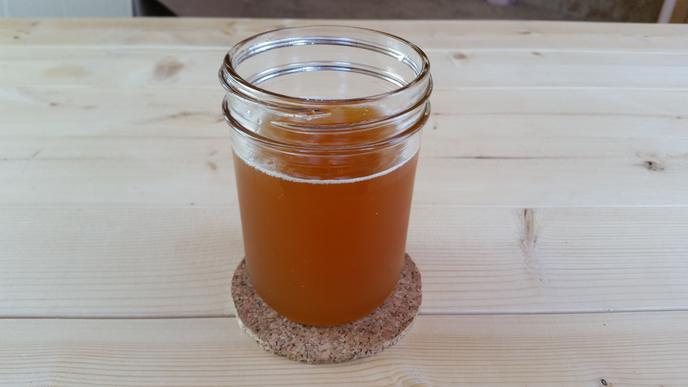

# Dandelion and Burdock

*The old British soft drink: dandelion root and burdock root simmered with star anise, ginger and brown sugar, carbonated, served cold from a brown glass bottle.*

**Serves:** 4 to 6

**Prep Time:** 10 minutes

**Cook Time:** 30 minutes

## Overview
Dandelion and burdock is the British cousin of American root beer: a herbal-bittersweet soda made from dandelion root and burdock root, sweetened and spiced, traditionally fermented but now usually carbonated with sparkling water. Brewed in the north of England since the Middle Ages (allegedly invented by St. Thomas Aquinas, though that's apocryphal), it tastes like nothing else in the supermarket fizzy-drink aisle: faintly bitter, earthy, sweet without being sickly, slightly liquorice-adjacent. Both dried roots come from any decent herbal supplier. The shop version (Fentimans, Barr's) is good; the homemade version is a weekend project worth doing once.

## Ingredients

### Syrup
- 1.2 litres cold water
- 30 g dried dandelion root (chopped, from a herbalist)
- 30 g dried burdock root (chopped)
- 5 cm fresh ginger (sliced)
- 1 star anise
- 1 cinnamon stick
- 2 cloves
- 180 g dark muscovado sugar
- 1 tablespoon black treacle (for depth and colour)
- 1 teaspoon vanilla extract (added at the end)

### To serve
- Chilled sparkling water
- Ice cubes
- A wedge of lemon (optional)

## Method

### Stage 1 - Simmer the roots
1. Combine the water, dandelion root, burdock root, ginger, star anise, cinnamon and cloves in a saucepan.
1. Bring to a boil; reduce and simmer covered for 25 minutes. The water should turn deep brown.

### Stage 2 - Sweeten and finish
1. Strain through a fine sieve into a clean jug; discard the roots.
1. Stir in the dark muscovado sugar and black treacle until dissolved.
1. Cool, then stir in the vanilla extract.

### Stage 3 - Serve
1. Pour 4 tablespoons of the syrup into a tall glass with ice.
1. Top with chilled sparkling water; stir gently.
1. Add a wedge of lemon if you fancy a little brightness.

## Notes
- **Both roots together.** Dandelion alone is too bitter, burdock alone too sweet-earthy; the blend balances both.
- **Muscovado sugar matters.** Light brown or white sugar makes a thinner, less interesting drink; the dark muscovado has the molasses depth.

## Storage
- The syrup keeps in a sealed bottle in the fridge for 3 weeks; mix per glass.
