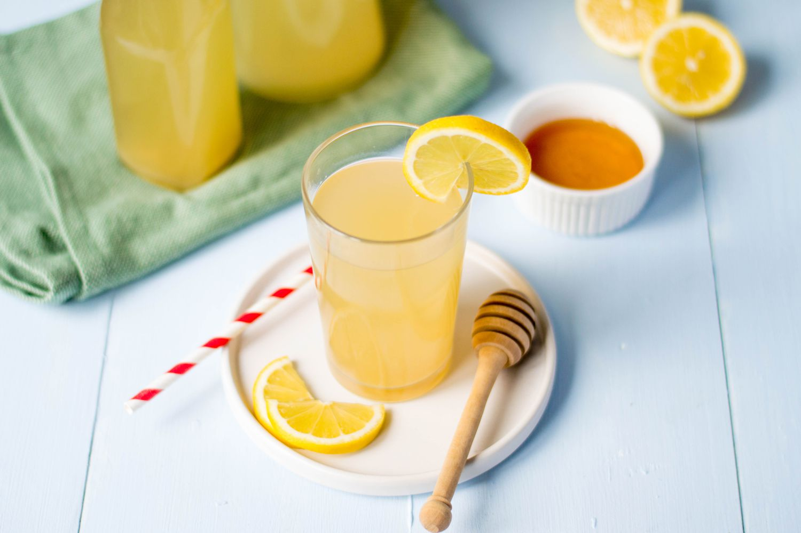

# Lemon Barley Water

*The classic British soft drink: pearl barley simmered with lemon zest until the water turns silky-thick, strained, sweetened, sharpened with lemon juice. Refreshing, slightly nourishing, the drink served at Wimbledon since 1934.*

**Serves:** 1 litre (about 4 tall glasses)

**Prep Time:** 5 minutes

**Cook Time:** 30 minutes (plus chilling)

## Overview
Lemon barley water is one of Britain's quietly persistent classics. Robinson's bottled version has been the official drink of Wimbledon since 1934, handed in cartons to ball boys and ball girls between sets. But the homemade version, made by simmering pearl barley with the pared zest of lemons until the cooking water turns a faintly milky, silky-thick consistency, then strained, sweetened and sharpened with juice, tastes like a different and better drink. The barley starches give the liquid a soft, slightly thickened mouthfeel that's neither watery nor cloying; the lemon cuts cleanly through. Victorian and Edwardian cookbooks described it as a "barley restorative", served to invalids and convalescents because the barley was thought to be gentle on the stomach. Now it's a perfect hot-afternoon drink, served deep cold over ice with a slice of lemon and a sprig of mint.

## Ingredients

- 100 g pearl barley
- 1 litre water (for cooking the barley)
- Pared zest of 3 unwaxed lemons (use a peeler to take off long strips, avoiding the white pith)
- 100 g caster sugar (or to taste)
- Juice of 3 lemons (about 120 ml)
- 1 tablespoon honey (optional, for round sweetness)

### To serve
- Plenty of ice cubes
- Lemon slices
- Mint sprigs
- Cold sparkling water (optional, to top up)
- Tall glasses, chilled

## Method

### Stage 1 - Rinse the barley
1. Rinse the pearl barley in cold water through a sieve until the water runs clear. This removes excess starch dust and stops the drink turning chalky.

### Stage 2 - Simmer
1. Put the rinsed barley in a saucepan with 1 litre of cold water.
1. Bring to the boil, then reduce to a gentle simmer for 30 minutes; the water will turn slightly opaque and silky, and the barley will be soft.
1. About halfway through, add the pared lemon zest.

### Stage 3 - Strain and sweeten
1. Strain through a fine sieve into a jug, pressing the barley to extract everything. (Save the cooked barley for soup or porridge if you like; don't waste it.)
1. While the liquid is still warm, stir in the caster sugar (and honey if using) until fully dissolved.
1. Add the fresh lemon juice. The colour brightens; the smell wakes up.

### Stage 4 - Chill
1. Cool to room temperature, then refrigerate at least 3 hours, or until very cold. The mouthfeel improves as it chills.

### Stage 5 - Serve
1. Pour into chilled tall glasses over plenty of ice.
1. Top up with a splash of cold sparkling water for a slightly fizzy version, or serve still for the Wimbledon-style flat drink.
1. Garnish with a lemon slice and a mint sprig.

## Notes
- **Pared zest, not grated.** Long pared strips (taken with a peeler) infuse cleanly and strain out. Grated zest leaves bitter flecks in the final drink.
- **Rinse the barley.** Skipping the rinse gives a chalky, dusty finish. A 30 second rinse fixes it.
- **The mouthfeel is the whole point.** Lemon barley water shouldn't be watery; the gentle silkiness from the cooked starch is what makes it different from straight lemonade.
- **Use unwaxed lemons.** Waxed lemon peel will leave a faintly waxy slick on the finished drink. Unwaxed (or scrubbed) is much better.

## Variations
- **Orange barley water.** Use the zest and juice of oranges instead of lemons; sweeter, more grown-up.
- **Hot lemon barley.** Serve warm in winter with a tablespoon of honey: the classic cold-and-flu drink.
- **Sparkling.** Top up over ice with cold soda water; the bubbles lift the lemon.

## Storage
- The strained, sweetened drink keeps 5 days in the fridge in a sealed jug. After that the flavour fades; better to brew a fresh jug.
