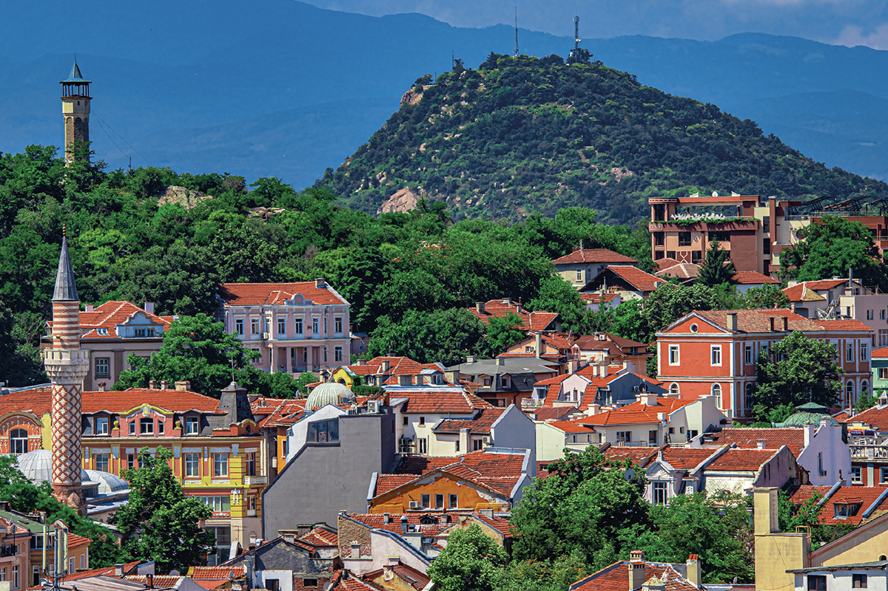

# Bulgarian Drinks

Bulgaria drinks rakia first, ayran next, and finishes the day with a glass of red. Rakia (the clear fruit brandy distilled in copper stills behind country houses every autumn from grapes, plums or apricots) is the host's welcome, the small chilled glass set down before the shopska salad with the conversation. The yoghurt heritage runs deep: ayran, the salted yoghurt drink shaken cold with water in a tall glass, is the everyday cooler poured against the summer heat, the country's answer to a cold drink with the meal. Boza, the thick honey-coloured fermented millet drink, is the breakfast tradition that survives in Sofia bakeries and the Rhodope towns, sweet-sour and chalky, drunk with a banitsa straight from the oven. The wine country (the Thracian valley around Plovdiv, the hills of Melnik in the south, the slopes of the Black Sea coast) is reviving the indigenous Mavrud, Melnik and Rubin reds and the Dimyat whites after a long Soviet flatness. Bulgarian herbal teas (mursalski from the Pirin mountains, rose hip, linden) are the apothecary tradition still poured at every kitchen table for any complaint that turns up.
