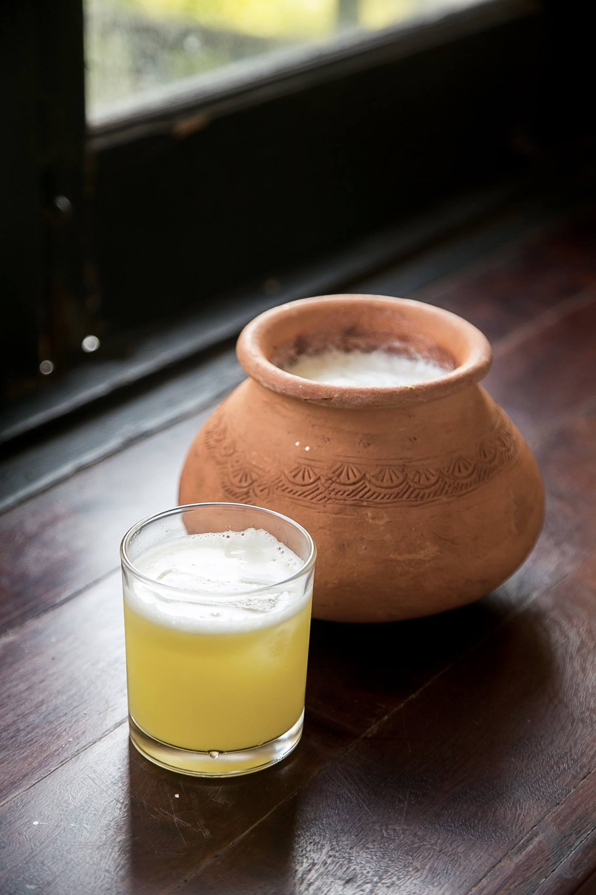

# Htan Ye (Burmese Palm Sugar Juice)

*The sap of the toddy palm: drawn fresh from the flower stem of the palmyra palm, drunk immediately (or just hours later) before fermentation kicks in. Naturally sweet, faintly floral, served chilled in tall glasses with crushed ice. A road-trip staple across central Burma's Dry Zone.*

**Serves:** 4 tall glasses

**Prep Time:** 5 minutes

**Cook Time:** 0 minutes

## Overview
Htan ye is the fresh, unfermented sap of the toddy palm tree (Borassus flabellifer), called htan-bin in Burmese. The sap is collected daily before dawn by climbers who cut a slit in the flower stem and tie a clay pot to catch the dripping liquid. When fresh (within two to four hours of harvest), htan ye is sweet, mildly floral and faintly milky, a natural soft drink. As it sits, wild yeasts ferment the sugars; within eight to twelve hours at warm Burmese temperatures it turns into htan-yay-chin (palm wine) at about 4% ABV, and by twenty-four hours it's vinegar. The fresh form is sold from roadside stalls across central Myanmar's Dry Zone, where climbers descend from the palms with terracotta pots tied with banana-leaf lids and serve the day's harvest cold in tall glasses with crushed ice. Outside Myanmar, fresh palm sap is nearly impossible to find; this recipe gives the serving preparation, plus a substitute using palm sugar dissolved in water that approximates the sweetness.

## Ingredients

### If you have fresh palm sap
- 1 litre fresh palm sap (htan ye), kept cold from the moment of harvest

### Substitute (when fresh sap isn't available)
- 1 litre cold water
- 120 g palm jaggery (jaggery from palm sugar - sold at South Asian / Southeast Asian groceries; brown lumps, NOT the same as cane sugar)
- 2 tablespoons fresh lime juice
- 1/4 teaspoon ground cardamom
- Pinch of fine salt

### To serve
- Plenty of crushed ice
- 4 tall glasses, chilled
- Optional: 1 small wedge of lime per glass

## Method (fresh sap version)

### Stage 1 - Strain
1. Pour the fresh palm sap through a fine sieve into a clean jug (palm sap often has small fibre bits from the harvest).
1. Keep refrigerated until serving.

### Stage 2 - Serve
1. Fill the chilled tall glasses three-quarters full with crushed ice.
1. Pour the cold palm sap over.
1. Garnish with a small wedge of lime if you like.
1. Drink immediately. After 4-6 hours in a cold fridge, the natural fermentation begins; the drink turns slightly fizzy and slightly alcoholic. Most Burmese drinkers prefer it before this point.

## Method (substitute version)

### Stage 1 - Dissolve the jaggery
1. Break or chop the palm jaggery into small chunks for faster dissolving.
1. Put into a small saucepan with 200 ml of the litre of water; warm gently while stirring until completely dissolved. Don't boil.
1. Remove from heat and cool to room temperature.

### Stage 2 - Combine
1. Pour the jaggery syrup into the remaining 800 ml of cold water in a jug.
1. Stir in the lime juice, cardamom and salt.
1. Taste: the drink should be sweet with a faint molasses note from the jaggery, and a clean lime brightness. Adjust sweetness if needed.

### Stage 3 - Chill and serve
1. Refrigerate at least 1 hour.
1. Serve over crushed ice in tall glasses with a wedge of lime.

## Notes
- **Fresh palm sap is rare outside Myanmar.** Some Burmese / Thai / Indian groceries carry frozen palm sap, but quality is variable. The substitute version is a credible approximation of the flavour profile.
- **Palm jaggery, not cane jaggery.** Palm jaggery (made from boiled-down palm sap) has a deeper, more floral, slightly smoky character than cane jaggery. The substitute hinges on this - cane sugar gives a flatter drink.
- **Drink quickly.** Both versions are best within a few hours of preparation. The fresh sap version is on a clock as the fermentation accelerates.
- **Salt.** The pinch of salt amplifies the jaggery's complex sweetness. Don't skip.

## Variations
- **Coconut-palm htan ye.** Replace 200 ml of water with coconut milk. Creamier, tropical; modern Yangon café variation.
- **Spiced htan ye.** Add a small piece of fresh ginger (sliced) to the warming pan with the jaggery; adds warmth.
- **Htan yay chin.** The fermented version: leave fresh htan ye at warm room temperature for 12 hours; becomes lightly alcoholic palm wine. Traditional but not part of this recipe.

## Storage
- Fresh palm sap: 4-6 hours in fridge before fermentation accelerates noticeably.
- Substitute version: 3 days in fridge sealed.
