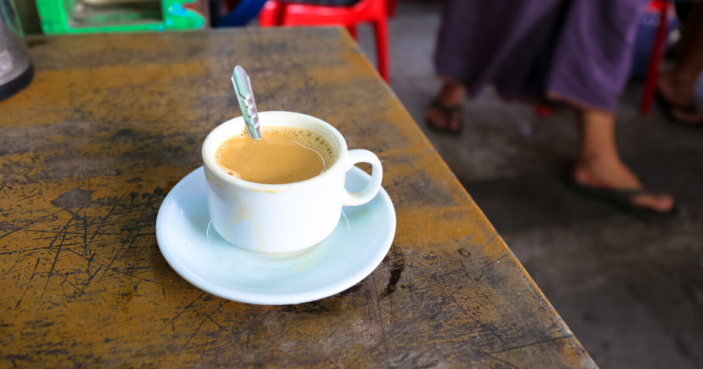

# Laphet Yay

*Burmese sweet milky tea: strong black tea brewed hard, sweetened with condensed milk and topped up with evaporated milk, served from morning teashops across Yangon.*

**Serves:** 2

**Prep Time:** 2 minutes

**Cook Time:** 7 minutes

## Overview
Laphet yay is the morning drink of Burma (Myanmar), poured at every roadside teashop from Yangon to Mandalay alongside a plate of e kya kway (Chinese-style fried dough). The build is colonial-era: strong black tea brewed hard in a kettle, then mixed with sweetened condensed milk for thick sweetness and evaporated milk for body. Each teashop has its own ratio (some heavy on the condensed, some lighter) and customers order by colour preference: po sin (light), cho saint (medium-sweet), or saint sin (extra strong). Drunk all day long, but especially at breakfast.

## Ingredients

### Per pot (2 cups)
- 400 ml cold water
- 2 tablespoons loose-leaf strong black tea (Burmese Shan tea ideal, Assam works)
- 3 tablespoons sweetened condensed milk
- 4 tablespoons evaporated milk (or whole milk for a less heavy drink)

### To serve
- Small thick-walled glass mugs
- A wedge of fried dough or a plain roll (e kya kway tradition)

## Method

1. Bring the water to a boil in a small saucepan; add the tea leaves.
1. Boil hard for 4 to 5 minutes, then reduce to a low simmer for another 2 minutes. The tea should turn very dark.
1. Strain through a fine sieve into a warmed teapot or jug.
1. Spoon the condensed milk into each glass mug; pour over the hot tea; top with evaporated milk and stir.

## Notes
- **Boiled hard, not steeped.** Burmese laphet yay is brewed by active boiling for body and tannin; gentle steeping produces a weaker drink.
- **Ratios are personal.** Sweet is the default; cut the condensed milk to 2 tablespoons and add a teaspoon of sugar for a less syrupy version.

## Storage
- Drink immediately. The tea concentrate (pre-milk) keeps in a thermos for 2 hours.
