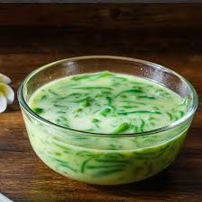

# Moh Let Saung

*Burma's cold rice-noodle dessert drink: chewy rice-flour noodles (let-saung) in a sweet coconut milk syrup with dark palm-sugar drizzle and crushed ice. The mid-afternoon street-stall reset on a hot Yangon afternoon, eaten with a spoon as much as drunk.*

**Serves:** 4 small bowls or tall glasses

**Prep Time:** 15 minutes

**Cook Time:** 10 minutes

## Overview
Moh let saung sits at the boundary between drink and dessert. The let-saung are chewy short rice-flour noodles, like thick translucent worms, traditionally made by extruding a hot rice-flour batter through a press directly into cold water (where they set into noodles). At the moh let saung stall, the cold noodles are scooped into a small bowl, drowned in sweetened coconut milk, drizzled with dark palm-sugar syrup (nyaung pyaw), and topped with crushed ice. The drinker eats the noodles with a spoon and sips the coconut milk between bites. Variations across Myanmar include white-bread chunks, agar jelly, tapioca pearls, or shaved coconut alongside the noodles. The defining flavours are the dark caramel of palm jaggery and the gentle sweetness of coconut milk against the chewy slippery noodles.

## Ingredients

### For the rice-flour noodles
- 150 g rice flour
- 30 g tapioca starch (or cornflour)
- 500 ml water
- A pinch of salt
- A few drops of pandan extract (optional, for the pale-green colour)

### For the palm sugar syrup
- 150 g palm jaggery (palm sugar, sold at Southeast Asian groceries; the dark brown lumps)
- 100 ml water
- 1 pandan leaf, knotted (optional)

### For the coconut milk
- 400 ml coconut milk (tinned full-fat)
- 50 g caster sugar
- Pinch of salt

### To serve
- Plenty of crushed ice
- Optional: 2 tablespoons fresh young coconut flesh
- Optional: 2 tablespoons toasted sesame seeds

## Method

### Stage 1 - Make the let-saung noodles
1. In a saucepan, whisk together the rice flour, tapioca starch, water, salt and pandan extract (if using) until completely smooth.
1. Cook over medium heat, whisking constantly. The mixture will thicken in 4 to 6 minutes from a thin batter to a thick, sticky, smooth paste that pulls away from the pan sides. It should be glossy and stretchy.
1. Off the heat, scoop the paste into a piping bag fitted with a small round tip (or a heavy zip-lock bag with a corner snipped off, about 5 mm hole). Have a large bowl of cold ice water ready.
1. Pipe the paste in continuous lines into the cold water; the noodles will set instantly. Aim for noodles 3-5 cm long. Continue until all the paste is used.
1. Let the noodles cool in the water for 5 minutes, then drain. Set aside.

### Stage 2 - Palm sugar syrup
1. Chop the palm jaggery into small chunks.
1. In a small pan, combine the jaggery, 100 ml water and the pandan leaf (if using). Warm over medium-low heat, stirring, until the jaggery dissolves completely. Don't reduce, you want a pourable syrup.
1. Cool to room temperature.

### Stage 3 - Coconut milk base
1. Whisk the coconut milk, sugar and salt together in a small pan over low heat until the sugar dissolves. Don't boil, keep it warm just enough to dissolve.
1. Cool to room temperature, then refrigerate.

### Stage 4 - Build the bowls
1. Into each chilled bowl or tall glass:
   - 4 tablespoons of let-saung noodles
   - 1 tablespoon of fresh young coconut flesh (if using)
1. Pour over about 100 ml of cold coconut milk.
1. Drizzle 1-2 tablespoons of palm sugar syrup on top.
1. Top with a generous handful of crushed ice.
1. Sprinkle with toasted sesame seeds if using.

### Stage 5 - Serve
1. Serve immediately with a long spoon AND a wide straw.
1. The drinker mixes the syrup into the coconut milk and ice with the spoon as they eat.

## Notes
- **The let-saung dough should pull from the pan.** Under-cooked dough makes weak noodles that dissolve in the water; over-cooked is gummy and hard to pipe. The right consistency is glossy, stretchy, pulling from the pan sides, about 4-6 minutes of constant whisking on medium heat.
- **Cold water bath.** The noodles set in the cold water; the colder, the firmer. Lots of ice in the water helps.
- **Palm jaggery is essential.** Cane sugar substitutes give a flatter, less complex syrup. Palm jaggery (called nyaung pyaw in Burmese) has the molasses-floral character that defines this drink.
- **Coconut milk full-fat.** Light coconut milk gives a thin, sad drink.

## Variations
- **With agar jelly.** Add 2 tablespoons of agar jelly cubes per bowl alongside the noodles.
- **With sago.** Add 2 tablespoons of cooked tapioca pearls.
- **Modern Yangon style.** Restaurant versions add a scoop of vanilla ice cream on top.
- **Without noodles.** A simpler version with just coconut milk, jaggery syrup and crushed ice, closer to a cold drink than a dessert.

## Storage
- Components store separately. Cooked let-saung noodles keep 2 days in cold water in the fridge. Palm sugar syrup keeps 2 weeks sealed. Coconut milk base keeps 3 days. Assemble bowls to order.
