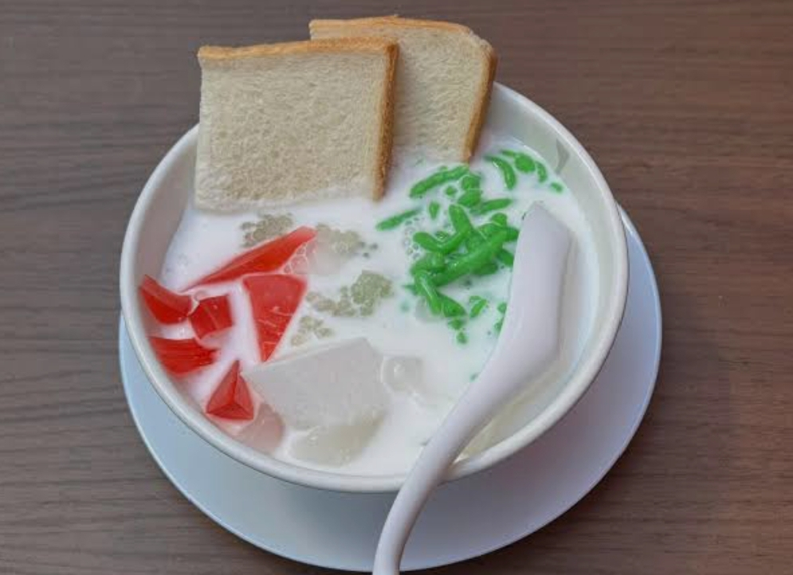

# Shwe Yin Aye

*Burma's iconic layered cold dessert drink: a tall glass holding sago pearls, jellied agar cubes, sweet bread chunks and tapioca, drowned in coconut milk and crowned with a scoop of ice cream. Refreshing, faintly tropical, eaten with a spoon as much as drunk.*

**Serves:** 4 tall glasses

**Prep Time:** 25 minutes (assumes the toppings are pre-prepared)

**Cook Time:** 15 minutes

## Overview
Shwe yin aye (literally "golden cold heart") is the cold-weather treat-of-treats in Burmese summers, sold from carts in Yangon and on every restaurant dessert menu. The drink is part dessert, part beverage, served in a tall glass with layers of textures: pearl tapioca (sa-pyaung), softened white bread chunks (paun-mont), cubes of pale-green or pink agar jelly (kyaut-kyaw), occasionally young coconut flesh, all drowned in sweetened coconut milk, finished with crushed ice and a scoop of vanilla or coconut ice cream on top. The contrast of textures is the whole point: chewy tapioca, slippery jelly, soft bread, frozen ice cream, all in the same spoonful. This recipe gives a manageable home version with the core textures; restaurant versions in Yangon and Mandalay add 4-5 more items.

## Ingredients

### Cooked components (prepare these first)
- 100 g small pearl tapioca (sago, the small pearls, not the larger boba pearls)
- 1 small block (about 5 g) of agar agar powder, prepared as jelly (see Stage 1) - or 200 g pre-made jelly cubes
- 4 thick slices of plain white bread (Burmese sweet bread / paun-mont, or any sweet enriched white bread like brioche or milk bread)
- 2 tablespoons fresh young coconut flesh (optional)

### For the coconut milk syrup
- 400 ml coconut milk (tinned full-fat)
- 80 g caster sugar
- A pinch of fine salt
- 1 pandan leaf, knotted (optional, traditional)

### To serve
- Plenty of crushed ice
- 4 small scoops of vanilla or coconut ice cream
- 4 tall glasses, chilled

## Method

### Stage 1 - Make the agar jelly (or skip if using pre-made)
1. Bring 500 ml water and 50 g sugar to the boil in a small pan. Whisk in 5 g agar agar powder, boil 2 minutes, optionally add a few drops of green or pink food colouring.
1. Pour into a flat tray (about 1 cm deep). Cool 5 minutes then refrigerate 30 minutes to set firm.
1. Cut into 1 cm cubes. (Makes more than this recipe needs; save extra for next time.)

### Stage 2 - Cook the tapioca
1. Rinse the tapioca pearls. Bring 600 ml water to the boil in a small pan, add the tapioca, and boil for 12-15 minutes, stirring occasionally so they don't stick. They're done when they turn translucent.
1. Drain and rinse under cold water to stop the cooking. Set aside.

### Stage 3 - Make the coconut milk syrup
1. Pour the coconut milk into a small pan with the sugar, salt and pandan leaf.
1. Warm over medium-low heat, stirring, until the sugar dissolves. Don't let it boil hard.
1. Cool to room temperature, then refrigerate.

### Stage 4 - Prep the bread
1. Tear or cut the white bread into rough 2 cm cubes. Lightly toast in a dry pan if you want them slightly firmer (modern Yangon variant).

### Stage 5 - Build the glass
1. Into each chilled tall glass, layer:
   - 2 tablespoons cooked tapioca at the bottom
   - 3 tablespoons agar jelly cubes
   - Generous handful of bread cubes
   - 1 tablespoon young coconut flesh if using
1. Pour over the cold coconut milk syrup until everything is submerged (about 100 ml per glass).
1. Top with a generous mound of crushed ice.
1. Crown with a scoop of vanilla or coconut ice cream.

### Stage 6 - Serve
1. Serve immediately with a long spoon AND a wide straw.
1. The drinker stirs to break up the ice cream into the coconut milk and starts spooning out the toppings.

## Notes
- **Component-by-component prep.** All the toppings can be made ahead and refrigerated separately; the assembly happens at serving. Restaurants in Yangon prep everything in the morning and build glasses to order.
- **Coconut milk choice.** Full-fat tinned coconut milk is the right texture. Light coconut milk gives a thin, sad drink.
- **Bread is the surprise ingredient.** Western diners often question the bread; in Burma it's the most important texture. The bread soaks up the coconut milk and becomes pillow-soft. Don't skip.
- **Eat with a spoon, drink with the straw.** Half-eaten, half-drunk.

## Variations
- **With falooda noodles.** Add 2 tablespoons of soaked falooda noodles (cornflour vermicelli) for an extra slippery texture.
- **With nyaung-pyaw (jaggery syrup).** Drizzle 1 tablespoon of palm jaggery syrup over the top instead of regular sugar; deeper sweetness.
- **Without ice cream.** The traditional pre-1980s version had no ice cream, just the layered toppings with sweetened coconut milk and shaved ice. Simpler, less sweet.

## Storage
- The components store separately. Pre-cooked tapioca keeps 2 days in cold water in the fridge; the jelly keeps 4 days; the coconut syrup keeps 3 days. Build glasses to order, pre-built ones go sodden within 10 minutes.
