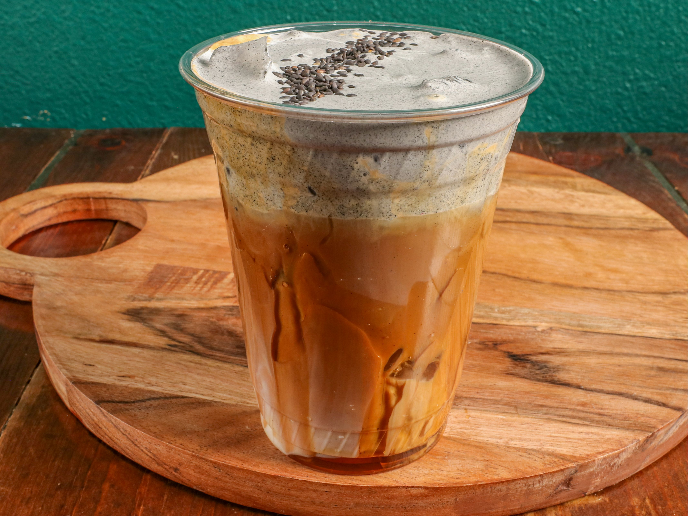

# Cafe Touk Dah Koh (Cambodian Iced Coffee)

*Cambodia's morning street coffee: strong dark coffee dripped slowly over a layer of sweetened condensed milk at the bottom of a glass, stirred together, poured over crushed ice in a clear tall glass. Sweeter and creamier than the Vietnamese cousin; almost a dessert-coffee.*

**Serves:** 2 tall glasses

**Prep Time:** 3 minutes

**Cook Time:** 7 minutes

## Overview
Cafe touk dah koh (literally "coffee with milk") is the Cambodian street coffee, brewed identically to Vietnamese cà phê sữa đá but with a slightly sweeter profile and often a longer drip. The base is finely ground dark-roast coffee (typically a Robusta or Robusta-Arabica blend), brewed through a Vietnamese-style phin filter or a simple sock filter, dripping onto a generous layer of sweetened condensed milk at the bottom of a small glass. Once the drip finishes (3-5 minutes), the resulting strong sweet coffee is stirred together and poured over a tall glass packed with crushed ice. The Phnom Penh and Siem Reap street versions tend to use more condensed milk than Vietnamese versions, sometimes with a touch of evaporated milk added for extra body. A favourite breakfast drink alongside a kuy teav noodle soup, and the dessert-coffee at any time of day.

## Ingredients

- 2 tablespoons strong dark-roast ground coffee (Cambodian or Vietnamese brand; espresso-grind)
- 160 ml just-off-the-boil water
- 6 tablespoons sweetened condensed milk (3 tablespoons per glass, more than the Vietnamese version)
- 2 tablespoons evaporated milk (optional, for extra body)
- Plenty of crushed ice

### To serve
- 2 small thick-walled glasses, chilled
- Long spoons

## Method

### Stage 1 - Brew strong
1. Put 1 tablespoon of coffee grounds into a Vietnamese phin filter (or French press, or moka pot).
1. Spoon 3 tablespoons of sweetened condensed milk into each of the 2 small glasses you'll brew into.
1. Set the phin on top of one of the glasses.
1. Pour 80 ml of just-off-the-boil water into the filter. Cover and let drip for 4-5 minutes.
1. Repeat with the second glass and the remaining 1 tablespoon of coffee + 80 ml water.

### Stage 2 - Mix
1. When the drip is complete, stir the brewed coffee into the condensed milk in each glass. The colour shifts from dark coffee to a milky-caramel beige.
1. Optionally stir in 1 tablespoon of evaporated milk per glass for extra body.

### Stage 3 - Serve
1. Fill 2 chilled tall glasses three-quarters full with crushed ice.
1. Pour the sweet coffee-milk mixture over the ice.
1. Serve immediately with a long spoon, the drinker stirs as they sip.

## Notes
- **More condensed milk than Vietnamese.** Cambodian versions lean sweeter - 3 tablespoons per glass instead of the Vietnamese 2. Adjust to taste.
- **Phin filter is the cleanest method.** A drip filter gives the right slow-extraction body. Moka pot works; French press gives a slightly different (but still good) texture.
- **Crushed ice, not cubes.** Like all SE Asian iced coffees, this is built on a mound of crushed ice that slowly melts in as you drink.

## Variations
- **Cafe touk dah pas (hot version).** Same brew, no ice. The morning version on a cool day.
- **Black version (cafe touk).** Skip the condensed milk; sweetened with regular sugar. Less sweet, more coffee-forward.
- **With coconut.** Stir in 2 tablespoons of coconut milk before pouring over ice. Closer to Vietnamese bạc xỉu but a Cambodian variant.

## Storage
- Doesn't store; build to order. The condensed-milk-and-coffee base keeps 3 days in the fridge as a syrup.
