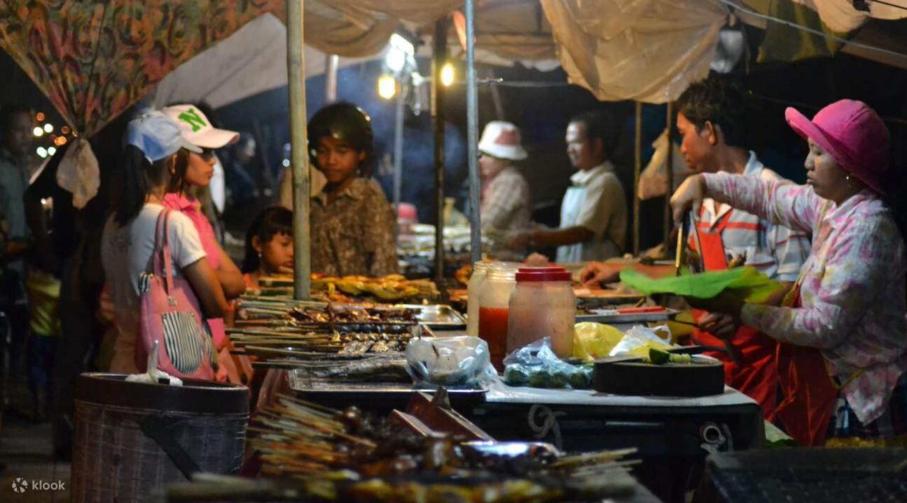

# Drinks of Cambodia

Iced coffee thick with sweetened condensed milk (kafe tuk dah koh), sugarcane juice with a squeeze of calamansi, palm wine from the sugar palm, and tuk a-om (coconut water sipped straight from the green coconut).
