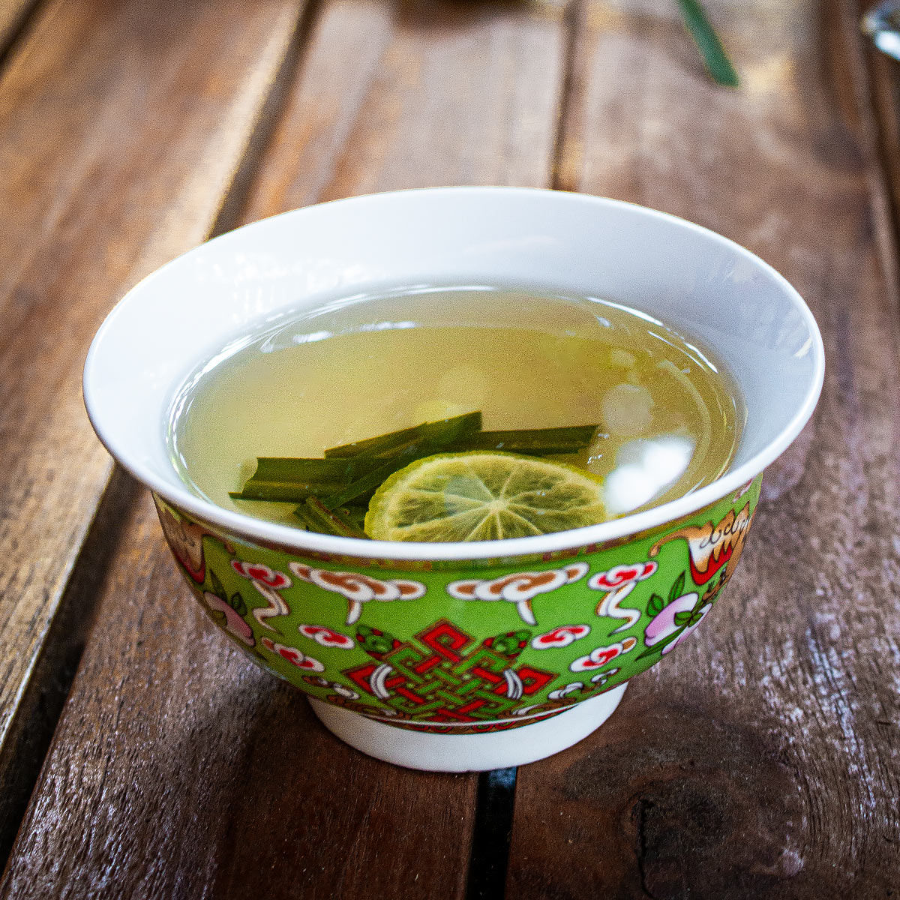

# Snae Krohop (Cambodian Lemongrass and Ginger Tea)

*Cambodia's everyday remedy-drink: lemongrass stalks bruised and simmered with fresh ginger and a touch of palm sugar, served hot in small glasses. Light, aromatic, slightly sweet, the household pick-me-up at any sign of a cold or a long Phnom Penh humid day.*

**Serves:** 4 small glasses

**Prep Time:** 5 minutes

**Cook Time:** 12 minutes

## Overview
Snae krohop ("lemongrass tea" in Khmer) is the household remedy-drink across Cambodia. Lemongrass grows abundantly in every Cambodian garden, fresh stalks pulled and trimmed, bruised with the flat of a knife to release their essential oils, simmered with sliced ginger and a touch of palm sugar. The result is a clear, bright golden tea with a citrus-grassy nose and a warm ginger finish. Cambodian households serve it for colds, for upset stomachs, for hot afternoons, and just because the kettle is on. It pairs especially well with Cambodian sweets and small biscuits at the end of a meal. The drink is closely related to Vietnamese lemongrass tea and Thai takrai water but distinct in its slightly higher ginger ratio and the use of palm sugar (not white sugar). Modern Phnom Penh cafés sometimes add a drizzle of honey or a squeeze of lime for the brighter version.

## Ingredients

- 4 fresh lemongrass stalks
- 30 g fresh ginger, sliced (skin on is fine)
- 800 ml water
- 30 g palm sugar (palm jaggery; brown lumps from any SE Asian grocery) OR 2 tablespoons honey
- 1 small piece of pandan leaf, knotted (optional, common in coastal regions)
- A squeeze of lime juice (optional)

### To serve
- 4 small heatproof glasses or teacups

## Method

### Stage 1 - Prep the lemongrass
1. Trim the lemongrass: cut off the dry tops (the leafy ends) and the dry root ends, leaving the firm 15-20 cm stalk per piece.
1. Bruise each stalk by smacking firmly with the flat of a heavy knife or rolling pin. The fibres should crack open along the length of the stalk, this releases the essential oils.
1. Cut each bruised stalk into 4-5 pieces.

### Stage 2 - Brew
1. Bring the water to the boil in a small saucepan.
1. Add the lemongrass pieces, ginger slices and pandan leaf (if using).
1. Reduce to a low simmer for 10 minutes. The water turns a pale golden colour and develops a clear citrus-ginger aroma.

### Stage 3 - Sweeten
1. Off the heat, add the palm sugar (chopped into small chunks for faster dissolving) or honey. Stir until completely dissolved.
1. Taste; the drink should be lightly sweet, distinctly lemongrass-forward, with a gentle ginger finish. Adjust sweetness if needed.

### Stage 4 - Strain and serve
1. Strain through a fine sieve into the cups (or remove the solids and pour from the pan).
1. Optionally add a small squeeze of lime juice to each cup.
1. Serve hot.

## Notes
- **Bruise the lemongrass properly.** Whole un-bruised stalks give a thin, flat-tasting tea. The bruising step releases the citrusy lemongrass oils.
- **Palm sugar over white.** Palm sugar's molasses-floral character pairs better with lemongrass than white refined sugar. Honey is a clean substitute.
- **Don't over-brew.** Past 12 minutes the lemongrass turns slightly bitter and the ginger overwhelming. 10 minutes is the sweet spot.
- **Skin-on ginger.** Don't bother peeling. The skin holds flavour and is removed at the strain.

## Variations
- **Iced snae krohop.** Brew the same tea, sweeten while warm, cool then refrigerate. Serve over ice with a lime wedge, the Cambodian summer iced version.
- **With kaffir lime leaves.** Add 2 bruised kaffir lime leaves to the brewing pan; deeper citrus-floral aroma.
- **With turmeric.** Add a 1 cm piece of fresh turmeric root (sliced) to the brewing pan; gives a faint yellow tint and earthy depth, sometimes used as an enhanced wellness tea.
- **Cambodian "cold remedy" version.** Add 2 cloves and a 5 cm cinnamon stick to the brew; serve hot with a tablespoon of honey and a squeeze of lemon. The household winter cold cure.

## Storage
- Brewed snae krohop keeps 2 days in a sealed jug in the fridge for the iced version; the fresh aromatics fade after 48 hours.
- Lemongrass stalks freeze beautifully (in a sealed bag for up to 6 months); use straight from frozen, no need to thaw.
