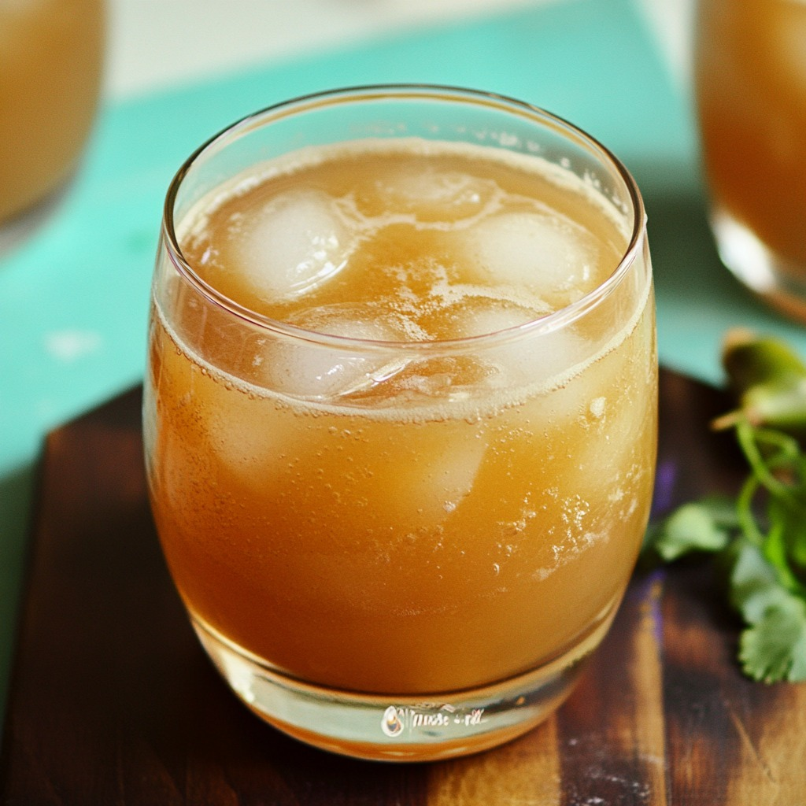

# Tuk Ampil

*Cambodian tamarind cooler: tamarind pulp dissolved in cold water with palm sugar and a pinch of salt, poured over crushed ice on the hottest Phnom Penh afternoons.*

**Serves:** 4

**Prep Time:** 10 minutes

**Cook Time:** 5 minutes

## Overview
Tuk ampil ("tamarind water" in Khmer) is the Cambodian street drink for cooling down in the relentless tropical heat: tamarind pulp soaked and strained, sweetened with palm sugar, sharpened with a pinch of salt to balance the sour-sweet. Sold from glass jars at roadside stalls in Phnom Penh and Siem Reap, served over crushed ice with a paper straw. The tamarind's sour-fruity-savoury edge is what makes it work; in the heat it's far more refreshing than anything purely sweet.

## Ingredients

- 80 g seedless tamarind pulp (the wet block-style; from any Southeast Asian grocer)
- 500 ml hot water
- 80 g palm sugar (or dark muscovado as substitute)
- ¼ teaspoon fine salt
- 800 ml cold water
- Plenty of crushed ice

### To serve
- Lime wedges (optional)
- Mint sprigs

## Method

1. Break the tamarind pulp into a heatproof bowl; pour over the hot water. Mash with a fork and steep 8 to 10 minutes.
1. Strain through a fine sieve, pressing the pulp hard to extract all the juice; discard the solids.
1. Stir in the palm sugar and salt while still warm so the sugar dissolves cleanly.
1. Combine with the cold water in a jug; taste and adjust sugar.
1. Pour over crushed ice in tall glasses; garnish with a wedge of lime and a sprig of mint.

## Notes
- **Wet tamarind pulp, not the dry pods.** The block-style pulp from a Southeast Asian grocer is faster to work with than fresh pods.
- **Palm sugar is the right sweetener.** Its caramel notes match tamarind's depth; white sugar gives a thinner-tasting drink.

## Storage
- Refrigerate up to 5 days in a sealed jug; pour over fresh ice per glass.
