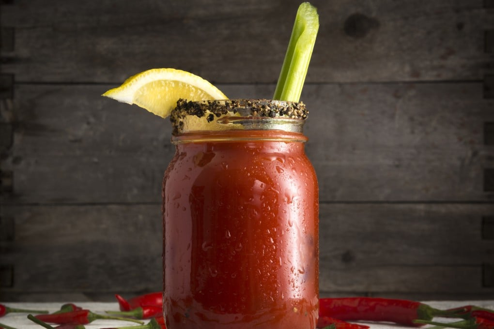

# Caesar (Canada's National Cocktail)

*Canada's national cocktail: vodka and Clamato (tomato juice and clam broth) shaken with Worcestershire and Tabasco, served in a celery-salt-rimmed glass: the Bloody Mary's wilder Canadian cousin.*

**Serves:** 2

**Prep Time:** 8 minutes

**Cook Time:** None

## Overview
The Caesar (full name: Bloody Caesar) is Canada's most identity-defining cocktail and the country's most-consumed mixed drink: an estimated 350+ million are drunk each year, more than any single American cocktail. It was invented in 1969 at the Calgary Inn by Italian-Canadian bartender Walter Chell, designing a signature drink inspired by the spaghetti alle vongole he'd eaten in Italy. He blended canned clam broth with tomato juice, added vodka and Worcestershire, and named it after Caesar (both the Roman emperor and the salad). Mott's soon bottled the clam-tomato blend as Clamato, which remains essential. Three things distinguish a Caesar from a Bloody Mary: the Clamato mixer gives the briny umami backbone; the celery-salt rim (a 50/50 mix of fine sea salt and celery seed) is the traditional touch; and the modern Sunday-brunch garnish piles on a pickled bean, crisp bacon, cheese, sometimes a grilled prawn or an entire chicken wing. The legendary "Sunday Caesar" can be a meal in itself.

## Ingredients

### Per Caesar (multiply for more)
- 30 ml good vodka (Stolichnaya, Smirnoff, Russian Standard, or Canadian Alberta Premium)
- 180 ml Mott's Clamato (or homemade: 145 ml good tomato juice + 35 ml bottled clam juice)
- 4 dashes Worcestershire sauce
- 4 dashes hot sauce (Tabasco original red, Frank's RedHot, or Cholula)
- 1 teaspoon prepared horseradish (optional but excellent; modern variant)
- 2 grinds of black pepper
- 1 small pinch of celery salt (for the drink itself, on top of the rim)
- 1 squeeze of fresh lime juice (about 1 teaspoon)
- Ice cubes (good big-cube ones, not crushed)

### The rim (essential)
- 2 tablespoons celery salt (commercial mix, or make your own: equal parts fine sea salt and celery seeds ground in a small spice grinder)
- 1 lime wedge (for moistening the rim)

### The garnish (pick your level)
**Classic minimal:**
- 1 long celery stalk (with leaves), per drink
- 1 lime wedge, on the rim

**Standard Canadian:**
- All the classic, plus
- 1 pickled bean (dilly bean / pickled green bean) per drink
- A few thin slices of cucumber on the rim

**Sunday brunch Caesar (the full theatrical Canadian):**
- All of the above, plus
- 1 strip of crisp bacon
- 1 small cube of mature Canadian cheddar on a cocktail stick
- 1 grilled prawn (optional)
- 1 small pickled jalapeño on a stick (optional)

### Glassware
- A tall highball glass (250-300 ml), or a Collins glass
- A pint glass for the maximalist brunch version

## Method

### Stage 1 - Prepare the rim
1. Spread the celery salt in a wide shallow dish.
2. Cut a small wedge from the lime; run it around the rim of each glass to moisten.
3. Invert the glass into the celery salt; rotate to coat the rim evenly.
4. Lift away; the rim should be evenly coated.

### Stage 2 - Build the drink in the glass
1. Fill each rimmed glass with ice cubes (3-4 large cubes; not crushed, the dilution is too fast).
2. Pour in 30 ml of vodka.
3. Add 4 dashes of Worcestershire sauce.
4. Add 4 dashes of hot sauce.
5. Add the optional horseradish, black pepper, and small pinch of celery salt (the inside-the-drink one).
6. Squeeze in the lime juice.
7. Top up with 180 ml of Clamato.

### Stage 3 - Stir gently
1. Use a long bar spoon to stir gently 5-6 times, just enough to combine.
2. Don't shake or stir vigorously, you'll disturb the celery-salt rim and aerate the Clamato into froth.

### Stage 4 - Garnish
1. Push a long celery stalk into the drink, leaves sticking up above the rim.
2. Slip a lime wedge onto the rim.
3. For the standard version: add a pickled bean on a cocktail pick.
4. For the Sunday brunch version: pile on the cocktail stick with a cube of cheddar, a strip of bacon, a pickled jalapeño, and (if feeling ambitious) a grilled prawn.

### Stage 5 - Serve immediately
1. Place each Caesar on a small bar napkin.
2. Hand to the diner.
3. The first sip should hit: the celery-salt rim, then the briny-tomato-clam, then the heat and the vodka.
4. Drink unhurried; the ice slowly dilutes it.

## Notes
- **Clamato is traditional:** the clam-juice element is what makes a Caesar a Caesar. Without it, you've made a Bloody Mary. Mott's Clamato is sold across Canada and the US; outside North America, blend tomato juice with bottled clam juice 4:1.
- **Celery salt rim is non-negotiable:** the rim is the unmistakable signature. A plain-salt rim makes the drink a Bloody Mary again.
- **Don't shake:** stirring is the traditional method. Shaking aerates the Clamato into a froth and dilutes too fast.
- **Big ice cubes:** small cubes melt fast and dilute the drink. Use one or two big cubes per glass for a slow dilution.
- **Heat to taste:** 4 dashes of hot sauce is the Canadian moderate; 8 dashes is the Calgary brunch standard; 12 dashes is for the brave.
- **The garnish should be edible AND functional:** the celery is a stir stick, the lime is a re-acidifier, the bacon and cheese are a small snack. The drink and the garnish are meant to interact.

## Variations
- **Caesar Spicy (Calgary brunch):** double the hot sauce and the horseradish; add 1/4 teaspoon Cajun spice mix.
- **Caesar with gin (the "Gin Caesar"):** swap vodka for a good London dry gin, the modern variant; works beautifully with the briny Clamato.
- **Caesar Verde (modern):** add 30 ml of muddled cilantro + jalapeño + cucumber; bright, herbaceous variant.
- **Bloody Mary (American cousin):** plain tomato juice instead of Clamato; plain salt rim; the same Worcestershire and hot sauce.
- **Caesar with bacon-infused vodka:** infuse the vodka with crispy bacon for 4 hours; strain; use as the base, the high-end brunch variant.
- **Smoked Caesar:** add 4 dashes of liquid smoke OR use a smoked salt rim.
- **Lobster Caesar (Maritime variant):** garnish with a small chunk of cooked lobster meat on a stick, the Halifax / PEI summer variant.
- **Pickle Caesar (Saskatchewan variant):** use the brine from a jar of dill pickles as part of the liquid; garnish heavily with pickled vegetables.
- **Caesar mocktail (non-alcoholic):** skip the vodka; double the lime juice and add a tablespoon of dill-pickle brine, the designated-driver Sunday-brunch version.
- **Caesar with chicken wing garnish:** spear a small grilled chicken wing on a cocktail pick, the maximalist meal-in-a-glass Caesar that's now a Canadian bar staple.

## Serving
- At a Canadian Sunday brunch (the traditional setting) · at a Calgary Stampede brunch · at a Vancouver hockey-night dinner party · at a Toronto wedding cocktail hour · at a Halifax Maritime barbecue · at a Canadian-themed restaurant abroad · at a Canadian pub at midday · at home as the traditional Saturday morning hangover cure · paired with eggs Benedict, peameal-bacon sandwich, or simply a plate of bacon and toast.

## Storage
- Make and drink fresh. Caesars don't store, the Clamato separates and the rim falls off.
- Mott's Clamato (sealed bottle) keeps in the fridge per the manufacturer's date.
- Once opened, Clamato refrigerates 7 days.
- The vodka, Worcestershire, hot sauce, and celery salt all keep indefinitely in the pantry.
- A "Caesar mix" can be batch-made (Clamato + Worcestershire + hot sauce + lime juice) and refrigerated 24 hours; just add vodka and ice when serving.
- Pre-rim the glasses up to 4 hours ahead and leave on the counter; the celery salt sticks better when the glass is dry.
