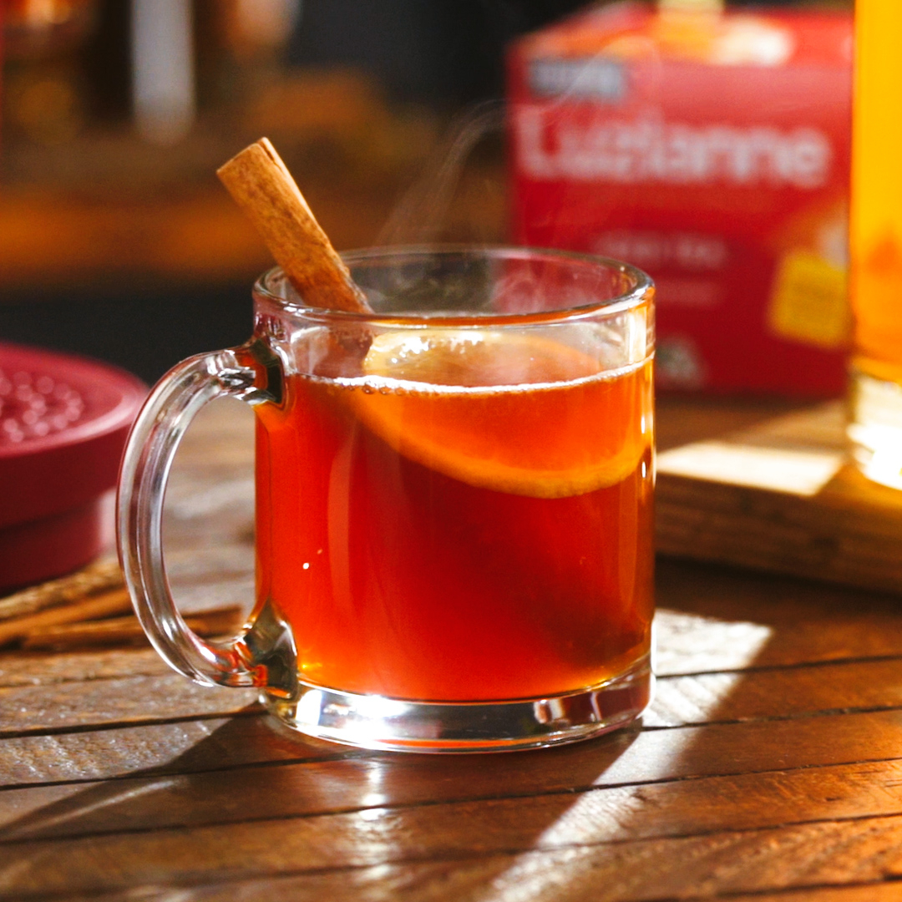

# Hot Maple Toddy

*The Canadian winter hot drink: Canadian rye whisky (or bourbon) + pure maple syrup + a squeeze of lemon juice + a generous slug of hot water, stirred in a heavy heatproof glass, served with a cinnamon stick to stir and a strip of lemon zest on the rim. The maple replaces honey from the classic Scottish-Irish hot toddy; the rye replaces Scotch. Drunk after a cold-weather hockey game, beside a Quebec fireplace in February, or at a Yukon trapline cabin at dusk. The Canadian sugar-shack ritual in a glass.*

**Serves:** 2

**Prep Time:** 5 minutes

**Cook Time:** 5 minutes

## Overview
The hot maple toddy is the Canadian winter answer to the British / Scottish / Irish hot toddy, with the canonical Canadian swap: maple syrup replaces honey, and Canadian rye whisky (or American bourbon, or sometimes Canadian dark rum) replaces Scotch whisky. The toddy is one of the world's oldest hot mixed drinks - the basic formula (spirit + sweetener + acid + hot water) appears in Scottish, Irish, English and Indian forms going back to the 18th century. The Canadian variation is distinctive enough to count as its own drink - the maple syrup (Grade A "Dark, Robust") brings a woody-caramel sweetness that honey can't match, and the Canadian rye whisky (Crown Royal, Canadian Club, Lot 40, or J.P. Wiser's) has a sweetness and corn-rye character that works in a way Scotch doesn't. Three things matter. First, the spirit choice: Canadian rye whisky is canonical; bourbon (Maker's Mark, Buffalo Trace) works as a substitute; Canadian dark rum (Newfoundland's Screech, or any aged dark rum) makes a Maritime variant. Second, the maple syrup grade: Grade A "Dark, Robust" or older "Grade B" - the darker grades give more depth. Light golden is too thin. Third, the temperature: the water should be hot but not boiling (about 85°C) - boiling water cooks off too much of the alcohol; lukewarm water leaves the drink unpleasantly tepid. A spoonful of hot water poured to fill the glass to 2/3, then the spirit and maple stirred in, then the lemon and cinnamon stick added last. Three details: GRADE A DARK MAPLE OR DARKER (Grade A Light is too thin; bourbon-grade depth is what works), HOT BUT NOT BOILING WATER (85°C; the alcohol stays, the lemon brightens, the maple dissolves), and CINNAMON STICK AS STIRRER (a real cinnamon stick steeps as it stirs, gently adding warming spice; ground cinnamon clouds the drink).

## Ingredients

### Per drink (multiply for more)
- 45 ml Canadian rye whisky (Crown Royal, Canadian Club, Lot 40, J.P. Wiser's) OR bourbon (Maker's Mark, Buffalo Trace) OR Canadian dark rum
- 2 tablespoons pure Canadian maple syrup (Grade A "Dark, Robust" or older Grade B)
- 1 tablespoon fresh lemon juice (about 1/4 of a lemon)
- 180 ml hot water (just below boiling; 85°C is ideal)
- 1 cinnamon stick (real bark, not ground)
- 1 strip of lemon zest (use a peeler; avoid the bitter white pith)
- 2 cloves (optional; pierce into the lemon strip for slow infusion)
- 1 thin slice of fresh ginger (optional; for a more warming variant)

### Glassware
- A heatproof glass (a hot-toddy glass, an Irish coffee glass, or a sturdy mug) - 250-300 ml capacity
- (If using a thin glass, warm it briefly with hot water first to prevent cracking)

### To serve alongside
- A small biscuit (shortbread, a butter tart, or a slice of fruit cake)
- A glass of cold water on the side
- (Optional: a small saucer of crystallised ginger)

## Method

### Stage 1 - Warm the glasses
1. Fill each glass halfway with hot tap water.
2. Let stand 30 seconds; tip out.
3. The glass is now pre-warmed and won't crack when the hot toddy goes in.

### Stage 2 - Boil and rest the kettle
1. Bring the kettle to the boil.
2. Let it stand 30 seconds (this drops the temperature from 100°C to about 85°C).
3. The water should be hot enough to dissolve the maple syrup and warm the drink, but not so hot it boils off the whisky.

### Stage 3 - Build the drink in the glass
1. Pour 45 ml of whisky into the warm glass.
2. Add 2 tablespoons of maple syrup.
3. Add 1 tablespoon of lemon juice.
4. Stir briefly to combine - the maple syrup should start dissolving into the spirit.

### Stage 4 - Add the hot water
1. Pour in 180 ml of the just-cooled hot water.
2. Stir gently with a long spoon till the maple syrup is fully dissolved.

### Stage 5 - Garnish
1. Drop in a cinnamon stick (which will continue to steep gently as you drink).
2. Twist a strip of lemon zest over the surface to release the citrus oils; drop it in.
3. If using cloves: pierce 2 cloves into the lemon strip first, then drop the studded zest in.
4. Optional: add a thin slice of fresh ginger.

### Stage 6 - Serve immediately
1. Hand the warm glass to the diner.
2. The first sip is the hottest; the drink cools as you go.
3. The cinnamon and lemon zest infuse the drink gently over 5-10 minutes; the last sip is the most aromatic.
4. Serve with a small biscuit alongside.

## Notes
- **Grade A Dark Robust maple syrup or darker:** the dark grades give the bourbon-like depth this drink needs. Grade A Light Golden is too thin and gives a one-dimensional toddy.
- **Hot but not boiling water:** 85°C is the sweet spot. Boiling water cooks off too much alcohol; lukewarm water gives a flat drink.
- **Pre-warm the glass:** a cold glass shocks the hot liquid and can crack thin glasses. 30 seconds of hot water beforehand prevents this.
- **Stick cinnamon, not ground:** the bark steeps gently as you drink; ground cinnamon clouds the liquid and settles on the bottom.
- **Don't squeeze too much lemon:** 1 tablespoon is the canonical proportion. More and the drink becomes lemonade-with-whisky; less and the maple sweetness goes unchallenged.
- **Drink hot, not cold:** the toddy is at its best for about 10 minutes. After that the temperature drops and the magic fades.

## Variations
**Hot maple toddy with bourbon (cross-border variant):** swap rye for bourbon (Maker's Mark, Buffalo Trace) - sweeter, more vanilla.
**Hot maple-and-rum toddy (Maritime variant):** swap whisky for Newfoundland Screech rum or any dark Caribbean rum - rounder, more molasses.
**Hot maple-ginger toddy:** add a thin slice of fresh ginger to the glass; double the spice warmth - the Yukon trapline variant.
**Hot maple Earl Grey toddy:** swap the hot water for hot brewed Earl Grey tea - gives the bergamot note alongside the maple.
**Hot apple-maple toddy:** swap half the water for hot apple juice; great for Christmas market settings.
**Hot maple-buttered toddy (Canadian "hot buttered rum" cousin):** add 1 teaspoon of unsalted butter to the drink; stir till melted - the rich winter variant.
**Hot maple toddy with cardamom:** add 1 cardamom pod (lightly crushed) to the glass; gives a fragrant subtle spice.
**Non-alcoholic maple "toddy":** swap whisky for strong brewed black tea (or rooibos for a caffeine-free option); same maple, lemon, cinnamon - the designated-driver winter warmer.
**Smoked maple toddy:** use a smoked salt rim and a slightly smoky whisky (Forty Creek Smoke Show) - the modern Toronto variant.
**Hot maple toddy with herbal bitters:** add 2 dashes of orange bitters or Angostura - a slightly more cocktail-bar variant.

## Serving
At a Quebec sugar shack in the spring sap-running season (the canonical setting; March-April) · at a Canadian ski-resort fireside lounge · at a Yukon trapline cabin · at a Vancouver Island winter cottage · at a Canadian Christmas Eve · at home on a cold January evening · at a Canadian hockey-watching party · paired with a butter tart, a slice of tourtière, or a small piece of Canadian dark chocolate.

## Storage
- Make and drink fresh. The hot toddy doesn't store.
- The maple syrup, whisky, and lemon all keep separately as normal pantry items.
- A "toddy mix" of pre-blended maple + lemon + spices can be made ahead (mix 4 portions worth in a small jar) and refrigerated 1 week; add hot water and whisky on demand for fast service.
- The cinnamon sticks reuse well - dry them out for an hour after the first use; they keep some flavour for a second toddy though the first use is the best.
- The maple syrup itself improves with quality - if you can source a single-tree pure Quebec syrup from a specific producer (Cyril Charbonneau, Jacques Lavallée, or one of many small-batch operations), the difference from generic supermarket maple is dramatic.
