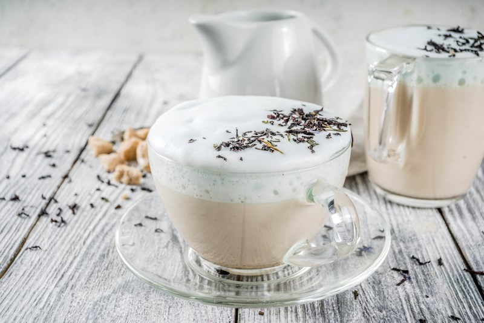

# London Fog (Vancouver Tea Latte)

*Vancouver's contribution to the world's coffee-shop menu: strong Earl Grey tea topped with steamed milk and a pump of vanilla syrup, the bergamot rising through the steam like fog.*

**Serves:** 2

**Prep Time:** 5 minutes

**Cook Time:** 5 minutes

## Overview
The London Fog is one of Canada's most successful modern drink exports. Despite the name, it has nothing to do with London: it was invented in Vancouver, British Columbia, in the mid-1990s. The most-credited origin story attributes it to Mary Loria, who reportedly asked a Vancouver coffee shop barista for "something warm and not coffee" in 1995 while pregnant; the barista brewed Earl Grey concentrated, added steamed milk and vanilla syrup, and called it a London Fog for the misty Vancouver atmosphere outside. Starbucks added it to its menu in 2009 and the drink has spread worldwide. The bergamot oil in Earl Grey is what gives the drink its distinctive citrus-floral note. Strong-brewed tea (two bags per 200 ml of hot water, steeped four or five minutes), steamed whole milk and a pump or two of vanilla syrup in roughly equal parts make up the build, served in a tall ceramic mug. Fragrant, gently sweet, milky-warm: exactly the right thing for a damp Vancouver afternoon.

## Ingredients

### Per drink (multiply for more)
- 1 Earl Grey tea bag OR 1 tablespoon loose-leaf Earl Grey (good quality - Twinings, Taylor's, Harney & Sons; the flavour matters)
- 200 ml freshly boiled water (at 95°C; not above 100°C - bergamot turns bitter at full boil)
- 200 ml whole milk
- 2 teaspoons vanilla syrup (homemade or shop-bought; recipe below)
- Optional: a small lavender bud or 2 drops of lavender extract (for the "Earl Grey lavender" variant)

### Homemade vanilla syrup (makes 250 ml, enough for many drinks)
- 200 g caster sugar
- 200 ml water
- 1 vanilla pod, split lengthways and seeds scraped (OR 2 teaspoons good vanilla extract)

### Equipment
- A teapot OR a small heatproof jug for brewing
- A milk-steamer OR a small saucepan + a hand whisk
- A tall ceramic mug (about 350 ml capacity)

### To serve alongside (optional)
- A small biscuit (shortbread, biscotti, or speculoos)
- A tiny pot of extra vanilla syrup for those who want it sweeter

## Method

### Stage 1 - Make the vanilla syrup (one-time prep)
1. In a small saucepan, combine the sugar and water.
2. Add the scraped vanilla pod and seeds.
3. Bring to a gentle boil; simmer 2 minutes till the sugar fully dissolves.
4. Take off the heat; let cool.
5. Strain into a clean glass bottle.
6. Refrigerates 4 weeks.

### Stage 2 - Brew the tea
1. Place the tea bag (or loose-leaf in a strainer) in a small heatproof jug.
2. Pour over 200 ml of just-boiled water (let the kettle cool 30 seconds after boiling to drop from 100°C to about 95°C - bergamot is volatile and turns bitter at full boil).
3. Brew 4-5 minutes (a strong brew - the bergamot needs to be present even after dilution by milk).
4. Remove the tea bag (or strain out the loose-leaf).

### Stage 3 - Steam the milk
1. Pour the whole milk into a small saucepan.
2. Warm over medium heat 2-3 minutes till the milk reaches 60-65°C (steaming, just before the simmer; bubbles forming at the edge).
3. Off the heat, whisk vigorously by hand for 30 seconds to create some foam - or use a milk-steamer wand if you have one.
4. (If using a stovetop espresso milk-steamer or a French press, follow that method instead.)

### Stage 4 - Assemble
1. Pour 100 ml of the brewed Earl Grey into the bottom of each warmed mug.
2. Add 1-2 teaspoons of vanilla syrup; stir gently.
3. Pour the steamed milk over - aim for the centre of the mug so the milk sinks in and mixes; finish by spooning a small dollop of foam on top.
4. The drink should be the colour of a milky tea with a light foam crown.

### Stage 5 - Serve
1. Serve in a tall ceramic mug.
2. (Optional) Place a small biscuit on the saucer.
3. Drink hot. The bergamot rises with the steam.

## Notes
- **Strong tea is essential:** a weak brew gets lost behind the milk. 2 tea bags (or a heaped tablespoon of loose-leaf) per 200 ml of water gives the right concentration.
- **Don't boil the bergamot:** Earl Grey's bergamot oil is volatile; full boiling water makes it bitter. 95°C (let the kettle cool 30 seconds after boiling) is the sweet spot.
- **Whole milk steams better than skim:** the fat carries the flavour and gives the right mouthfeel. Skim milk creates more foam but lacks body.
- **Vanilla syrup, not vanilla extract:** the syrup adds both sweetness and vanilla flavour, balancing the bitter-citrus of the Earl Grey. Extract alone gives flavour without sweetness, throwing off the balance.
- **Don't over-sweeten:** 1-2 teaspoons of syrup is the traditional amount. More and the drink becomes a vanilla milkshake.
- **Brew teabag vs loose-leaf:** loose-leaf gives better flavour (especially Earl Grey, where the bergamot oil quality varies enormously between brands). Twinings Earl Grey bags work; a good loose-leaf Earl Grey from a specialty tea shop is markedly better.

## Variations
**Earl Grey Lavender Fog (modern Vancouver):** add 2-3 lavender buds to the brewing tea, OR 2 drops of culinary lavender extract to the milk - the floral variant.
**Maple London Fog:** swap the vanilla syrup for 2 teaspoons pure maple syrup - the Quebec-Vancouver crossover.
**Iced London Fog:** brew the tea hot, add vanilla syrup, cool; pour over ice with cold milk - the summer variant.
**Honey London Fog:** swap the vanilla syrup for 1-2 teaspoons of good honey - more delicate, more aromatic.
**Vanilla bean London Fog:** infuse the milk with a split vanilla pod (warm in the milk for 5 minutes, then strain) - the extravagant variant.
**Earl Grey Crème Brûlée Fog:** add a tablespoon of double cream and a touch more sugar; gives a richer, custard-like body.
**Decaf London Fog:** swap the regular Earl Grey for decaf (rare but available) - the late-afternoon and evening version.
**Spiced London Fog:** add a pinch of ground cardamom, cinnamon, and ginger to the brewing tea - the chai-influenced variant.
**Vegan London Fog:** swap whole milk for oat milk (the best stand-in; oat milk steams beautifully); same vanilla syrup.

## Serving
At a Vancouver coffee shop (the traditional setting; the drink's birthplace) · at a Canadian coffee shop nationwide · at a Toronto tea-room · at a Calgary independent café · at a Maritime tea-and-cake shop · at a Yukon hotel lobby on a winter afternoon · at home as the Sunday morning weather-permitting brew · paired with a Nanaimo bar, a butter tart, or a fresh-baked biscuit.

## Storage
- Brew and drink fresh. London Fog doesn't reheat well - the milk forms a skin and the tea goes bitter on a second heat.
- The vanilla syrup keeps refrigerated 4 weeks in a sealed glass bottle.
- Tea bags / loose-leaf tea keeps in a dry tin indefinitely (though Earl Grey loses bergamot fragrance after 12-18 months; buy fresh for the best flavour).
- A pre-brewed "London Fog concentrate" (strong brewed tea + vanilla syrup mixed) keeps refrigerated 3 days; add hot milk on demand for fast service.
- Iced London Fog can be batch-brewed; refrigerate the iced version 24 hours.
