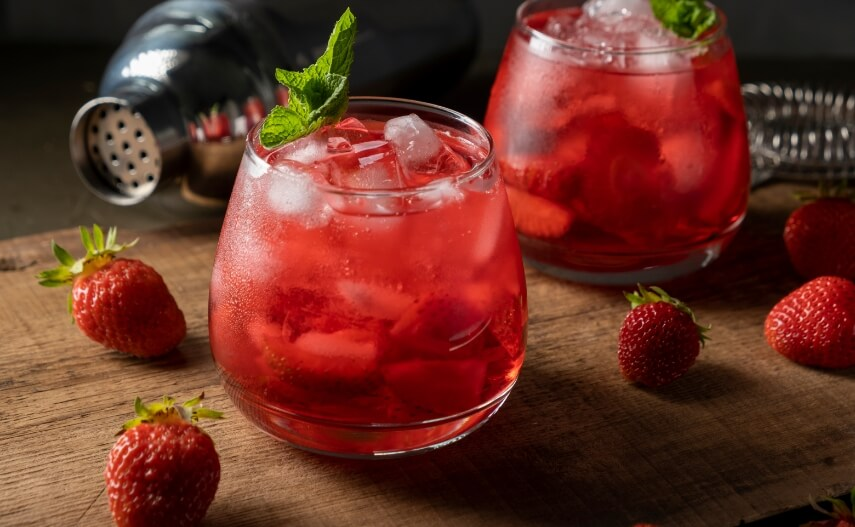

# Borgoña

*Chile's summer wine punch: ripe strawberries macerated in sugar and red wine for a few hours, served chilled in tall glasses with strawberries floating in the wine. The traditional drink at Fiestas Patrias (Chile's September independence celebrations).*

**Serves:** 6 tall glasses (makes 1.5 litres)

**Prep Time:** 10 minutes (plus 2 hours macerating)

**Cook Time:** 0 minutes

## Overview
Borgoña ("Burgundy") is Chile's strawberry-and-red-wine punch, traditional at Fiestas Patrias in September (Chile's independence holiday) when strawberry season peaks and the country is shaking off winter. The build is straightforward: ripe strawberries hulled and quartered, layered in a tall jug with sugar to macerate for 1-2 hours, then drowned in a cheap-but-honest Chilean red wine and chilled for another hour or two. The strawberries release their juice into the wine, sweetening and flavouring it, while absorbing the wine themselves; you eat the now wine-soaked strawberries with a spoon after drinking the wine. The drink is poured cold over ice in tall glasses, with a generous helping of fresh and macerated strawberries floating in each glass. The same template exists across Chile, Argentina (where it's sometimes called "sangría chilena" by tourists) and Bolivia.

## Ingredients

- 500 g fresh ripe strawberries
- 100 g caster sugar
- 1 bottle (750 ml) of dry-to-medium Chilean red wine (a Carmenère, Cabernet Sauvignon, or País - Chile's grape varieties; or any drinkable but not expensive red wine, £6-8)
- 250 ml cold sparkling water or soda water
- A small pinch of fine salt

### To serve
- Plenty of ice cubes
- 6 tall glasses, chilled
- A long-handled spoon for fishing out the strawberries
- Optional: a few mint sprigs to garnish

## Method

### Stage 1 - Macerate the strawberries
1. Hull and quarter the strawberries (or halve if they're small).
1. Put them in a large jug or pitcher with the sugar. Stir gently to coat.
1. Cover and refrigerate at least 1 hour, ideally 2 hours. The strawberries will release their juice and produce a sweet pink syrup at the bottom of the jug.

### Stage 2 - Add wine and salt
1. Pour the wine over the macerated strawberries. Stir gently to combine.
1. Add the pinch of salt - it amplifies the strawberry flavour without tasting salty.
1. Cover and refrigerate another 1-2 hours. The strawberries will absorb wine and turn from pink to a deep red; the wine will sweeten and develop a clear strawberry character.

### Stage 3 - Finish with sparkling water
1. Just before serving, stir in the cold sparkling water. This gives borgoña a faint fizz that contrasts with the still wine - important.
1. Taste: it should be lightly sweet, distinctly red-wine with a bright strawberry forward note, and a clean acidity. Add a tablespoon more sugar if too dry, more wine if too sweet.

### Stage 4 - Serve
1. Fill tall glasses with ice cubes.
1. Ladle the borgoña over, making sure each glass gets a few strawberry pieces.
1. Garnish with a mint sprig if you have one.
1. Serve immediately with a long spoon.

## Notes
- **Strawberries must be ripe.** Under-ripe strawberries give a flat tasteless drink. The strawberries should yield to gentle thumb pressure and smell sweet.
- **Wine quality.** A £6-8 drinkable Chilean red is the right call. £20 wine is wasted (the strawberries dominate); £4 grocery-store red is rough. Chilean Carmenère is the ideal grape variety; Cabernet Sauvignon works; País gives a slightly rustic version.
- **The salt pinch.** A tiny pinch of salt amplifies the strawberry without making the drink taste salty. Don't skip.
- **Sparkling at the end.** The fizz lift at serving is important - adds brightness. Don't pre-add the sparkling water hours ahead; the bubbles dissipate.

## Variations
- **With peaches.** Replace strawberries with stoned and sliced ripe peaches; common in summer Chilean households. Sometimes called "borgoña de durazno".
- **With chirimoya.** Add cubes of fresh cherimoya (custard apple) to the macerating jug; tropical, very Andean.
- **Without sparkling.** Skip the soda water for a stiller, more traditional version. The sparkling addition is a modern lift.
- **Frozen.** Pour assembled borgoña into shallow trays, freeze for 2 hours, scrape into a slushie. Chilean summer dessert.

## Storage
- Macerated strawberries and wine (without the sparkling water) keep 2 days in the fridge sealed. Add sparkling water at serving.
- The wine-soaked strawberries themselves are excellent over ice cream or yogurt the next day - eat them as the byproduct.
