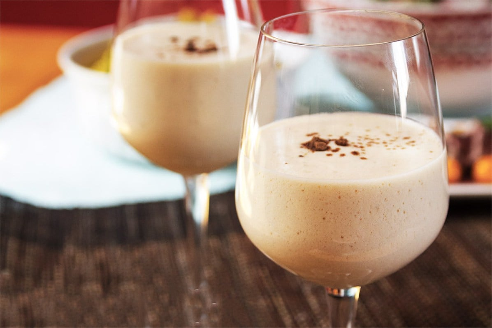

# Cola de Mono

*Chile's Christmas drink: warm milk infused with coffee, cinnamon, cloves and orange peel, sweetened with sugar, fortified with aguardiente (Chilean grape spirit). Served in chilled glasses on Christmas Eve, with kuchen or pan de pascua on the side.*

**Serves:** 6 small glasses (makes 1 litre)

**Prep Time:** 5 minutes

**Cook Time:** 15 minutes (plus 4 hours chilling)

## Overview
Cola de mono ("monkey's tail" — the name's origin is debated, possibly referencing the dark colour, possibly a Chilean joke that's been lost to time) is Chile's signature Christmas drink, served at every Nochebuena (Christmas Eve) family table from Santiago to Valparaíso to Punta Arenas. The build is warm whole milk infused with strong instant or brewed coffee, a generous quantity of ground cinnamon, cloves and a strip of orange peel, sweetened with sugar and fortified with aguardiente — the local grape-based spirit (similar to pisco but typically lower-grade). The result is a deep beige-brown spiced milky liquid that tastes like a Chilean cousin of eggnog, but with coffee replacing the egg yolks. It's served chilled (not hot — important), in small glass tumblers, alongside pan de pascua (the Chilean Christmas fruit-and-nut bread) or kuchen.

## Ingredients

- 1 litre whole milk
- 2 tablespoons instant coffee (or 100 ml of strong brewed espresso added cold)
- 2 cinnamon sticks
- 6 whole cloves
- A 5 cm strip of unwaxed orange peel
- 1 vanilla pod, split lengthways (or 1 tablespoon vanilla extract)
- 150 g caster sugar
- 250 ml aguardiente (Chilean grape spirit; substitute with pisco at 38% ABV, or with vodka, brandy, or a neutral grain spirit)

### To serve
- 6 small glass tumblers, chilled
- A bottle that can be sealed and refrigerated
- Optional: small slices of pan de pascua or kuchen alongside

## Method

### Stage 1 - Infuse
1. Pour the milk into a heavy-bottomed saucepan. Add the cinnamon sticks, cloves, orange peel and split vanilla pod (or vanilla extract).
1. Warm over medium-low heat, stirring occasionally, until the milk is steaming but not boiling (about 70°C). Hold at that temperature for 10 minutes to infuse — don't let it boil over.

### Stage 2 - Sweeten and add coffee
1. Stir in the instant coffee (or the cold-brewed espresso) and the sugar. Continue gentle warming for 2-3 minutes until sugar fully dissolves.
1. Remove from heat.

### Stage 3 - Strain and add the spirit
1. Strain through a fine sieve into a 1-litre or larger bottle (a clean reused wine or spirit bottle works), discarding the cinnamon sticks, cloves, peel and vanilla pod.
1. Once the milk has cooled to room temperature (about 30 minutes), stir in the aguardiente / pisco. Don't add the spirit while the milk is hot — heat drives off alcohol.

### Stage 4 - Chill
1. Seal the bottle. Refrigerate at least 4 hours, ideally overnight. Cola de mono improves with chilling.

### Stage 5 - Serve
1. Shake the bottle well — the spice oils and milk solids separate as it sits.
1. Pour into chilled small tumblers.
1. Serve with a slice of pan de pascua or other Christmas cake.

## Notes
- **Aguardiente vs pisco.** Authentic Chilean cola de mono uses aguardiente — a slightly rougher, cheaper Chilean grape spirit. Pisco is a Chilean / Peruvian spirit too but typically higher-end. Either works; the Chilean version typically uses cheaper aguardiente. Outside Chile, any neutral grape spirit, brandy or vodka can substitute.
- **Don't boil.** Boiling the milk gives a scorched-skin texture and kills the delicate aromatics. Steady warmth at 70°C is right.
- **Add the spirit cold.** Heat evaporates alcohol; let the spiced milk cool to room temperature before adding the aguardiente.
- **Served cold, not hot.** Cola de mono is a CHILLED drink despite its warming spices. Hot versions exist but are not traditional.

## Variations
- **Without vanilla.** Skip; rare in modern recipes but the most traditional 19th-century version had no vanilla.
- **Without coffee (cola de mono blanca).** Skip the coffee for a pale version; more like a spiced milk punch. Less common but exists.
- **With orange juice.** Add the juice of 1 fresh orange (instead of just the peel) to the infusion. Brighter, modern variant.
- **Decaf.** Use decaf instant coffee for a kid-friendly non-alcoholic version (also skip the aguardiente). Then it's basically spiced cold coffee milk.

## Storage
- Sealed in a bottle in the fridge, cola de mono keeps 2 weeks easily and improves over the first week. The spice infusion deepens with time.
- Don't freeze; texture is destroyed.
