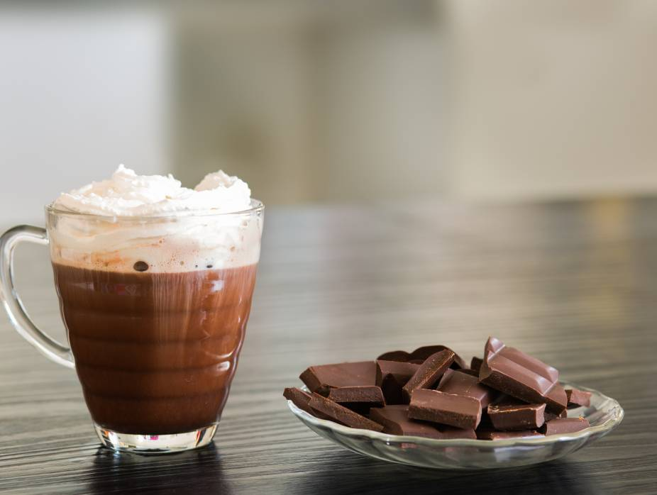

# Submarino

*Chile's classic kids' afternoon drink: a tall glass of hot milk into which a chunk of dark chocolate is dropped to slowly sink and melt, stirred with a long spoon as it dissolves. Simple, theatrical, deeply comforting. The chocolate substitutes the cocoa powder you'd otherwise have to stir in.*

**Serves:** 2 mugs

**Prep Time:** 1 minute

**Cook Time:** 6 minutes

## Overview
Submarino (literally "submarine" - named for how the chocolate "dives" into the milk) is the Chilean answer to "kids want hot chocolate". Instead of pre-mixing cocoa powder, sugar and milk, you pour a tall glass of hot milk and drop in a chunk of dark chocolate - typically a square or two from a bar of plain dark chocolate, sometimes a specifically-sold "submarino" chocolate cube. The chocolate slowly melts and sinks; the drinker stirs gradually to encourage dissolving, watching the dark spiral spread through the milk. By the time the chocolate has fully melted (about 4-5 minutes), you have a glass of homemade hot chocolate - milky, properly chocolate, with whatever exact sweetness you'd add yourself. Found in every Chilean café from breakfast hours through afternoon merienda, served alongside sopaipillas (fried dough discs) or marraqueta bread with butter. Adults sometimes add a shot of pisco or rum for a grown-up version.

## Ingredients

- 600 ml whole milk
- 100 g dark chocolate (60-70% cocoa; a single thick bar broken into 2-4 large chunks, or 2 traditional "submarino" cubes from a Chilean grocery)
- 2 to 4 teaspoons sugar, to taste
- A pinch of fine salt
- 1/2 teaspoon vanilla extract (optional)
- 1/4 teaspoon ground cinnamon (optional, kid-friendly twist)

### To serve
- 2 tall heatproof mugs or glass tumblers
- 2 long spoons (essential - the chocolate needs stirring)
- Optional: a small piece of sopaipilla or marraqueta on the side

## Method

### Stage 1 - Warm the milk
1. Pour the milk into a small saucepan with the salt (and vanilla and cinnamon if using).
1. Warm over medium-low heat, stirring occasionally, until the milk is steaming but not boiling - about 70°C. Don't let it boil hard, you want hot enough to melt chocolate but not so hot that the chocolate seizes.

### Stage 2 - Pour and submerge
1. Pour the hot milk into 2 tall mugs.
1. Drop 2 large chunks (or 1 submarino cube) of dark chocolate into each mug. The chocolate immediately sinks to the bottom.

### Stage 3 - Stir to dissolve
1. Hand each drinker a long spoon. Stir gently, breaking up the chocolate as it softens.
1. The full melt takes 4 to 5 minutes; the drinker stirs intermittently and watches the dark chocolate spiral through the white milk.

### Stage 4 - Sweeten
1. Once the chocolate is fully dissolved, stir in 1 to 2 teaspoons of sugar per mug to taste.
1. Serve immediately with a small piece of sopaipilla or buttered marraqueta on the side.

## Notes
- **Quality chocolate matters.** This drink is just milk and chocolate, so the chocolate has to be good. Use 60-70% dark chocolate; brands like Lindt, Callebaut or even a quality supermarket dark work. Milk chocolate gives a thin, overly-sweet drink.
- **Don't boil the milk.** Hot enough to melt chocolate (70°C+), not so hot the chocolate seizes (above 90°C makes chocolate grainy). Steady warmth, not aggressive heat.
- **Theater is half the point.** Serving the chocolate already-melted in milk is just hot chocolate; the "submarine" effect - watching the chunk sink, stir, dissolve - is what makes this submarino. Always drop the chocolate in at the table.
- **No pre-stirring.** Don't pre-melt the chocolate in the saucepan. Drop it whole into the glass.

## Variations
- **Submarino con pisco.** Add a 30 ml shot of pisco to each glass before pouring in the hot milk. The adult Chilean version, common at chilly autumn afternoons.
- **Submarino blanco.** Use white chocolate instead of dark. Sweeter, kids tend to prefer it; loses the dramatic dark spiral.
- **Submarino picante.** Add a pinch of ground chilli to the milk. Mexican-inflected; rare in Chile but popular among adventurous adults.
- **Submarino mocha.** Add 1 teaspoon of instant coffee to the warmed milk. Coffee-chocolate hybrid; the adult morning version.

## Storage
- Doesn't store; build to order. The "submarine" experience requires the chocolate to be unmelted at serving.
