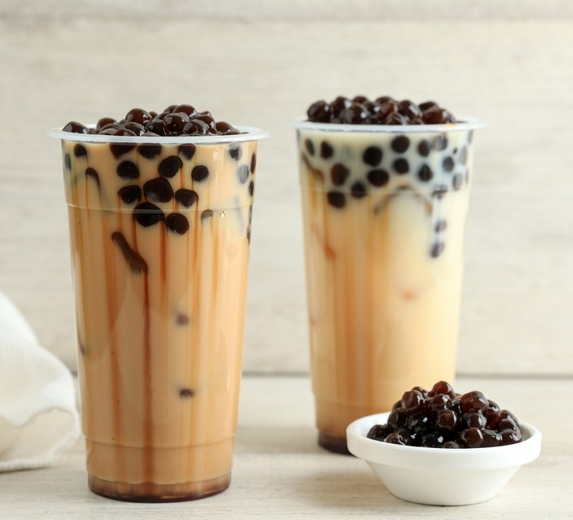

# Bubble Tea

*Sweetened iced black tea with milk and chewy black tapioca pearls at the bottom, drunk through an oversized straw: the Taiwanese invention that turned into a global obsession.*

**Serves:** 2

**Prep Time:** 5 minutes

**Cook Time:** 25 minutes

## Overview
Bubble tea (also called boba) was invented in 1980s Taichung, Taiwan, by either Chun Shui Tang or Hanlin Tea Room (lawsuit settled, both claim origins). The build is sweet milky iced tea over a layer of chewy black tapioca pearls (the "bubbles") sucked up through a wide straw thick enough to capture them. A proper bubble tea uses fresh-boiled tapioca pearls (15 minutes in boiling water, then 25 minutes resting in sugar syrup), strong-brewed black or green tea, evaporated or non-dairy creamer, and brown-sugar syrup. The pearls have to be chewy not gummy; the tea has to be properly strong so the milk doesn't mute it; and the ratio of pearl to liquid matters. Get all three right and you understand why this took over the world.

## Ingredients

### Tapioca pearls
- 80 g dried black tapioca pearls (large pearls, "boba"; from Asian groceries)
- 1 litre boiling water
- 4 tablespoons brown sugar (for the syrup soak)

### Tea base
- 400 ml just-boiled water
- 2 tablespoons strong black tea (Assam, or jasmine green for a lighter version)
- 4 tablespoons brown sugar syrup (or to taste)
- 200 ml evaporated milk or whole milk

### To serve
- Plenty of ice cubes
- Wide bubble tea straws (the 12mm-wide ones)

## Method

### Stage 1 - Cook the pearls
1. Bring the litre of water to a rolling boil; tip in the dried pearls.
1. Stir to prevent sticking; reduce to medium boil for 15 minutes. The pearls will float when nearly done.
1. Off heat, cover and rest for 10 minutes.
1. Drain and rinse briefly in cold water.

### Stage 2 - Syrup soak
1. Combine the 4 tablespoons brown sugar with 2 tablespoons hot water in a bowl; stir to dissolve into syrup.
1. Tip in the cooked pearls; toss to coat. Let sit 5 to 10 minutes so the pearls absorb the syrup.

### Stage 3 - Brew the tea
1. Steep the tea leaves in the just-boiled water for 5 minutes; strain.
1. Stir in the brown sugar syrup while warm so it dissolves.
1. Cool to room temperature.

### Stage 4 - Build
1. Spoon a generous layer of pearls into the bottom of each tall glass.
1. Pour over a pour of pearl syrup (about a tablespoon per glass).
1. Fill the glass with ice cubes.
1. Pour over the cooled sweetened tea (about three-quarters full).
1. Top with the evaporated milk; stir once gently.
1. Add a wide bubble tea straw; serve immediately.

## Notes
- **Pearls are best within 4 hours of cooking.** They go hard in the fridge overnight; cook fresh batches each time.
- **Strong tea is non-negotiable.** Weak tea + milk + sugar gives a flat sweet drink; strong tea is what makes bubble tea taste of tea.
- **Wide straw, not a normal one.** Standard straws are too thin for the pearls to come up; the 12mm bubble tea straw is essential.

## Storage
- Drink immediately. Cooked pearls don't keep; brewed tea (no milk) refrigerates 24 hours.
