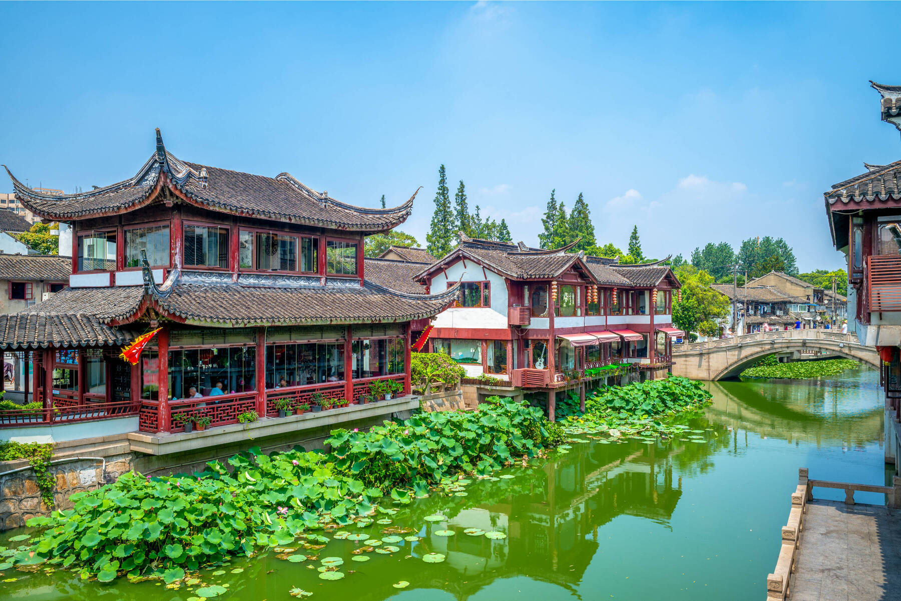

# Drinks of China

Jasmine and oolong brewed gong fu cha-style in tiny pots, pu-erh aged in dark cakes, suanmeitang (smoked sour-plum drink) iced in summer, chrysanthemum tea for the heat in the body, and baijiu raised at the round table.
