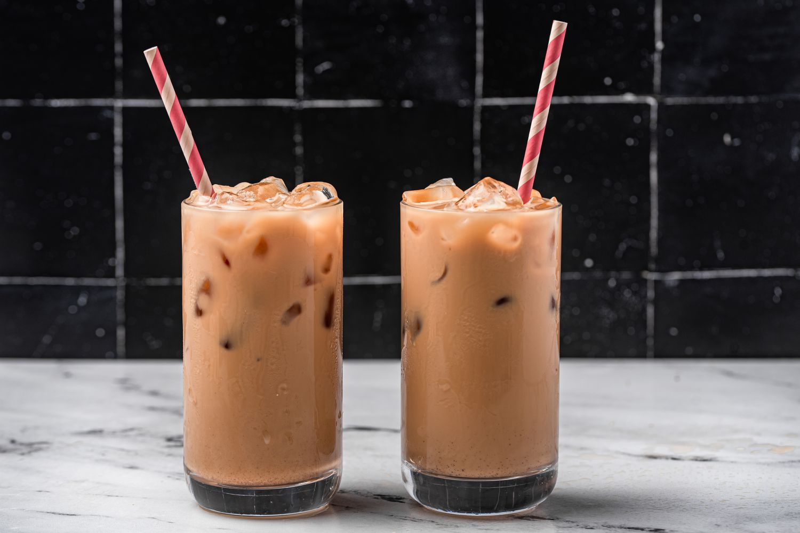

# Hong Kong Milk Tea

*The Hong Kong cha chaan teng classic: strong Ceylon black tea pulled through stockings, blended with evaporated milk and sugar, served from tin teapots from morning till closing.*

**Serves:** 2

**Prep Time:** 3 minutes

**Cook Time:** 10 minutes

## Overview
Hong Kong milk tea (also called silk-stocking tea, after the cloth filter the better cha chaan tengs use) is the British colonial milky tea reinterpreted for Hong Kong palates: strong Ceylon black tea boiled in water with evaporated milk instead of fresh, sweetened heavily, served piping hot in winter or over ice in summer (the iced version, "lai cha", is the more famous export). The "pull" (pouring the tea repeatedly from teapot to teapot through a cloth filter) is what gives the drink its silky body and the cha chaan teng its theatre. At home a fine-mesh sieve does the same job. The right tea is a Ceylon-heavy blend; the right milk is full-fat Carnation evaporated.

## Ingredients

### Per pot (2 mugs)
- 500 ml cold water
- 3 tablespoons loose-leaf strong black tea blend (Ceylon + Pu-erh or Assam; Lipton Yellow Label works in a pinch)
- 200 ml evaporated milk (Carnation full-fat)
- 4 tablespoons caster sugar (or sweetened condensed milk for a richer drink)

## Method

1. Bring the water to a rolling boil; add the tea leaves and reduce to medium-low heat. Simmer 5 minutes, then cover and steep off-heat for another 3 minutes.
1. The "pull": strain the tea through a fine sieve into a second teapot or saucepan; pour back through the sieve into the original pot. Repeat 3 to 4 times. The tea oxygenates and becomes silky.
1. Stir in the sugar until dissolved.
1. Pour the hot tea into thick-walled mugs; top up each with the evaporated milk to the colour you like (typically about 60:40 tea to milk).

## Notes
- **The pull is the trick.** Skipping it gives a perfectly drinkable but thinner milk tea; the repeated strain-and-pour is what makes a proper Hong Kong cup.
- **Evaporated milk, not fresh.** Fresh milk doesn't have the depth; evaporated milk's caramelised sweetness is the defining note.
- **For iced lai cha.** Brew double-strength, cool, pour over a tall glass of ice and top with cold evaporated milk and sugar to taste.

## Storage
- Drink immediately while hot.
