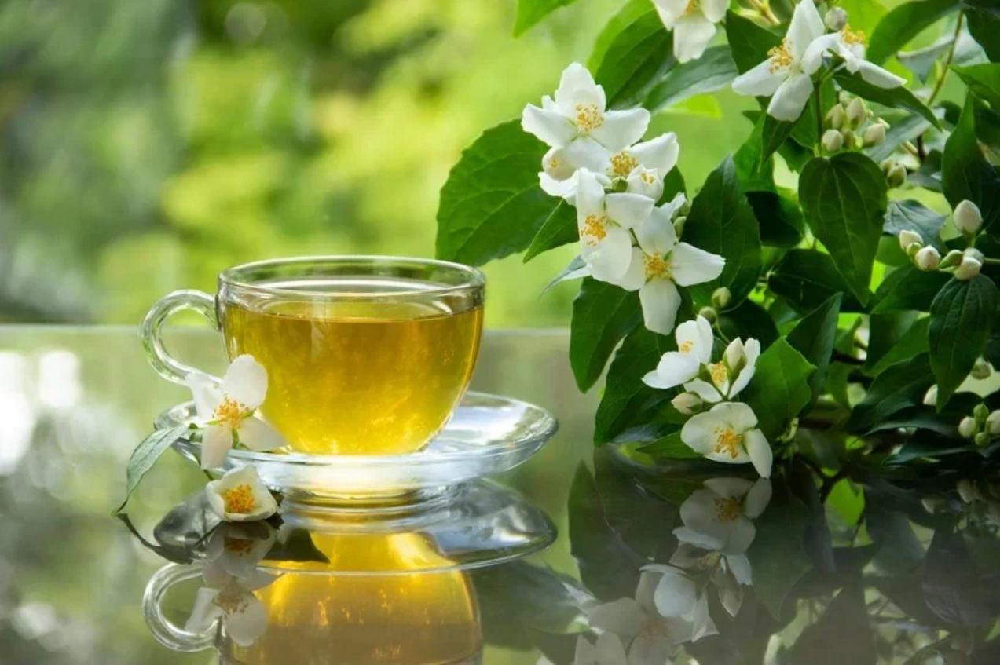

# Jasmine Tea

*Chinese green or white tea scented with fresh jasmine blossoms over multiple infusions: floral, gentle, the everyday tea served at dim sum across the country.*

**Serves:** 4

**Prep Time:** 2 minutes

**Cook Time:** 5 minutes

## Overview
Jasmine tea is the scented Chinese tea that anchors dim sum lunch and afternoon tea breaks across the country: a base of green or white tea leaves are layered with fresh jasmine blossoms for several nights, the leaves absorb the floral perfume, and what you brew out is a delicate honeyed-floral cup that tastes far more sophisticated than a plain green. The good stuff (jasmine pearls, pearl-rolled silver tip tea) unfurls beautifully in the gaiwan; the everyday stuff (jasmine loose leaf) brews up fine in a teapot. Multiple short infusions, never a long single steep; the same leaves give 3 to 4 pots of tea, each one slightly different.

## Ingredients

- 6 g loose-leaf jasmine tea (jasmine pearls or loose jasmine green; about 2 teaspoons of pearls or 3 of loose)
- 600 ml water at 75 to 80°C (NOT boiling; boiling water scorches the green leaves and ruins the flavour)

### To serve
- A gaiwan (Chinese covered teacup) or small teapot
- Small handleless cups

## Method

1. Boil the water, then let it stand for 1 to 2 minutes to drop to about 80°C.
1. Place the tea leaves in a warmed teapot or gaiwan.
1. Pour over a small amount of water (just enough to wet the leaves); discard after 5 seconds (this "rinse" wakes the leaves and removes any dust).
1. Pour over the rest of the water; steep for 1 to 2 minutes for the first infusion, then strain or pour into cups.
1. Refill the same leaves for subsequent infusions; each can go slightly longer (2, then 3 minutes).

## Notes
- **Don't use boiling water.** Green tea leaves cook above 85°C; the resulting cup is bitter and dull. 75-80°C is the right zone.
- **Short steeps, many infusions.** The Chinese way is several short brews from the same leaves rather than one long over-extraction.
- **Jasmine pearls vs loose.** Pearls (silver tip pearls scented with jasmine) are the higher grade; they unfurl into beautiful long leaves and give 4+ infusions. Loose jasmine green is the everyday choice.

## Storage
- The dry leaves keep in an airtight tin away from light for 6 months. Brewed tea is best within an hour.
