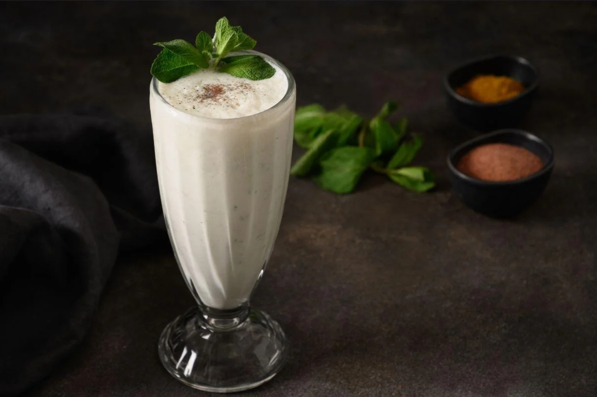

# Classic Lassi

*The Punjabi long pour: cold yogurt, sugar, ice, and the slow shimmer of cardamom across the top.*

**Serves:** 4

**Prep Time:** 5 minutes

**Cook Time:** 0 minutes

## Overview
The cold drink that finishes every Punjabi summer lunch, and the one you'll find served in tall steel glasses from Lahore to Delhi to Amritsar. The basic mixture is full-fat yogurt loosened with cold water, sweetened with sugar, and perfumed with green cardamom; everything goes into a blender or shaker until it's smooth and frothy on top. Some houses add a few drops of rose water for floral lift; others stay strict and let the cardamom and the dairy speak for themselves. The texture should be drinkable but coating, somewhere between buttermilk and a thin milkshake; if it's too thick to draw through a straw, splash in more water. Pour over ice into a tall glass, dust the top with a pinch of crushed cardamom and a few rose petals if you have them, and drink it cold at the start of a heavy meal or right after, when the spice has done its work and you want something to settle everything down.

## Ingredients

### Lassi base
- 600 g thick full-fat plain yogurt (Greek-style or hung curd ideal; or whole-milk dahi)
- 300 ml cold water (start with 250 ml and adjust to consistency)
- 4 to 6 tablespoons caster sugar (to taste; some prefer it barely sweet)
- 8 green cardamom pods (lightly crushed, seeds only)
- ¼ teaspoon rose water (optional, for floral lift)
- Pinch of fine salt (sharpens the dairy)

### To serve
- Plenty of ice cubes
- Pinch of ground cardamom (for dusting)
- A few dried rose petals (optional, traditional)
- Slivered pistachios (optional, traditional)

## Method

### Stage 1 - Crush the cardamom
1. Lightly crush the green cardamom pods in a pestle and mortar to crack the husks.
1. Pick out the small black seeds and discard the green husks.
1. Grind the seeds to a coarse powder.

### Stage 2 - Blend
1. Tip the yogurt, 250 ml of the water, sugar, cardamom powder, rose water (if using) and salt into a blender.
1. Blend on medium-high for 30 to 45 seconds until smooth and a layer of foam forms on top.
1. Check the consistency: it should pour easily but coat the back of a spoon. Add more water 25 ml at a time if it's too thick.
1. Taste and adjust the sugar if needed.

### Stage 3 - Serve
1. Half-fill four tall glasses with ice cubes.
1. Pour the lassi over the ice. The foam will rise to the top.
1. Dust the top with a pinch of ground cardamom and scatter a few rose petals and slivered pistachios if using.
1. Serve immediately with the meal or straight after.

## Notes
- **Yogurt thickness sets everything else.** Greek-style or hung curd gives the richest mouthfeel; runny yogurts produce a thinner lassi and need less water. Taste the yogurt first, the sourer it is, the more sugar you'll want.
- **Don't over-blend.** Thirty to forty-five seconds is plenty. Longer can warm the lassi from the blade friction and break the foam.
- **Cardamom matters.** Use whole green pods you crush yourself; pre-ground cardamom in jars loses aroma fast. Black cardamom is the wrong kind here, smoky rather than sweet.

## Variations
- **Sweet lassi with saffron.** Steep a small pinch of saffron in 2 tablespoons of warm milk for 10 minutes, then blend it in with the rest. Turns the lassi pale yellow and adds a delicate honeyed note.
- **Banana lassi.** Add one small ripe banana to the blender; reduce sugar to 2 tablespoons. Common in homes and budget-eat dhabas.

## Storage
- Best drunk within 30 minutes of blending; the foam settles and the lassi thins.
- Refrigerate up to 24 hours in a sealed jug; whisk briefly before serving and add a splash of cold water to loosen.
- Don't freeze: the yogurt separates on thawing.
