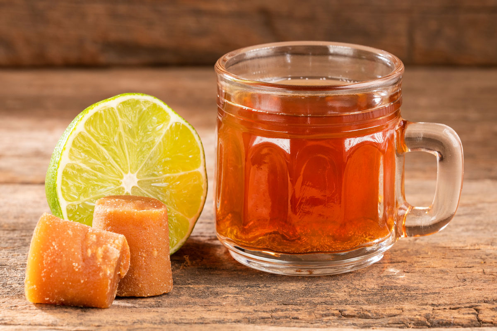

# Aguapanela

*Colombian sugarcane infusion: a block of raw cane sugar (panela) dissolved in hot or cold water, sharpened with fresh lime juice, drunk at breakfast hot or on a hot day cold.*

**Serves:** 4

**Prep Time:** 5 minutes

**Cook Time:** 10 minutes

## Overview
Aguapanela is Colombia's everyday sugarcane drink: blocks of panela (unrefined raw cane sugar pressed into hard bricks, sold at every Latin American grocer) dissolved in water, sharpened with fresh lime juice, drunk hot in the cool of the Andean highlands or cold under tropical sun. The drink is the working day's reset button: coffee at breakfast, aguapanela at mid-morning break, aguapanela again with lunch. Hot aguapanela with milk is the Colombian counterpart to a hot toddy when you're coming down with something. Cold aguapanela with lime over ice is the cooler at every roadside stop.

## Ingredients

- 150 g panela (one block; or substitute dark muscovado sugar)
- 1.2 litres water
- 60 ml fresh lime juice (from 2 limes)

### To serve (cold)
- Plenty of ice cubes
- Lime wedges

### To serve (hot, with milk for "aguapanela con leche")
- 250 ml whole milk, warmed
- A cinnamon stick

## Method

1. Break the panela block into chunks; place in a saucepan with the water.
1. Bring to a boil, then simmer gently for 8 to 10 minutes, stirring occasionally, until the panela has completely dissolved.
1. Off heat, stir in the fresh lime juice.

### To serve cold
1. Cool completely, then refrigerate 2 hours.
1. Pour over ice in tall glasses; garnish with a lime wedge.

### To serve hot
1. Pour the hot drink into mugs; add a splash of warm milk and a cinnamon stick per mug for the cold-weather version.

## Notes
- **Panela is the right sweetener.** Its molasses depth is what makes the drink. Dark muscovado is a passable substitute; refined sugar gives a totally different (lesser) drink.
- **Lime brightens the cold version.** Without it the drink is just sweet water; the lime is what lifts it.

## Storage
- Refrigerate up to 5 days. The dissolved panela syrup also keeps a fortnight and dilutes with water per glass.
