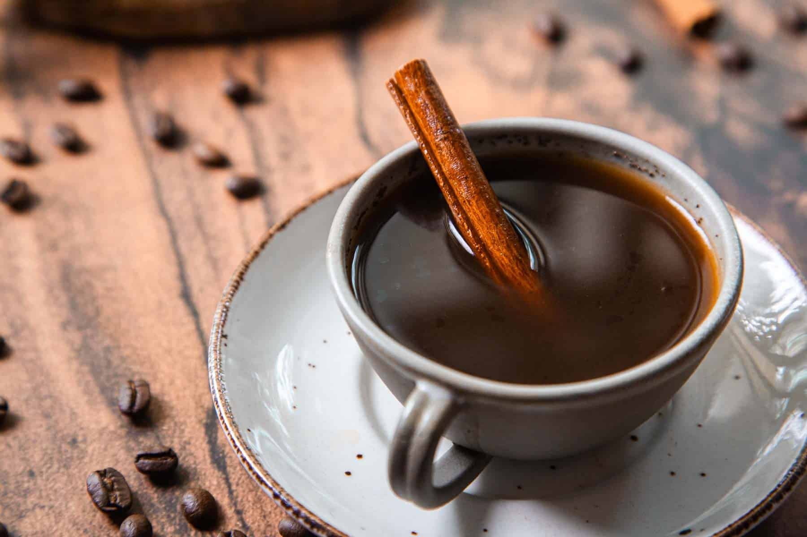

# Tinto

*Colombia's everyday coffee: a small cup of black coffee brewed strong, sweetened heavily with panela or sugar, poured from a thermos by street vendors carrying it through every city in Colombia.*

**Serves:** 4

**Prep Time:** 2 minutes

**Cook Time:** 8 minutes

## Overview
Tinto is Colombia's small-cup everyday coffee; confusingly, "tinto" in Spanish usually means "red wine", but in Colombia it specifically means a small cup of black coffee, served from thermoses by tinteros (street vendors) at every street corner, office building and bus station in the country. The build is simple: strong-brewed Colombian coffee, brewed in a sock filter (or a cafetière) with a generous spoonful of panela or brown sugar simmered in the water itself before adding the coffee. The result is sweet, dark, hot, served in tiny porcelain cups, drunk in two sips. Locals drink five or six a day. Strong but small, never bitter, always sweet.

## Ingredients

- 600 ml cold water
- 40 g panela (or 4 tablespoons dark brown sugar)
- 50 g ground Colombian coffee (medium-coarse, the kind for filter coffee or cafetière)

### To serve
- Small porcelain cups (espresso-sized)

## Method

1. Combine the water and panela in a saucepan; bring to a boil and stir until the panela has dissolved completely.
1. Off the heat, add the ground coffee; stir to combine.
1. Cover and steep for 4 to 5 minutes.
1. Strain through a fine sieve (or a cloth filter "sock" if you have one) into a warmed thermos or directly into small cups.

## Notes
- **Panela in the water first.** Dissolving the sugar before adding the coffee gives a more uniform sweetness than stirring sugar into the cup.
- **Colombian coffee, ideally.** Single-origin Colombian beans give the bright, slightly fruity profile the drink is known for; any decent medium-roast filter coffee works.
- **Small cups, drunk twice a day at minimum.** Tinto isn't a "morning coffee"; it's an all-day ritual, served at any time and any place.

## Storage
- Best within an hour of brewing; the coffee oxidises in a thermos but stays drinkable for 4 hours.
