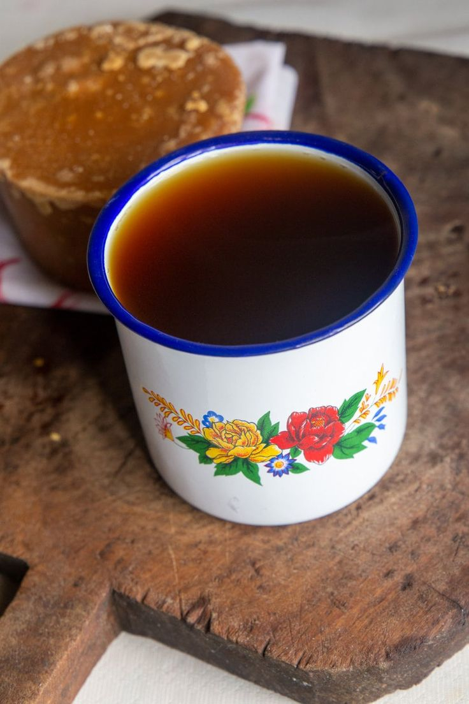

# Agua Dulce (Costa Rican Sugarcane Breakfast Drink)

*The breakfast cup of rural Costa Rica: hot water poured over a chunk of tapa dulce (unrefined cane sugar block) with a splash of milk, drunk at 5am before farm work in the mountain villages above the coffee belt.*

**Serves:** 2 (1 mug each)

**Prep Time:** 2 minutes

**Cook Time:** 5 minutes

## Overview
Agua dulce ("sweet water") is the Costa Rican country breakfast in a mug. A chunk of tapa dulce (a hard block of unrefined cane sugar, sometimes called panela or piloncillo in other Latin American countries) is dropped into hot water and stirred till dissolved, then thinned with a splash of warm milk. The drink predates coffee in rural Costa Rica: tapa dulce was the cheapest sweetener and the easiest way to get morning calories before a day in the field. The flavour is molasses-rich, slightly smoky, gently caramelised. In the cloud-forest villages of Monteverde or San Vito, agua dulce is still poured before the family's pot of frijoles for breakfast. The drink also serves as the everyday children's hot chocolate when a chunk of cocoa is grated in alongside the tapa dulce.

## Ingredients

### For 2 mugs (about 500 ml)
- 400 ml water
- 80-100 g tapa dulce (or panela, piloncillo, jaggery, or dark muscovado sugar)
- 100 ml whole milk (optional but traditional)
- 1 small pinch fine sea salt (optional, lifts the molasses note)
- 1 small cinnamon stick (optional)

### Cacao variation
- 30 g good-quality dark chocolate (70% or higher; grated)
- OR 2 tablespoons cocoa powder

## Method

### Stage 1 - Crack the tapa dulce
1. Tapa dulce arrives as a hard cone or brick.
2. Place on a chopping board; cover with a clean tea towel.
3. Tap firmly with a rolling pin or the back of a heavy knife to break off 80-100 g of chunks.
4. (If using softer panela or muscovado sugar, just measure straight.)

### Stage 2 - Dissolve
1. Bring the water to a simmer in a small saucepan over medium heat.
2. Add the tapa dulce chunks (and the cinnamon stick if using).
3. Stir gently with a wooden spoon; the chunks dissolve over 3-4 minutes.
4. Once fully dissolved, the liquid is a deep amber-brown.

### Stage 3 - Finish
1. Warm the milk in a separate small pan or microwave (don't boil).
2. Pour the sweetened water into two warm mugs.
3. Top up with the warm milk.
4. Add the pinch of salt and stir.

### Stage 4 - Serve
1. Serve immediately, while hot.
2. Stir occasionally as you drink (the molasses settles).

## Notes
- **Tapa dulce is the right ingredient:** it's unrefined sugarcane juice boiled down and set into blocks. Substitutes (in order of nearness): panela, piloncillo, jaggery, dark muscovado sugar. Regular brown sugar will work but is less aromatic.
- **Crack first, dissolve second:** trying to dissolve a whole block takes 15 minutes; cracked chunks are 3-4.
- **Salt pinch:** balances the sweetness and brings out the molasses.
- **Drink hot:** as the cup cools the sugar tightens and the milk thickens; agua dulce is best in the first ten minutes.
- **Pre-coffee breakfast:** even in coffee country, the morning often starts with agua dulce, then coffee at 9am.

## Variations
**Black agua dulce (sin leche):** drop the milk entirely; this is the Lent / fasting version.
**Agua dulce con chocolate:** grate 30 g dark chocolate into the hot sugar water for the children's cup.
**Agua dulce con queso:** the highland farmer's version: drop a small cube of fresh white cheese into the mug and let it soften.
**Cold agua dulce:** dissolve the tapa dulce in hot water as above, then pour over ice with a squeeze of lime; the Liberia-region summer version.
**With aguardiente:** add 30 ml Guaro Cacique (Costa Rica's cane spirit) for an evening warmer.

## Serving
At a Costa Rican mountain-village breakfast (the traditional setting) · with frijoles and tortilla at 5am · for a sick day (the country's "feel better" drink) · after a rainy hike in the Monteverde cloud forest · as a children's bedtime drink · at a Costa Rican farmstay with a slice of pan casero.

## Storage
- Drink fresh; agua dulce doesn't keep.
- Leftover dissolved tapa dulce syrup (without milk) keeps 1 week in the fridge; reheat and add fresh milk.
- A whole tapa dulce block keeps 12 months wrapped in paper in a dry cupboard.
- Don't freeze (the sugar crystallises out and the texture suffers).
