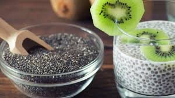

# Chan (Costa Rican Basil-Seed Refresco)

*The Costa Rican soda-counter cooler: hydrated basil seeds (jelly-coated, tapioca-like) suspended in cold lime-and-sugar water, sometimes lifted with a splash of tamarind syrup; the everyday refresco of a Tica lunch plate.*

**Serves:** 4 (1 large jug, about 1.5 litres)

**Prep Time:** 10 minutes (plus 20 minutes for the seeds to hydrate)

**Cook Time:** None

## Overview
Chan is the Costa Rican refresco built around chan seeds (also called albahaca seeds, the seed of a Caribbean basil variety that swells into a translucent gel-coated bead when soaked, very similar to chia or sabja). The seeds are stirred into cold water and left to hydrate for twenty minutes till each one is wrapped in a small jelly coat; the swollen seeds are then mixed with lime juice, sugar and more cold water to produce a refreshingly textured cooler that crunches and slips down at the same time. The traditional Costa Rican lunch-counter ("soda") menu lists chan among the natural-flavour refrescos (along with cas, tamarindo, horchata, mora); the drink is poured into a tall glass and served over ice alongside a casado plate. The basil-seed coat is supposed to have cooling and digestive properties; whether or not, it is the most refreshing post-lunch drink in the country.

## Ingredients

### For 1.5 litres
- 4 tablespoons chan / albahaca seeds (or sabja or chia, in order of nearness)
- 1.2 litres cold water
- 150 g caster sugar (adjust to taste)
- Juice of 4 limes (about 100 ml)
- 1 small pinch fine sea salt

### Optional flavour adds
- 60 ml tamarind syrup (for chan con tamarindo)
- A small sprig of fresh mint (for serving)
- 2 tablespoons rose-water cordial (for the Atlantic-coast version)

### To serve
- Ice cubes
- 4 tall glasses
- Long-handled spoons (the seeds settle, so stir while drinking)

## Method

### Stage 1 - Hydrate the seeds
1. Tip the chan / albahaca seeds into a small bowl.
2. Pour 200 ml of the cold water over.
3. Stir; the seeds will swirl and start to swell.
4. Leave 20 minutes; the seeds bloom into translucent gel-coated beads (each looking like a small frogspawn).

### Stage 2 - Sweeten and acidify
1. In a large jug, combine the remaining 1 litre of cold water with the sugar.
2. Stir until the sugar dissolves.
3. Add the lime juice and the pinch of salt; stir.

### Stage 3 - Combine
1. Tip the hydrated seeds (with their soaking water) into the jug.
2. Stir thoroughly.
3. If using, add the tamarind syrup and stir again.

### Stage 4 - Serve
1. Fill four tall glasses with ice.
2. Stir the jug well (the seeds settle within 30 seconds of standing).
3. Pour into the glasses.
4. Garnish with a sprig of mint and a slice of lime.
5. Hand each drinker a long spoon to stir as they go.

## Notes
- **Chan vs chia vs sabja:** these are related but distinct seeds; all bloom into gel beads. Chia is the easiest to find globally and works perfectly.
- **20 minutes of hydration:** any less and the seed is gritty; any more is fine but the drink can be assembled and served right away.
- **The seeds settle fast:** stir the jug between pours, and give drinkers a spoon.
- **Lime, not lemon:** lime gives the rounded tropical-bright flavour; lemon is too sharp.
- **Sugar to taste:** Costa Rican sodas serve chan with quite a bit of sugar (it balances the lime). Adjust down 20% if your limes are mild.

## Variations
- **Chan con tamarindo:** add 60 ml tamarind syrup or 4 tablespoons tamarind paste mixed with hot water; the most common Costa Rican variant.
- **Chan con leche:** swap half the water for cold milk; a coastal Caribbean variation.
- **Chan with mora syrup:** add 60 ml blackberry (mora) syrup; cloud-forest version with the tart mountain berry.
- **No-sugar chan:** sweeten with 60 ml agave syrup or with stevia drops.
- **Boozy chan:** add a 50 ml shot of Guaro Cacique to each glass (the adult after-beach version).

## Serving
- At a Costa Rican soda (the everyday lunch counter, the natural setting) · alongside a casado plate · on the porch on a hot Pacific-coast afternoon · for breakfast after gallo pinto · as a pregnancy-friendly cooler (no alcohol, no caffeine) · for kids at a Tica family lunch.

## Storage
- Refrigerates 24 hours in a sealed jug; the seeds soften further but the drink stays bright.
- The drink separates fast; stir thoroughly before each pour.
- Don't freeze (the seed-gel goes mushy and the drink loses its sparkle).
- Make the syrup base (water + sugar + lime + tamarind, no seeds) ahead and add the hydrated seeds 30 minutes before serving.
