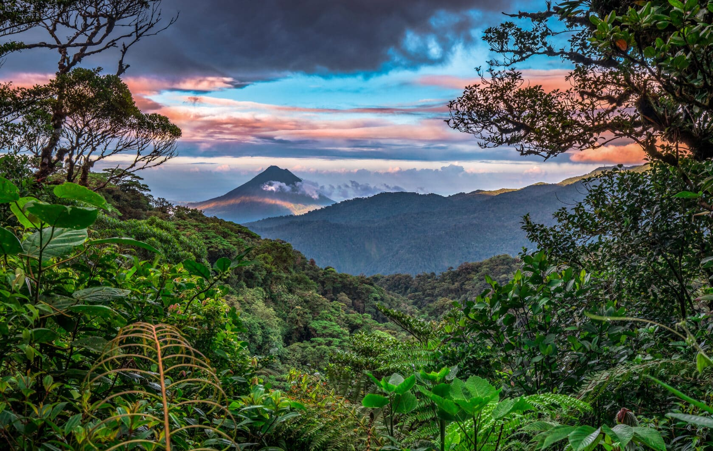

# Drinks of Costa Rica

Costa Rica's drinks start with coffee. The Tarrazú region's high-grown arabica is among the world's most prized, and at home it is brewed through a chorreador, the wooden stand with a cotton sock-bag that filters the grounds slowly into a waiting jug. Resbaladera, a cold spiced milk drink built from blended rice and barley with cinnamon and nutmeg, is the daytime cooler poured at sodas in the dry heat. Imperial, the pale lager with the black-eagle label, is the beach beer of the country, ordered ice-cold with a plate of chicharrones or patacones. Up in the mountain villages, breakfast often starts with agua dulce, a mug of hot water stirred with a chunk of tapa de dulce (unrefined cane sugar block) until it dissolves into something between tea and warm syrup. At the bar, Guaro Cacique (the national cane spirit) goes into a Chiliguaro shot of tomato juice, lime and chilli, knocked back in one. The drinks track the day: coffee at dawn, resbaladera at noon, Imperial at sunset, guaro after dark.
