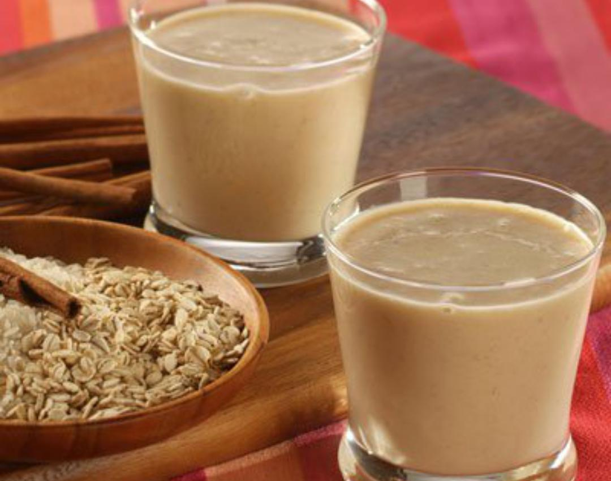

# Resbaladera

*The Costa Rican cooler: a cold spiced milk drink made from blended rice and barley with cinnamon, nutmeg and vanilla, served over ice as a daytime refresher at the country's sodas.*

**Serves:** 6 glasses

**Prep Time:** 15 minutes (plus 4 hours soak)

**Cook Time:** 25 minutes

## Overview
Resbaladera is the Costa Rican answer to horchata, a creamy cold milk-based drink that takes its body from blended cooked rice and toasted barley rather than the almonds of the Spanish original. It is the cooling daytime drink of the country's sodas, poured over ice in tall glasses at lunchtime when the dry-season heat sits heavy. The rice and barley are cooked together with cinnamon, nutmeg and vanilla, then blended smooth, sweetened with condensed milk and thinned with whole milk and water to drinking consistency. The name comes from the Spanish verb "resbalar", to slide, a reference to the way the cold drink slips down on a hot afternoon. The flavour is gently spiced, mellow and pleasantly grainy on the tongue, the country's most-loved everyday cold drink.

## Ingredients

- 100 g long-grain white rice
- 50 g pearl barley
- 1 cinnamon stick
- 1/4 tsp grated nutmeg
- 1 vanilla pod, split (or 1 tsp vanilla extract)
- 1 litre water
- 500 ml whole milk, plus more to taste
- 1/2 tin (200 ml) sweetened condensed milk
- 100 g caster sugar (or to taste)
- 1 tsp ground cinnamon, to dust
- Ice cubes, to serve

## Method

### Stage 1 - Soak the grains
1. Rinse the rice and barley in cold water.
2. Combine in a bowl with the cinnamon stick, grated nutmeg, split vanilla pod and 500 ml of the water.
3. Soak at room temperature for 4 hours (or overnight in the fridge).

### Stage 2 - Cook the grains
1. Tip the soaked grains with all their soaking water into a pot.
2. Add the remaining 500 ml water; bring to a boil.
3. Drop to a low simmer, cover and cook for 25 minutes until both grains are very soft and the liquid is creamy and starchy.
4. Let cool slightly.

### Stage 3 - Blend smooth
1. Lift out the cinnamon stick and vanilla pod (if used).
2. Pour the cooked grains with their liquid into a blender; blend on high for 2 minutes until completely smooth.
3. Strain through a fine sieve into a jug, pressing the solids with the back of a spoon to extract everything. (Skip the strain if you like the grainy texture.)

### Stage 4 - Sweeten and chill
1. Whisk in the whole milk, condensed milk and caster sugar until smooth.
2. Taste and adjust: more milk if too thick, more sugar if needed.
3. Chill for at least 2 hours.

### Stage 5 - Serve
1. Stir the resbaladera (the rice settles to the bottom on standing).
2. Pour into tall glasses over plenty of ice.
3. Dust the top with ground cinnamon.

## Notes
- **Soak the grains:** The 4-hour soak gives the rice and barley a head-start on blending and a smoother final texture. Skipping it leaves grit.
- **Strain or not:** Strained resbaladera is silky; unstrained is more textured. Both versions are common at sodas; choose your texture.
- **Stir before pouring:** The grain solids settle in the jug. A good stir before each pour keeps the drink even.
- **Adjust the milk:** The resbaladera thickens as it chills. Add an extra 100 ml milk if it sets too dense.

## Variations
- **Resbaladera con almendras:** Add 50 g blanched almonds with the grains for a richer, more horchata-like version.
- **Resbaladera con coco:** Replace 200 ml of the milk with coconut milk for a Caribbean-coast version.
- **Resbaladera con dulce:** Sweeten with panela (unrefined cane sugar) in place of the condensed milk and sugar for a deeper molasses note.
- **Resbaladera con ron:** A splash of dark rum in the adult version, served at family parties.
- **Resbaladera sin lácteos:** Use oat milk in place of whole milk and skip the condensed milk; sweeten with maple syrup for a dairy-free version.

## Serving
Serve cold over plenty of ice in tall glasses · with a dusting of cinnamon · with a slice of bizcocho or empanada de chiverre alongside · or as a soda-counter lunch drink

## Storage
- Resbaladera keeps 3 days refrigerated, covered
- Stir before each pour (the grain solids settle)
- Does not freeze (the texture becomes grainy and the milk separates)
