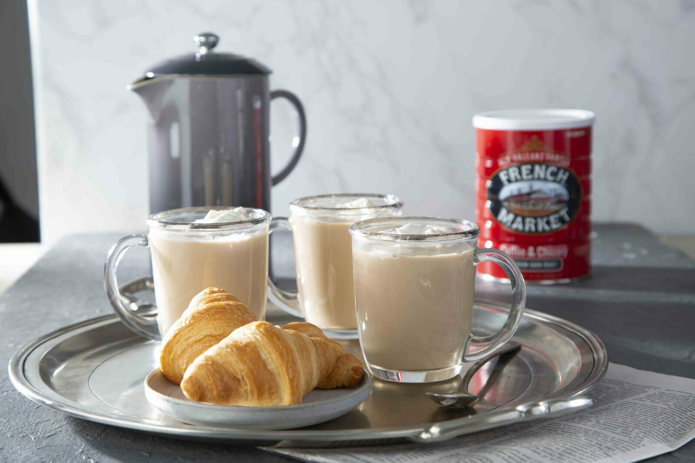

# Café au Lait with Chicory

*New Orleans's signature coffee: dark-roast coffee blended with roasted chicory root, brewed strong and poured into a tall cup with equal parts steamed milk. Smoky, bittersweet, almost chocolatey. The morning ritual at Café du Monde with a side of beignets dusted in icing sugar.*

**Serves:** 2 mugs

**Prep Time:** 2 minutes

**Cook Time:** 8 minutes

## Overview
Café au lait Creole-style is the unofficial coffee of New Orleans, made famous by Café du Monde in the French Quarter where it's served around the clock alongside fresh beignets. The defining ingredient is chicory: the roasted ground root of the chicory plant, blended with dark-roast coffee in roughly a 30:70 ratio. The blend dates from the 19th-century French period when coffee was scarce and chicory was used as a stretcher; New Orleanians grew to prefer the flavour, which adds a deep, slightly bittersweet, almost-chocolatey note pure coffee can't replicate. The brew is made strong (1:8 rather than the typical 1:16) in a French drip or moka pot, then poured into a tall mug with equal parts hot frothed whole milk. Sweetened to taste at the table. The proper accompaniment is three fresh beignets, hot from the fryer, dusted heavily with powdered sugar. The whole point of the chicory is the smoky-bitter coffee cutting the beignet sweetness.

## Ingredients

- 4 tablespoons coffee-and-chicory blend (Café du Monde's tinned blend is the classic, sold in red tins; New Orleans Roast or Community Coffee also make versions) OR 3 tablespoons dark-roast coffee + 1 tablespoon roasted chicory root powder
- 400 ml just-off-the-boil water (about 95°C)
- 400 ml whole milk
- Sugar to taste (a packet or two per mug at the table)

### To serve
- 2 tall mugs or thick-walled glasses
- Optional but traditional: a plate of fresh beignets dusted with powdered sugar

## Method

### Stage 1 - Brew strong
1. Put the coffee-chicory blend into a French press, moka pot, or pour-over filter.
1. Pour the just-off-the-boil water over the grounds. Let steep / drip / brew according to your method:
   - French press: 4 minutes, then plunge.
   - Moka pot: heat over medium until the brew completes (about 5 minutes from cold).
   - Pour-over: slow circular pour over 3 minutes.
1. The brewed coffee should be very dark, almost black-brown, with a slight oily sheen from the chicory.

### Stage 2 - Steam the milk
1. While the coffee brews, heat the milk in a small saucepan to about 65-70°C (steaming, small bubbles at the edge, not boiling).
1. Off the heat, whisk briefly with a milk frother or balloon whisk to create a light foam on top. You want body and warmth, not a stiff cappuccino-style foam.

### Stage 3 - Combine
1. Pour the brewed coffee into 2 tall mugs, filling them about half full (about 200 ml per mug).
1. Pour the warmed frothed milk on top, filling each mug to about 2 cm below the rim.
1. The ratio should be roughly 1:1 coffee to milk. The drink will be a deep tan-brown.

### Stage 4 - Serve
1. Bring to the table with a sugar bowl and spoons; the drinker sweetens to taste.
1. The classic New Orleans serve: 3 fresh beignets on a separate plate, dusted with icing sugar. Eat one beignet between sips.

## Notes
- **Chicory is non-negotiable.** Pure coffee gives a fine but ordinary café au lait. The chicory's smoky-bitter-chocolatey character is what makes it a New Orleans drink. Café du Monde's tinned blend is the easiest source; supermarkets in New Orleans-leaning regions also stock it.
- **Brew strong.** Café au lait with chicory needs a strong, almost-overstrength coffee base because half the cup will be milk. Use 4 tablespoons of grounds per 400 ml of water; don't go lighter.
- **Whole milk only.** Skim milk gives a thin, sad drink. Whole milk's body holds up to the strong coffee.
- **Sweetened at the table.** Don't pre-sweeten; everyone takes a different amount. New Orleans cafés serve a sugar caddy on every table.

## Variations
- **Iced café au lait.** Brew double-strength coffee, pour over a tall glass of ice, top with cold whole milk. The summer New Orleans version.
- **Without chicory.** Pure dark-roast café au lait. Standard, fine, just not New Orleans.
- **With a shot.** A 15 ml splash of bourbon stirred into each mug. The breakfast version of an Irish coffee; common in older New Orleans households on a Sunday morning.
- **Bigger ratio of coffee.** 60% coffee to 40% milk for a stronger, more bracing drink. Closer to a Spanish café cortado.

## Storage
- Doesn't store; serve immediately. The chicory grounds can be reused once for a weaker second brew if you must.
- Whole roasted chicory keeps 6 months sealed in a cool dry place. Café du Monde blend keeps 12 months sealed.
