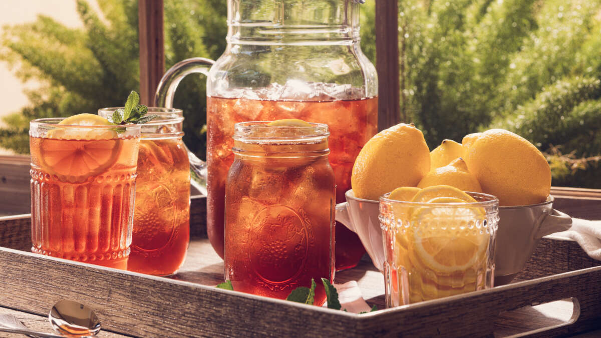

# Southern Sweet Tea

*Strong black tea brewed long, sweetened generously with white sugar while still hot, then chilled and served over a tall glass of ice with a lemon wedge. The unofficial table drink of the American South, drunk at every Sunday lunch from New Orleans to Charleston, ordered by the pitcher at every diner.*

**Serves:** 8 tall glasses (makes 2 litres)

**Prep Time:** 5 minutes

**Cook Time:** 10 minutes (plus chilling)

## Overview
Sweet tea is the everyday drink of the American South - from Louisiana up through Alabama, Mississippi, the Carolinas and Georgia, and into Texas and Tennessee. Order "tea" at a Southern diner and what you'll get without further explanation is iced sweet tea: strong black tea brewed long, sweetened heavily with white sugar while hot, then chilled and served over crushed ice with a lemon wedge. The Creole / New Orleans version belongs to this Southern tradition and shows up at every backyard cookout, family Sunday lunch, after-church gathering, and Saturday-football tailgate. The single critical step that distinguishes proper Southern sweet tea from "iced tea with sugar added later" is dissolving the sugar while the brew is still hot - this way the sweetness integrates fully and doesn't sit gritty at the bottom of the glass. Sugar by volume varies by household: 1.5 cups per gallon (about 200 g per 4 litres) is on the lighter end; the deeper-South version uses 2 to 3 cups (250-400 g). The classic finishing touch is a wedge of fresh lemon clipped on the rim and a sprig of mint.

## Ingredients

- 6 black tea bags (Lipton is the South's go-to; use a robust everyday black tea - Yorkshire, PG Tips, or English Breakfast all work)
- 2 litres cold water
- 200 to 250 g caster sugar (start at 200, taste, add more for properly Southern sweetness)
- A small pinch of baking soda (the secret Southern trick: a tiny amount of baking soda neutralises any bitter tannins from over-brewing)
- 1 lemon, sliced into wedges

### To serve
- Plenty of ice cubes (crushed if possible)
- 8 tall glasses, chilled
- Optional: sprigs of fresh mint
- Optional: extra lemon wedges on a small plate

## Method

### Stage 1 - Brew strong
1. Bring 500 ml of the cold water to a hard rolling boil in a kettle or saucepan.
1. Place the 6 tea bags in a heatproof jug or large teapot. Sprinkle the pinch of baking soda over them.
1. Pour over the boiling water and let steep for 5 to 7 minutes. The brew should be very dark, almost black.

### Stage 2 - Sweeten while hot
1. Remove the tea bags (squeeze gently against the side of the jug to extract).
1. Pour the hot concentrated brew into a larger heatproof pitcher.
1. While still very hot, stir in 200 g of caster sugar until completely dissolved. Taste: the brew should be aggressively sweet. Add another 50 g for the proper Southern version.

### Stage 3 - Dilute and cool
1. Add the remaining 1.5 litres of cold water to the pitcher and stir well.
1. Cool to room temperature, then refrigerate at least 3 hours (overnight is even better). The flavour deepens as it sits cold.

### Stage 4 - Serve
1. Fill tall glasses with plenty of ice (crushed gives the best Southern look and dilution rate).
1. Pour the chilled sweet tea over the ice until the glass is almost full.
1. Garnish each with a fresh lemon wedge clipped on the rim. Add a sprig of mint if you have it.
1. Serve with a long spoon or a fat straw.

## Notes
- **The baking soda trick.** A tiny pinch of baking soda in the brew (no more than 1/8 teaspoon per 2 litres) neutralises any harsh bitter tannins from long-brewed tea, giving a cleaner sweetness. This is the secret in most Southern grandmothers' recipes; don't skip it.
- **Sugar while hot.** Adding sugar to cold tea leaves it gritty at the bottom. Always dissolve while hot.
- **Bag count and steep time.** 6 bags for 2 litres is the standard ratio. Steep 5 to 7 minutes; don't go longer or it gets harsh even with baking soda.
- **Sweet by Southern standards.** 250 g of sugar to 2 litres is the proper deep-South sweetness. If that sounds like a lot, start lighter - but recognise that "sweet tea with not enough sugar" isn't sweet tea, it's iced tea.
- **Always with lemon.** A wedge of fresh lemon on every glass. The lemon cuts the sweetness and adds the right brightness; don't serve it without.

## Variations
- **Half-and-half ("Arnold Palmer Southern style").** Mix sweet tea with fresh lemonade in equal parts in the glass. Common at Southern brunches.
- **Peach sweet tea.** Add 200 g fresh sliced peaches to the cooling stage; let macerate for 4 hours. Strain or leave the slices in for serving.
- **Mint-infused.** Add a generous handful of fresh mint leaves to the hot brew alongside the tea bags. Steeped, strained, sweetened. Bright, refreshing.
- **Cold-brew version.** Skip the hot brew entirely. Steep the tea bags in 2 litres of cold water in the fridge overnight; sugar dissolved separately in 100 ml of hot water and stirred in. Smoother, less tannic.

## Storage
- Keeps 5 days in a sealed pitcher in the fridge. The flavour stays bright for 3 days then slowly fades.
- Don't freeze; the texture stays fine but the flavour dulls on thawing.
