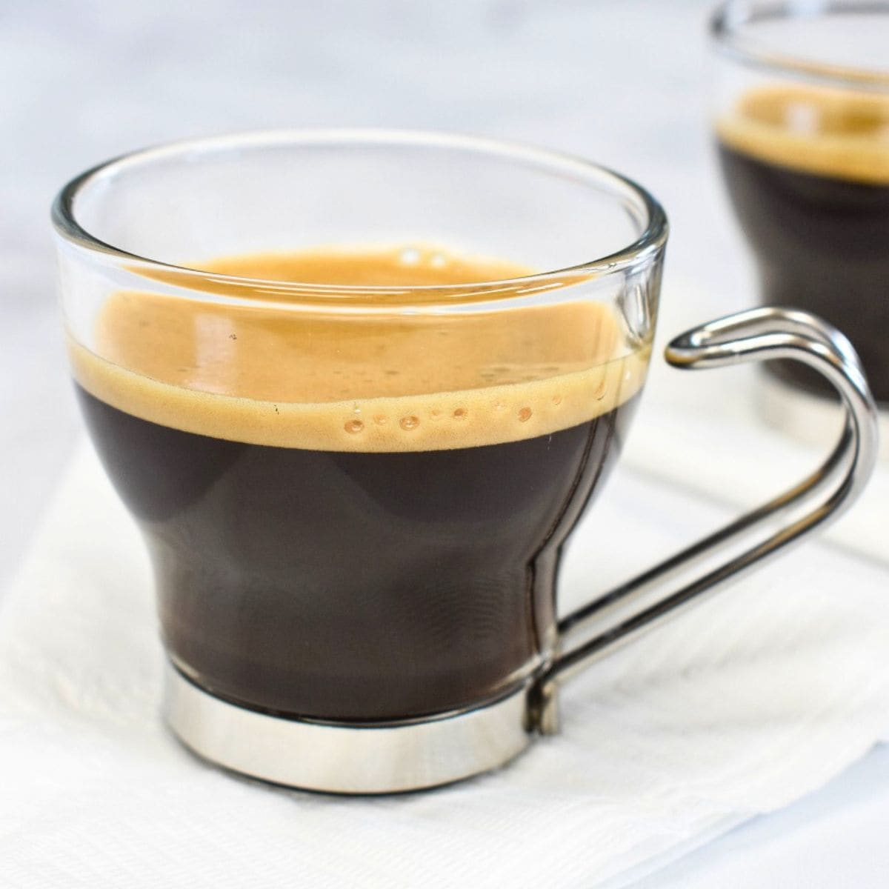

# Café Cubano

*Cuban espresso sweetened in the brew itself: dark espresso pulled hot, then whipped with sugar at the first drops to form the espuma, a foamy caramel cap that floats on top of the shot.*

**Serves:** 2

**Prep Time:** 2 minutes

**Cook Time:** 4 minutes

## Overview
Café cubano (also called cafecito or Cuban coffee) is the small, intensely sweet espresso shot of every Cuban breakfast and afternoon: a moka-pot or espresso machine brews a strong dark coffee, and the first 2 to 3 drops of that coffee are whipped vigorously with sugar in a small cup until they form a thick caramel foam called espuma. The rest of the coffee pours over the espuma; the foam floats on top of the shot like crema but sweeter and denser. Drunk in two small sips from tiny demitasse cups, often as a midday social break ("la colada") shared from a single thermos passed between coworkers. Strong, sweet, hot, the Cuban version of cardamom-laden Arabic coffee or sweet Italian espresso.

## Ingredients

### Per 2 demitasse cups
- 50 g finely ground dark-roast coffee (Bustelo or Cubita; or any dark-roast espresso grind)
- 200 ml cold water (for the moka pot)
- 4 teaspoons demerara or caster sugar

## Method

### Stage 1 - Brew
1. Fill the moka pot's water chamber with the cold water; tamp the ground coffee gently into the basket.
1. Assemble and put over medium heat. As the water boils, coffee rises through the spout.

### Stage 2 - Make the espuma
1. Spoon the sugar into a small heatproof cup.
1. The moment the first dark drops of coffee emerge from the moka pot, take it off the heat briefly and capture 2 to 3 teaspoons of those first drops directly into the sugar cup.
1. Whip hard with a spoon for 30 to 45 seconds; the sugar and coffee will turn into a thick pale-tan foam ("espuma de café").

### Stage 3 - Combine and serve
1. Return the moka pot to the heat to finish brewing.
1. Pour the rest of the coffee into the cup with the espuma; the foam will rise to the top and float as a cap.
1. Pour into two demitasse cups; serve immediately.

## Notes
- **First drops only for the espuma.** The very first drops out of the moka pot are the thickest and richest; that's what whips into espuma.
- **Sugar amount is non-negotiable.** Cuban coffee is properly sweet; cutting the sugar misses the entire point.
- **Sip, don't dilute.** No milk; this is the black version. Café con leche (Cuban) is a separate larger drink.

## Variations
- **Cortadito.** Café cubano topped up with steamed milk; the morning version, less intense.
- **Colada.** Same recipe scaled to one large styrofoam cup, shared between 4 or 5 people from small accompanying demitasses; the office afternoon ritual.

## Storage
- Drink immediately while the espuma is standing.
