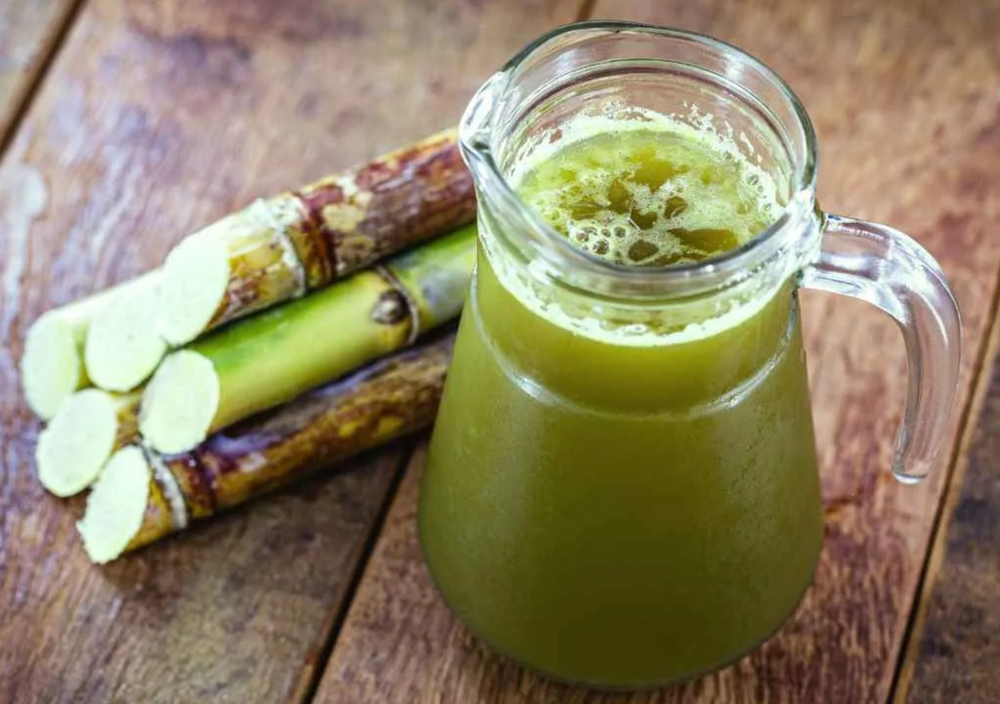

# Guarapo

*Fresh sugarcane juice: cane stalks crushed through a press, the green-amber juice caught straight into a glass with ice and a wedge of lime, drunk roadside across Cuba.*

**Serves:** 2

**Prep Time:** 5 minutes

**Cook Time:** 0 minutes

## Overview
Guarapo is fresh sugarcane juice, pressed roadside in Cuba from cane stalks fed through a hand-cranked or electric guarapera (sugarcane press). The raw juice runs green-amber, sweet but with a fresh grassy edge that bottled sugarcane juice never matches. Served immediately into a cup with ice and a squeeze of fresh lime, sometimes a little crushed ginger; the lime cuts the sweetness and stops the drink from being cloying. You'll see guarapo stalls along every Cuban highway and on Havana side streets; the cane oxidises fast (within an hour) so it has to be pressed and drunk at the stall. Outside Cuba you'll need a juicer or a small electric cane press; pre-bottled sugarcane juice from a tin is a sad substitute but works.

## Ingredients

- 500 ml fresh sugarcane juice (juiced from 4 to 6 stalks; or from a tin/bottle if no fresh available)
- 30 ml fresh lime juice (from 1 lime)
- 1 cm fresh ginger (peeled, finely grated; optional, traditional in some Cuban regions)
- Pinch of fine salt (optional, brings out the sweetness)
- Plenty of ice cubes

### To serve
- Lime wedges

## Method

1. If pressing fresh: feed cane stalks through a guarapera or sturdy juicer until you have 500 ml of juice; strain through a fine sieve to catch any pulp.
1. In a jug, combine the cane juice, lime juice, ginger (if using) and salt; stir well.
1. Pour over a tall glass full of ice; notch a lime wedge onto the rim. Serve immediately.

## Notes
- **Fresh-pressed is the whole point.** Bottled cane juice loses its bright green flavour within 24 hours; the magic of guarapo is drinking it within minutes of pressing.
- **Lime is not optional.** Without it the drink is cloyingly sweet; the lime cuts and balances.

## Storage
- Drink within 30 minutes of pressing. Fresh sugarcane juice oxidises and turns dull within an hour. Bottled keeps in the fridge for 5 days.
