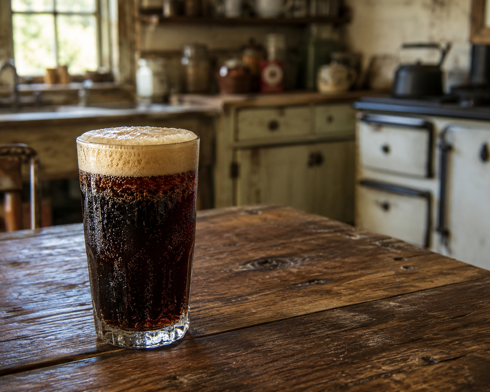

# Homemade Kofola

*The Czech alternative to Coca-Cola: a herbal cola syrup made from caramelised sugar, cinnamon, anise, ginger, citrus and a hint of licorice, topped with sparkling water and served over ice. Less sweet than Coke, distinctively spiced, deeply nostalgic for any Czech who grew up in the 1970s onwards.*

**Serves:** Makes about 1 L of syrup, enough for 30 servings

**Prep Time:** 20 minutes

**Cook Time:** 45 minutes

## Overview
Kofola is the Czech national soft drink - a cola-style fizzy beverage invented in 1959 in Communist Czechoslovakia as a domestic alternative to Coca-Cola (which wasn't available). The recipe was developed by a researcher at the Galena pharmaceutical company who infused herbal extracts with caramel and citrus to mimic the cola flavour profile without the original American formula. Today it's the second-most-popular soft drink in the Czech and Slovak Republics, sold in cans, bottles and on draught in pubs. The homemade version uses a herbal syrup that captures the same character: caramelised sugar for the cola colour and depth, plus warming spices (anise, cinnamon, ginger) and citrus peel that distinguish kofola from a generic cola. The syrup keeps for months; one tablespoon per glass plus sparkling water gives the drink.

## Ingredients

### Kofola syrup
- 300 g caster sugar (for caramel)
- 60 ml water (for caramel)
- 600 ml water (for syrup)
- 200 g more caster sugar (for syrup base)
- Zest of 2 oranges (peeled in wide strips)
- Zest of 1 lemon (peeled in wide strips)
- 2 cinnamon sticks
- 6 whole star anise (or 2 tsp anise seeds)
- 8 whole cloves
- 6 whole allspice berries
- 2 tsp coriander seeds, lightly crushed
- 1 tsp fennel seeds
- 1 thumb fresh ginger, sliced
- 1 small piece (5 g) dried licorice root (optional, but adds the distinctive Czech note)
- 2 vanilla pods, split (or 1 tbsp vanilla extract added at the end)
- 1 tsp citric acid (or juice of 1 large lemon)
- A small pinch of fine salt

### To serve (per glass)
- 30-40 ml kofola syrup (1 generous tablespoon, adjust to taste)
- 250 ml chilled sparkling water
- Ice cubes
- A lemon or orange slice
- Optional: a sprig of mint

## Method

### Stage 1 - Make the caramel
1. In a heavy saucepan, combine the 300g sugar with 60ml water.
2. Place over medium heat without stirring; swirl the pan occasionally.
3. Cook 7-10 minutes until the caramel turns a deep mahogany - just before it would burn (the smell is sweet and slightly acrid).
4. Watch carefully - the colour change accelerates in the last 30 seconds.

### Stage 2 - Add water carefully
1. Off the heat, very carefully and slowly add the 600ml water to the caramel (it spits violently; use a long-handled spoon and stand back).
2. Stir until any solid caramel pieces have dissolved (return to low heat if needed).

### Stage 3 - Build the syrup
1. Add the additional 200g sugar; stir to dissolve.
2. Add the citrus zest strips, cinnamon sticks, star anise, cloves, allspice, coriander, fennel seeds, sliced ginger, licorice root (if using), vanilla pods and salt.
3. Bring to a gentle simmer; cook 30 minutes over low heat - the syrup deepens in colour and concentrates in flavour.

### Stage 4 - Acidify
1. Off the heat, stir in the citric acid (or fresh lemon juice).
2. Add the vanilla extract if using (not pod).
3. Cool 30 minutes to room temperature; the flavours continue to infuse.

### Stage 5 - Strain
1. Strain through a fine sieve into a clean jug, pressing the solids to extract all the liquid.
2. Discard the solids.
3. Bottle in a sterilised glass bottle.
4. Refrigerate.

### Stage 6 - Serve
1. In a tall glass, place 2 ice cubes.
2. Pour in 30-40 ml of kofola syrup.
3. Top up with 250 ml chilled sparkling water.
4. Stir gently once.
5. Add a slice of orange or lemon and a mint sprig.

### Stage 7 - Adjust to taste
1. Czech kofola is less sweet than Coca-Cola. Start with 30 ml syrup per glass; adjust upward only if you like it sweeter.
2. The drink should taste of spice and caramel as much as of sugar.

## Notes
- **The caramel is critical:** The depth of the colour and the slight bitter-sweet edge of the syrup comes from caramelising the sugar to dark mahogany. Underdone caramel gives a pale, sweet syrup; correctly caramelised gives the distinctive kofola character.
- **Licorice root is the secret:** Even a small amount of dried licorice root gives the syrup its unmistakable herbal note. Sold at health food shops or herb suppliers. Skip if unavailable; the syrup is still good but slightly less authentic.
- **Don't boil the caramel too dark:** Burnt caramel is bitter and unpleasant. Pull off the heat as soon as it hits deep mahogany; the residual heat keeps cooking it briefly.

## Serving
- The Czech alternative to global colas. Served in pubs on draught alongside beer; in restaurants in tall glasses with ice; from cans on summer hikes. As nostalgic for Czechs as Coca-Cola is for Americans.

## Storage
- The kofola syrup refrigerates 3 months in a sealed bottle.
- Mix per serving; the carbonation dies if pre-mixed.
- Freezes 6 months; thaw in the fridge.
