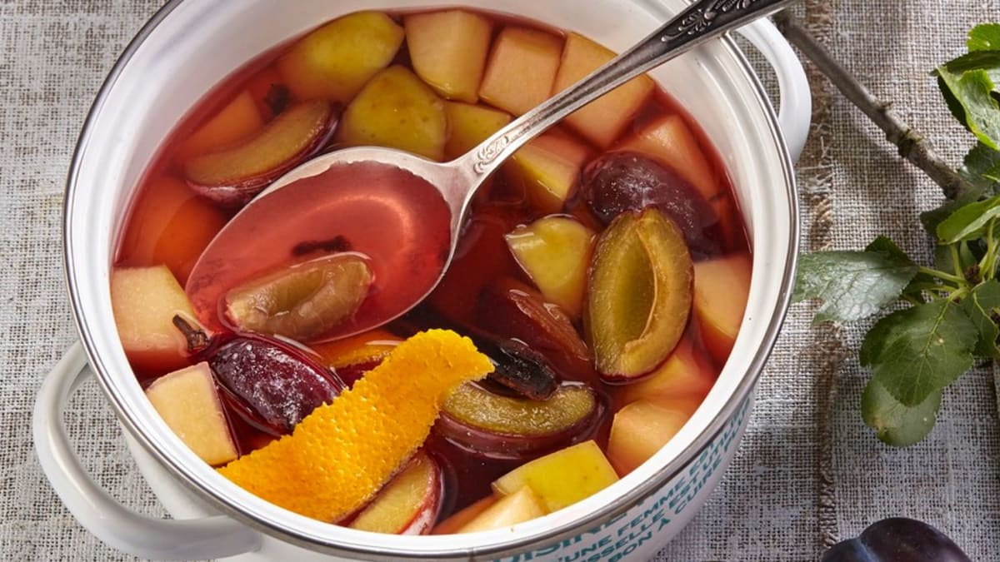

# Kompot (Czech Stewed-Fruit Drink)

*The Slavic everyday drink: whole fruit gently stewed in lightly sweetened water with spices, served cold with the soft fruit sitting at the bottom of the glass. Refreshing, only mildly sweet, made from whatever fruit is in season.*

**Serves:** 4 tall glasses (plus the fruit)

**Prep Time:** 10 minutes

**Cook Time:** 15 minutes (plus 2 hours chill)

## Overview
Kompot is the Slavic everyday fruit drink common across Czech, Polish, Russian and Ukrainian homes - whole or halved fruit (cherries, plums, apples, pears, dried fruit in winter) is simmered in lightly sweetened water with a cinnamon stick or a few cloves, then cooled. The liquid is the drink; the soft fruit sits at the bottom of the jug or each glass, eaten with a spoon once the drink is gone. It's the drink Czech families make in big jugs and refrigerate; pour cold from the door of the fridge instead of soft drinks. Less sweet than juice, less acidic than fruit cordial, gently fragrant with the fruit and the small amount of spice. Different from compote (the dessert) only in proportion - more water, less sugar, drinkable consistency.

## Ingredients
- 500 g mixed fruit (one or a combination of:
  - Sour cherries, stoned (in season May-July)
  - Dark plums, halved and pitted
  - Apples, peeled, cored and chopped (autumn-winter)
  - Pears, peeled, cored and chopped
  - Apricots, halved and pitted (in season)
  - Strawberries, hulled (summer)
  - Mixed dried fruit (raisins, dried apricots, dried plums) - for winter)
- 1.5 L water
- 80-100 g caster sugar (adjust to fruit tartness)
- 1 cinnamon stick
- 4 whole cloves (optional)
- 1 star anise (optional)
- Zest of half a lemon, in strips
- Juice of half a lemon
- A small pinch of salt
- Optional: 1 tbsp honey for added complexity

## Method

### Stage 1 - Prep the fruit
1. Wash all fresh fruit; pit and chop as needed (cherries pitted and whole; plums halved; apples peeled and chopped into 2 cm chunks).
2. If using dried fruit, soak briefly in warm water for 10 minutes first to soften.

### Stage 2 - Build the pot
1. Combine the water, sugar, cinnamon stick, cloves, star anise, lemon zest and salt in a large saucepan.
2. Bring to a simmer over medium heat; stir until the sugar dissolves.

### Stage 3 - Cook the fruit
1. Add the prepared fruit to the pot.
2. Return to a simmer; cook 10-15 minutes until the fruit is just tender but still holding shape (not mushy).
3. Different fruits cook at different rates; if mixing, add firmer fruit first (apples), softer fruit later (cherries, berries).

### Stage 4 - Finish
1. Off the heat, stir in the lemon juice and honey (if using).
2. Taste; adjust sugar.
3. The drink should be subtly sweet, fruit-forward, gently spiced.

### Stage 5 - Cool and chill
1. Let cool to room temperature 1 hour.
2. Pour (with the fruit) into a large jug.
3. Refrigerate at least 2 hours - kompot is always served cold.

### Stage 6 - Serve
1. Pour the cold kompot into tall glasses.
2. Distribute the fruit pieces between the glasses; they sit at the bottom.
3. Add a slice of fresh fruit on the rim for garnish (optional).
4. Drink the liquid with a straw; eat the fruit with a spoon at the end.

## Notes
- **Don't oversweeten:** Czech kompot is lightly sweet, not soda-sweet. Start with 80g sugar; add more only if the fruit is unusually tart.
- **Sour cherries are the classic:** The most traditional fruit. Sour cherries (morello cherries) give the deep red colour and the characteristic tart-sweet balance. Substitute with sweet cherries plus a tablespoon of lemon juice.
- **Mix fruits for complexity:** A pure single-fruit kompot is fine; a 2-3 fruit blend (e.g. plum + apple + dried apricot) has more depth.

## Serving
- The everyday drink at Czech (and Polish, and Russian, and Ukrainian) tables. A jug stays in the fridge through the week. Pour cold with any meal in place of soft drinks. Children love it; adults sip it through the day.

## Storage
- Refrigerates 5 days in a sealed jug.
- Freezes 3 months in portions.
- The cooked fruit can also be eaten as a compote alongside yoghurt or porridge - a separate small dish from the same pot.
