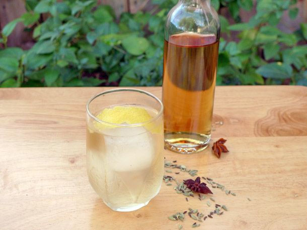

# Aalborg Akvavit (Danish Caraway Spirit)

*Denmark's national spirit: a clear caraway-and-dill-infused grain alcohol from the Aalborg distillery in northern Jutland (operated since 1846), served in tiny ice-cold glasses with pickled herring, smørrebrød and the Danish snaps ritual. Stronger and more caraway-forward than Swedish akvavit; the traditional drinking spirit at every Danish lunch.*

**Serves:** 8 (small shots, about 30ml each; figure 3-4 rounds per lunch)

**Prep Time:** 5 minutes (assumes bottled Aalborg Taffel) OR 2 weeks (for home-infused version)

**Cook Time:** None

## Overview
Aalborg Akvavit is Denmark's most iconic spirit and the traditional drinking partner of every Danish lunch involving pickled herring, smørrebrød or cured meat. The Aalborg distillery in northern Jutland has been making akvavit since 1846 and produces multiple varieties: Aalborg Taffel (the traditional caraway-and-dill aquavit, smooth, clear); Aalborg Jubilæum (oak-aged, slightly darker); Aalborg Dild (extra-dill); Aalborg Porse (with sweet-gale, a Danish bog plant). The dominant flavour is caraway, more aggressively caraway-forward than Swedish Skåne or Norwegian Linie aquavits, with secondary notes of dill, fennel, and lemon peel. Served ice-cold (straight from the freezer; akvavit's high alcohol prevents it freezing, but it becomes syrupy-viscous and intensely cold), in tiny straight-sided 30-40ml shot glasses. The Danish snaps ritual: a snapsvisa (snaps song, there are hundreds, from the universal "Helan går" to bawdier regional variants) is sung at the table, then everyone shouts "Skål!" and downs (or sips) the shot, immediately following with a bite of pickled herring on rye bread.

## Ingredients

### Option A: Bottled Aalborg Akvavit (the traditional Danish way)
- 1 bottle (700 ml) Aalborg Taffel Akvavit OR Aalborg Jubilæum (for the oak-aged version)

### Option B: Home-infused Danish-style snaps (2-week infusion)
- 700 ml clear neutral vodka (a smooth one, Absolut, Smirnoff Black, or any quality potato vodka)
- 4 tablespoons caraway seeds (whole, this is the Danish caraway-forward emphasis)
- 2 tablespoons dill seeds (or 6 fresh dill sprigs)
- 1 tablespoon fennel seeds
- 1 teaspoon coriander seeds
- Peel of 1 lemon (no white pith)
- A small piece of sweet-gale (porse) if available, the Danish bog plant; or substitute juniper berries
- 1 tablespoon caster sugar (optional; balances the burn)

### Equipment
- A glass infusion jar (1 litre, sealable)
- A fine sieve and a coffee filter
- Small (30-40ml) straight-sided shot glasses ("snaps glasses")

### To serve (per round)
- 1 piece pickled herring (or karrysild, see [karrysild recipe](../../cuisine/danish/snacks/karrysild.md)) on a small piece of dark Danish rye bread
- A sprig of fresh dill
- A small pinch of flaky salt

### To serve alongside (the meal)
- A Danish lunch: smørrebrød + pickled herring + boiled new potatoes + sour cream + chopped chives + cold pilsner
- OR a Christmas julefrokost
- OR an Easter cold-buffet

## Method

### Stage 1A - Option A: Bottled Aalborg Akvavit
1. Place the unopened bottle in the freezer 24 hours before serving.
2. The akvavit (40-45% ABV) won't freeze; it'll become syrupy-cold and viscous.
3. Skip to Stage 4.

### Stage 1B - Option B: Home-infused (2-week version)
1. Lightly crush the caraway, dill, fennel, and coriander seeds in a mortar (release the oils without pulverising).
2. Add all the seeds, lemon peel, sweet-gale or juniper berries, and sugar (if using) to a 1-litre glass jar.

### Stage 2 - Pour vodka over
1. Pour the vodka over the spices.
2. Seal the jar tightly.

### Stage 3 - Infuse 2 weeks
1. Place in a cool dark cupboard for 2 weeks (Danish home cooks tend to infuse longer than Swedish, the caraway is stronger).
2. Shake the jar gently every 3 days.
3. The vodka will turn pale amber with hints of green from the herbs.
4. Taste at day 10: if strong enough, strain; if mild, continue to day 14.

### Stage 4 - Strain and chill
1. Strain the infused vodka through a fine sieve into a clean bottle.
2. For extra clarity, strain again through a coffee filter.
3. Seal; place in the freezer 24 hours.

### Stage 5 - The serving ritual
1. Place the snaps glasses in the freezer 15 minutes before serving.
2. Pour the ice-cold akvavit into each frosted glass to about ¾ full (about 25-30 ml).
3. Lay each glass on a small plate with a piece of pickled herring on rye bread alongside.

### Stage 6 - The snapsvisa
1. The host raises their glass and begins a snapsvisa (snaps song).
2. The universal "Helan går": "Helan går, sjung hopp faderallan lallan lej / Helan går, sjung hopp faderallan lej / Och den som inte helan tar, han heller inte halvan får / Helan går, sjung hopp faderallan lej". Everyone joins in.
3. At the end: everyone shouts "Skål!" and either downs the shot in one or sips half.
4. Immediately follow with a bite of herring on rye.

### Stage 7 - Repeat
1. A traditional Danish lunch has 3-5 rounds of snaps spaced across 2-3 hours.
2. Each round gets a different snapsvisa.
3. Pace yourself; this isn't a race.

## Notes
- **ICE-COLD from the freezer:** non-negotiable. Room-temp akvavit tastes hot and harsh.
- **TINY glasses (30-40ml):** the snaps glass is small for a reason. You're sipping a flavoured spirit, not chugging vodka.
- **Caraway-forward:** the Danish signature. More caraway than the Swedish version.
- **Snapsvisa before each round:** even a brief toast. It slows the drinking and builds conviviality.
- **Pickled herring alongside:** the salt cuts the spirit.

## Variations
**Aalborg Jubilæum (oak-aged):** slightly warmer, deeper colour. Bottled as a deluxe Aalborg version.
**Aalborg Dild (extra-dill):** dill-forward; for fish-and-pickle pairings.
**Aalborg Porse (sweet-gale):** Danish bog-plant infusion; herbal and bitter.
**Snaps cocktails:** modern Copenhagen bars increasingly use akvavit in cocktails, Aalborg Sour, Akvavit Negroni, for the depth and caraway notes.
**Birch-bud snaps (forager's version):** infuse vodka with fresh spring birch buds for a uniquely Scandinavian green-herbal snaps.

## Serving
At every traditional Danish meal involving cured fish or smørrebrød · at a julefrokost (Christmas lunch) · at Easter brunch · at a Copenhagen restaurant smørrebrød lunch · at home with cold pickled herring + rye bread + a pilsner chaser.

## Storage
- Bottled Aalborg akvavit keeps indefinitely.
- Home-infused snaps keeps in a sealed bottle 6 months in a cool dark place; 1 year+ in the freezer.
- Once opened, refrigerate.
- The infusion can be replenished: top up the spent spice jar with fresh vodka for a milder second batch.
